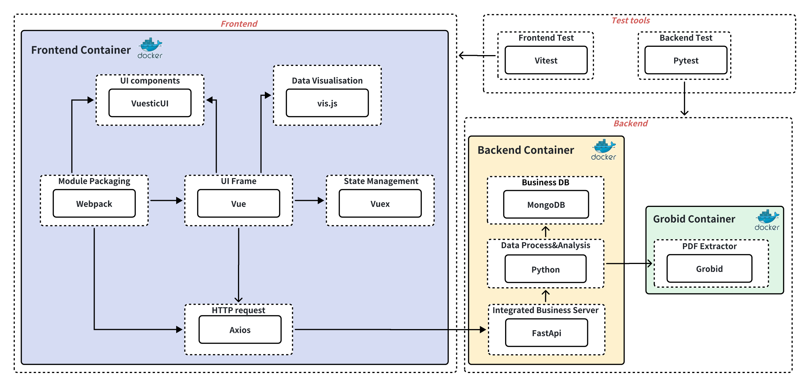
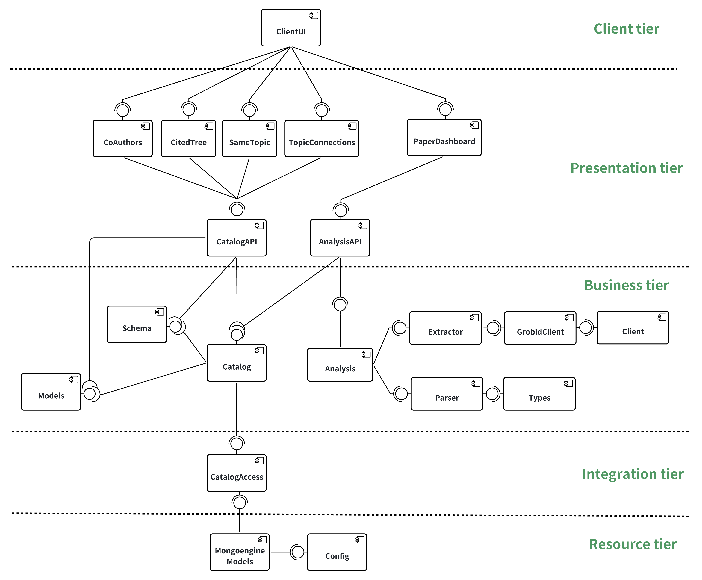
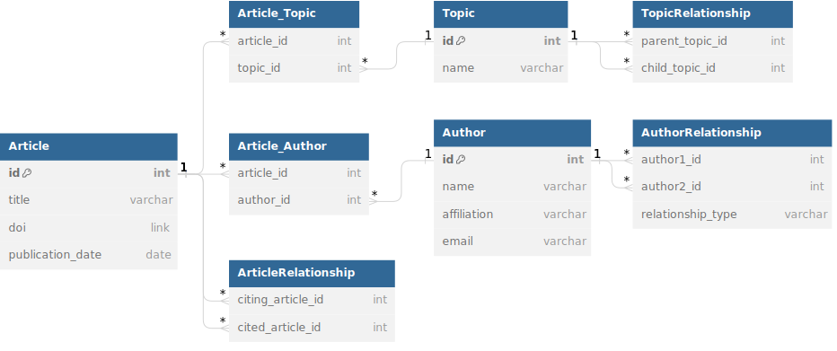

# PSD Project Design
## Table of Contents
- **[Introduction](#introduction)**
  - [Purpose](#purpose)
  - [Intended Users](#intended-users)
  - [Product Scope](#product-scope)
- **[System Overview](#system-overview)**
  - [Key Components](#key-components)
  - [System Interaction](#system-interaction)
- **[High-level design of an end-to-end solution](#high-level-design-of-an-end-to-end-solution)**
  - [System Architecture Overview](#system-architecture-overview)
  - [Component Interaction](#component-interaction)
  - [Scalability and Flexibility](#scalability-and-flexibility)
  - [Security and Compliance](#security-and-compliance)
  - [User Experience](#user-experience)
  - [Deployment Strategy](#deployment-strategy)
- **[Architectural Design](#architectural-design)**
  - [Technology Stack Architecture](#technology-stack-architecture)
  - [Component Architecture](#component-architecture)
- **[Requirements Table](#requirements-table)**
- **[Requirements Analysis](#requirements-analysis)**
  - [Paper Details Extraction (Topic/Keyword/Author/Reference)](#1-paper-details-extraction-topickeywordauthorreference)
  - [Topic Connection](#2-topic-connection)
  - [Author Relationship](#3-author-relationship)
  - [Reference Tree](#4-reference-tree)
  - [User Defined Filter and Search](#5-user-defined-filter-and-search)
- **[Design Details](#design-details)**
  - [Paper Details Extraction (Topic/Keyword/Author/Reference)](#1-paper-details-extraction-topickeywordauthorreference-1)
  - [Topic Connection](#2-topic-connection-1)
  - [Author Relationship](#3-author-relationship-1)
  - [Reference Tree](#4-reference-tree-1)
  - [User Defined Filter and Search](#5-user-defined-filter-and-search-1)
- **[Data Model](#data-model)**
  - [Entities](#entities)
  - [Associative Tables](#associative-tables)
  - [Data Model Diagram](#data-model-diagram)
- **[Test Plan](#test-plan)**
  - [Test Object](#test-object)
  - [Test Environment](#test-environment)
  - [Test Strategy](#test-strategy)
  - [Test Process](#test-process)

## Introduction
### Purpose
The system aims to provide a platform for academic literature research and analysis to meet the needs of a wide range of users including students, academics, government agencies and companies. The system can be used in scenarios of in-depth literature review, academic research validation, policy analysis and industry-specific research. In addition, the system integrates search functions, data analysis tools and visualisation capabilities designed to simplify the research process, enhance the organisation of information and support evidence-based decision-making in various fields.

### Intended Users
- **Students (Literature Review):** The system provides literature search, organisation, citation management and note-taking functions, which can be used by students to collect and organise the information required for a literature review to support the writing of their dissertation.
- **Academia (Academic Proof):** The system provides advanced search, source validation, and reference tracking capabilities that can be utilised by academics to validate research hypotheses and arguments. The system also helps academics to discover links between studies and serves as a reference tool for conducting academic research.
- **Government (Policy Analysis):** The data analysis and visualisation features of the system can help government practitioners understand research trends and integrate different research findings to make evidence-based policy decisions.
- **Companies (Industry-related Research):** Companies can use the system to conduct research functions for industry research aggregation, trend analysis and market analysis report for better market understanding and strategic planning.

### Product Scope
The scope of the product includes the development of a user-friendly system for researching and analysing academic articles to meet the needs of different user groups. Key features include
- **Advanced Research Functionality:** Enables users to search through existing literature databases and provides user definable filtering options.
- **Data Management Tools:** Facilitates efficient organisation, annotation and storage of research literature.
- **Citation and Reference Tracking:** Enables tracking of references in data articles to organise connections and streamline the academic writing process.
- **Analysis and Visualisation:** Provides the ability to analyse links between article data, between topics and between authors, and to visualise these relationships in a clear and understandable way.

## System Overview
The proposed PSD (Paper Source Discovery) system is designed to provide a comprehensive platform for the analysis and exploration of academic papers and related sources. The system integrates various features to facilitate efficient information extraction, connection mapping, and user-driven exploration.

### Key Components:
  1. **Paper Details Extraction:**
  2. **Topic Connection:**
  3. **Author Relationship:**
  4. **Reference Tree:**
  5. **User Defined Filter and Search:**

### System Interaction:
Researchers and analysts can upload articles, triggering the extraction of key details. The system then creates a dynamic network of connections between articles, authors, and topics. Users can explore these connections through an intuitive interface, supported by visualizations such as topic clusters, author collaboration networks, and citation trees.

The system aims to not only streamline information retrieval but also foster a deeper understanding of the relationships and influences within the academic landscape. It supports real-time query processing, interactive analysis, and collaborative features to enhance the overall research experience.

## High-level design of an end-to-end solution
### System Architecture Overview
The system is architecturally designed as a multi-layered application, facilitating clear separation of concerns, enhanced scalability, and ease of maintenance. At its core, the system integrates a client-server model where the front-end provides an interactive user interface, and the back-end handles business logic, data processing, and storage.

#### Decoupled Front-End and Back-End Architecture Rationale
A decoupled or separated front-end and back-end architecture was chosen for several compelling reasons that align with the system's requirements for flexibility, scalability, and user experience.
1. **Scalability:** Decoupling allows independent scaling of user interface and server resources, adapting easily to fluctuating demands.
2. **Development Agility:** Facilitates parallel development of UI and server-side components, accelerating feature rollouts and updates.
3. **Technology Flexibility:** Enables the selection of optimal technologies for each layer, enhancing system performance and maintainability.
4. **Enhanced Security:** Offers an additional security layer by segregating user-facing elements from the system's core data and logic.
5. **Improved User Experience:** Ensures a responsive and dynamic UI, independent of back-end processing complexities.
6. **Maintenance and Upgradability:** Simplifies updates and maintenance by allowing changes to either front-end or back-end without impacting the other.

### Component Interaction
1. **Front-End and User Interaction:** The front-end serves as the primary interface for users. It presents an intuitive UI for conducting searches, displaying search results, and visualizing data connections.
2. **Back-End Processing:** Python powers the back-end, providing robust API services. Python's extensive libraries are employed for complex data analysis and processing tasks.
3. **Data Storage and Management:** Databases are utilized for their flexibility in handling structured and unstructured data, supporting the system's need for efficient data retrieval and relationship mapping among academic papers.

### Scalability and Flexibility
The system is designed with scalability in mind, capable of handling increasing loads and accommodating future expansions in functionality. This is achieved through modular design, enabling individual components to be updated or scaled independently. The use of stateless components and load balancing ensures that the system can efficiently distribute workload across multiple servers.

### Security and Compliance
Security measures are ingrained in the system's design to protect user data and ensure privacy. This includes data encryption in transit and at rest, and adherence to industry-standard compliance regulations.

### User Experience
The design prioritizes user experience, ensuring that the system is responsive, accessible, and easy to navigate. The front-end architecture supports dynamic content loading and interactive visualizations, making complex data more comprehensible to users.

### Deployment Strategy
The system is planned to be deployed in a cloud-based environment, leveraging the flexibility and scalability of cloud services. A CI/CD pipeline will be established for streamlined development, testing, and deployment processes.

## Architectural Design
### Technology Stack Architecture

*Figure 1: The overview of planned technology stack architecture.*
#### Description
The overall architecture involves Vue and Axios for frontend development, FastApi for backend API services, Python for backend data processing, and MongoDB/Neo4j for data storage. The dependencies establish a seamless flow of data and operations between the frontend and backend components.

#### Front End
- **Components**:
  - **Vue:** A progressive JavaScript framework for building modern, responsive user interfaces. Vue emphasizes declarative rendering, component-based architecture, and seamless integration with other libraries.
  - **Vuex:** A state management library designed specifically for Vue.js applications. Vuex facilitates centralized state management, enabling efficient handling of shared data between components and maintaining a predictable state flow within the application.
  - **ElementUI:** A comprehensive Vue.js component library that provides a diverse set of pre-designed UI elements, such as forms, tables, and modals. ElementUI promotes rapid development by offering a consistent and visually appealing design system.
  - **Webpack:** A powerful module bundler and build tool for JavaScript applications. Webpack simplifies the management of project assets, facilitates code splitting, and optimizes the performance of web applications through efficient bundling and minification processes.
  - **Axios:** A promise-based HTTP client for the browser and Node.js, Axios seamlessly integrates with Vue.js to simplify asynchronous data fetching and manipulation. It provides a clean and concise API for handling HTTP requests and responses.
  - **ECharts:** A versatile JavaScript charting library that supports various chart types and interactive features. ECharts is particularly suitable for creating dynamic and visually engaging data visualizations, making it an ideal choice for representing complex datasets in a user-friendly manner.

- **Dependencies**
  - **Vue → Vuex**  
  Vue depends on Vuex for managing application-level state. Vuex provides a centralized statemanagement pattern for Vue applications, allowing efficient state sharing among components.
  - **Vue → ElementUI**  
  Vue relies on ElementUI as a component library to enhance the user interface. ElementUIprovides a set of pre-designed and customizable UI components, simplifying the process ofbuilding modern and visually appealing Vue applications.
  - **Vue → Axios** 
  Vue utilizes Axios for handling HTTP requests. Axios is a JavaScript library thatfacilitates asynchronous data fetching, making it an essential dependency for Vueapplications to communicate with backend servers and APIs.
  - **Vue → ECharts**  
  Vue integrates with ECharts to enable data visualization within the application. ECharts isa JavaScript charting library that provides a variety of interactive and dynamic chartoptions, allowing Vue applications to present data in a visually compelling manner.
  - **Webpack → Vue**  
  Webpack is responsible for bundling and managing front-end resources. Vue is one of thefront-end frameworks that Webpack supports, allowing developers to organize Vue components,templates, and styles efficiently.
  - **Webpack → ElementUI**  
  Webpack includes ElementUI as part of the front-end build process. Webpack manages theintegration of ElementUI components into the application, ensuring that the necessary stylesand scripts are bundled correctly.
  - **Webpack → Axios:**  
  Webpack incorporates Axios to handle HTTP requests during the build process. This allows Vue applications, managed by Webpack, to make asynchronous requests for data, ensuring a seamless integration of data fetching and bundling.

#### Back End
- **Components**:
  - **FastApi:** A modern, fast (high-performance), web framework for building APIs with Python 3.7+ based on standard Python type hints.
  - **Python:** A versatile programming language used for data processing and analysis in the backend. Python provides powerful libraries for various tasks, making it a suitable choice for backend development.
  - **MongoDB/Neo4j:** NoSQL databases used for storing and retrieving data in the backend. MongoDB is a document-oriented database, while Neo4j is a graph database, allowing flexibility in data modeling based on the application's requirements.

- **Dependencies**
  - **Vue + Axios → FastApi**  
  Vue, along with Axios, depends on FastApi for handling API requests. FastApi serves as the backend API framework, efficiently managing the communication between the frontend and backend components.
  - **FastApi → Python**  
  FastApi relies on Python for implementing the business logic and data processing tasks. Python's rich ecosystem of libraries makes it well-suited for handling complex backend operations.
  - **FastApi → MongoDB/Neo4j**  
  FastApi interacts with MongoDB and/or Neo4j databases to store and retrieve data. This dependency enables FastApi to persistently store information and perform data-related operations based on the chosen database model.
  - **Python → MongoDB/Neo4j**  
  Python communicates with MongoDB and/or Neo4j databases for data processing and analysis. This interaction allows Python to leverage the data stored in these databases, supporting functionalities such as data manipulation, aggregation, and analysis.

### Component Architecture

*Figure 2: The overview of the component architecture for the application.*

#### Overview
the system utilizes a 5-tier architecture to separate concerns, enhance scalability, and improve maintainability. This architecture allows for a clear distinction between the client interface, presentation logic, business processes, integration services, and resource management. By dividing the system into these layers, the system benefits from increased modularity, which simplifies updates and maintenance. Each tier can be developed and scaled independently, facilitating easier upgrades and integration with other systems or services. The separation also aids in security, as each layer acts as a gatekeeper to the next, ensuring that only authorized operations are performed.

#### Client Tier
- **ClientUI**: 
  - Description: The user interface through which users interact with the system. It is designed to be intuitive and facilitate easy access to the system's features.
  - Relation: This is the primary interface for users to input queries and view results related to academic paper analysis.

#### Presentation Tier
- **Controller**: 
  - Description: Manages user input, processes user requests, and sends commands to the model to update the view accordingly.
  - Relation: Acts as an intermediary between the ClientUI and the business logic, ensuring that user actions are translated into operations on the model.
- **View**: 
  - Description: Displays data to the user and sends user commands to the controller.
  - Relation: Represents the visualization of the data that the system handles, such as showing the extracted paper details and connection maps.

#### Business Tier
- **SessionFacade**: 
  - Description: Provides a simplified interface to complex subsystems in the business tier, often used to reduce network calls.
  - Relation: In the system, it could manage user sessions and streamline interactions with complex data processing tasks for paper analysis.
- **ValueObject**: 
  - Description: Holds data that is passed between components, reducing the number of method calls required.
  - Relation: Transfers relevant data like paper details and metadata across different components of the system.

#### Integration Tier
- **DataAccessObject (DAO)**: 
  - Description: Abstracts and encapsulates all access to the data source, managing the connection to the database and the execution of queries.
  - Relation: Responsible for retrieving and storing data related to academic papers from the database in the system.
- **ServiceActivator**: 
  - Description: Invokes services in an asynchronous fashion, can be used for message-driven beans or to initiate services without a direct client request.
  - Relation: In the system, it may handle asynchronous tasks such as initiating analysis of new academic papers or updating the reference tree.

#### Resource Tier
- **DataBase**: 
  - Description: Stores all the persistent data needed for the system to function, such as user accounts, paper details, and connection data.
  - Relation: Acts as the central repository for the system, where all the academic papers and related metadata are stored.
- **WebService**: 
  - Description: Provides a way for the system to communicate with external services over the internet, such as external databases of academic papers.
  - Relation: Could be used in the system to fetch paper details from external sources or to integrate with other academic research tools.

## Requirements Table
This table organizes the requirements, corresponding design details, descriptions, priorities, and test objects into a structured format, providing a comprehensive overview of the system's functionalities.

| Requirements | Design Detail                                                                                                                                        | Description | Priority | Test Object |
|--------------|------------------------------------------------------------------------------------------------------------------------------------------------------|-------------|----------|-------------|
| [1. Paper Details Extraction (Topic/Keyword/Author/Reference)](#1-paper-details-extraction-topickeywordauthorreference-1) | [1a. Topic Extraction](#1a-topic-extraction)                                                                                                         | Extracts main research areas or core themes from papers. | High | [Detail](#1a-topic-extraction-1) |
| | [1b. Keyword Extraction](#1b-keyword-extraction)                                                                                                     | Identifies and extracts significant keywords and phrases from papers. | High | [Detail](#1b-keyword-extraction-1) |
| | [1c. Author Identification](#1c-author-identification)                                                                                               | Extracts and stores authors' details from papers. | High | [Detail](#1c-author-identification-1) |
| | [1d. Reference Extraction](#1d-reference-extraction)                                                                                                 | Automatically extracts and parses reference lists from academic papers. | High | [Detail](#1d-reference-extraction-1) |
| [2. Topic Connection](#2-topic-connection-1) | [2a. Linking Articles with the Same Topic](#2a-linking-articles-with-the-same-topic)                                                                 | Links articles that share the same topic. | High | [Detail](#2a-linking-articles-with-the-same-topic-1) |
| | [2b. Establishing Connections Between Various Topics](#2b-establishing-connections-between-various-topics)                                           | Establishes connections between various topics within the same domain. | Medium | [Detail](#2b-establishing-connections-between-various-topics-1) |
| [3. Author Relationship](#3-author-relationship-1) | [3a. Associating Authors Collaborating on the Same Paper (Co-author)](#3a-associating-authors-collaborating-on-the-same-paper-co-author)             | Establishes connections between authors who have collaborated on the same paper. | High | [Detail](#3a-associating-authors-collaborating-on-the-same-paper-co-author-1) |
| | [3b. Linking Authors Working in the Same Company or Department (Colleague)](#3b-linking-authors-working-in-the-same-company-or-department-colleague) | Connects authors who work in the same company or department. | Medium | [Detail](#3b-linking-authors-working-in-the-same-company-or-department-colleague-1) |
| | [3c. Co-Recipients of Awards Relationship (Co-Recipients of Awards)](#3c-co-recipients-of-awards-relationship-co-recipients-of-awards)               | Showcases relationships between authors who have jointly received specific awards. | Low | [Detail](#3c-co-recipients-of-awards-relationship-co-recipients-of-awards-1) |
| [4. Reference Tree](#4-reference-tree-1) | [4a. Citation Tree Generation](#4a-citation-tree-generation)                                                                                         | Develops an algorithm to visually represent the citation network of a paper. | High | [Detail](#4a-citation-tree-generation-1) |
| | [4b. Cited-by Tree Feature (Optional)](#4b-cited-by-tree-feature-optional)                                                                           | Creates a reverse citation tree that identifies papers which have cited the current paper. | Low | [Detail](#4b-cited-by-tree-feature-optional-1) |
| | [4c. Citation Context Analysis (Optional)](#4c-citation-context-analysis-optional)                                                                   | Provides users with the context in which a paper is cited within the citing articles. | Low | [Detail](#4d-citation-context-analysis-optional-1) |
| | [4d. Citation Influence Scoring (Optional)](#4d-citation-influence-scoring-optional)                                                                 | Evaluates and displays the influence or impact of each citation within the tree. | Low | [Detail](#4e-citation-influence-scoring-optional-1) |
| | [4e. Customizable Tree Views (Optional)](#4e-customizable-tree-views-optional)                                                                       | Allows users to customize how citation trees are displayed. | Low | [Detail](#4f-customizable-tree-views-optional-1) |
| [5. User Defined Filter and Search](#5-user-defined-filter-and-search-1) | [5a. Customizable Filters](#5a-customizable-filters)                                                                                                 | Enables users to define filters based on various parameters. | High | [Detail](#5a-customizable-filters-1) |
| | [5b. Advanced Keyword Search](#5b-advanced-keyword-search)                                                                                           | Enables users to input specific terms or phrases for advanced keyword searches. | High | [Detail](#5b-advanced-keyword-search-1) |
| | [5c. Dynamic Query Building](#5c-dynamic-query-building)                                                                                             | Empowers users to create complex queries on-the-fly. | Low | [Detail](#5c-dynamic-query-building-1) |
| | [5d. Real-time Feedback (Optional)](#5d-real-time-feedback-optional)                                                                                 | Provides immediate feedback as users apply filters or modify search parameters. | Low | [Detail](#5d-real-time-feedback-optional-1) |
| | [5e. Saved Queries (Optional)](#5e-saved-queries-optional)                                                                                           | Allows users to store frequently used or complex queries for future reference. | Low | [Detail](#5e-saved-queries-optional-1) |
| | [5f. Intuitive User Interface (Optional)](#5f-intuitive-user-interface-optional)                                                                     | Ensures that users, regardless of their technical expertise, can navigate and utilize the filter and search functionalities seamlessly. | Low | [Detail](#5f-intuitive-user-interface-optional-1) |
| | [5g. Compatibility Across User Categories (Optional)](#5g-compatibility-across-user-categories-optional)                                             | Ensures that the filter and search functionalities cater to the specific needs of diverse user categories. | Low | [Detail](#5g-compatibility-across-user-categories-optional-1) |

*Table 1: The list of the requirements from client.*

## Requirements Analysis
### 1. [Paper Details Extraction (Topic/Keyword/Author/Reference)](#1-paper-details-extraction-topickeywordauthorreference-1)
Extracting information from articles is one of the most basic functions in the whole system. This feature extracts key information such as topics, keywords, authors and references from user uploaded articles or existing article databases. The extracted information can be stored in the database which can be queried and retrieved by other functions in the system. This will help researchers to quickly understand and organise the literature and make it easier for researchers to analyse and organise connections between academic sources.
### 2. [Topic Connection](#2-topic-connection-1) 
The system must enable users to explore and navigate through different topics or interconnected topics within the same domain. This includes facilitating the discovery of related subtopics and presenting articles covering diverse but relevant subjects within broader domains.   
### 3. [Author Relationship](#3-author-relationship-1)
The system should establish and display various types of relationships between authors based on their professional connections. This includes associating authors who have collaborated on the same paper, linking authors working in the same company or department, and showcasing relationships between authors with shared accolades.
### 4. [Reference Tree](#4-reference-tree-1)
Most academic papers cite other research works, usually listed in the References section at the end of the document. This feature aims to enable users to construct a citation tree based on the References section of a current paper. It visually represents the citations of the current paper and its subsequent references, offering a clearer understanding of the paper's citation network.
Optionally, we could also develop a 'Cited-by Tree' to identify all papers that have cited the current paper, along with their previous level of references. This helps users comprehend the impact of the paper on subsequent research.
### 5. [User Defined Filter and Search](#5-user-defined-filter-and-search-1)
One crucial aspect of the proposed system is the implementation of a robust user-defined filter and search functionality. This feature empowers users across different domains, including students, academics, government officials, developers, and companies, to tailor their research queries based on specific criteria. The system will provide a highly customizable search interface allowing users to filter academic papers and other sources with precision.

## Design Details
### 1. Paper Details Extraction (Topic/Keyword/Author/Reference)
- [1a. Topic Extraction](#1a-topic-extraction)
- [1b. Keyword Extraction](#1b-keyword-extraction)
- [1c. Author Identification](#1c-author-identification)
- [1d. Reference Extraction](#1d-reference-extraction)
#### 1a. [Topic Extraction](https://git.ecdf.ed.ac.uk/psd2324/Carlson-Johnson/-/issues/19)
- **Description:**
  - This function should be able to extract the main research areas or core themes of discussion from the input papers. Eventually the information shourl be deposited into a database and the papers can be grouped by using the selected topic as key.
- **Priorisation:** High
- **Design Details:**
  - Requirement Design:
    - This should be able to identify and extract the main areas of research or core themes discussed from papers.
    - This should be able to handle papers from a variety of academic fields and accurately identify sprcialisms or disciplines.
    - Can accurately determine the sub-disciplines under each discipline.
    - It is possible to query the database for existing topic categories and add multiple articles to the same category.
    - It can handle different representations of the same subject and still recognise that it is the same subject.
  - Implementation Details:
    - Text pre-processing: Text is extracted using PDF parsing tool (PyPDF2) and cleaned by using NLP library and regular expression.
    - Topic Extraction and Categorisation: Use topic modelling tools from NLP libraries (e.g. Gensim's LDA model) to identify and extract the main research areas and core topics in the paper. Apply machine learning classification algorithms (e.g., Scikit-learn's Support Vector Machines or Random Forest) to categorise documents into predefined disciplines and sub-disciplines.
    - Database Interaction: Use a graph database (Neo4j) for storing extracted topic and classification information and supporting efficient queries. Implement an API interface for querying existing subject categories in the database and support the ability to add multiple papers to the same category.

#### 1b. [Keyword Extraction](https://git.ecdf.ed.ac.uk/psd2324/Carlson-Johnson/-/issues/20)
- **Description:**
  - This function extracts obvious keywords from the article, such as the subject of the experiment, the object of the experiment, and so on. In addition, it should also be possible to summarise implicit keywords.
- **Priorisation:** High
- **Design Details:**
  - Requirement Design:
    - Keywords or phrases should be extracted from the paper that summarise the main content or research focus of the paper.
    - It can be located exactly to the keyword section of the article.
    - It is possible to match different keywords that express the same meaning.
  - Implementation Details:
    - Keyword Extraction Algorithm: uses the NLP functionality of spaCy to tag text and identify noun phrases and adjectives.
    - Keyword Normalization and Disambiguation: Normalisation of extracted keywords, e.g., unification of morphological variations and normalisation of synonyms. The NLP package (WordNet with NLTK) is used to distinguish and match different keywords that express the same meaning.
    - Database Integration: Uses a graph database to store keywords and their associated article information for subsequent querying and analysis. Implement a database query function that allows quick retrieval of keywords and associations to related articles.

#### 1c. [Author Identification](https://git.ecdf.ed.ac.uk/psd2324/Carlson-Johnson/-/issues/21)
- **Description:**
  - This feature extracts the author's information from the article and can store the relationship between the author and the article together in a database. In addition, it needs to be able to recognise author information already in the database and add multiple articles for the same author.
- **Priorisation:** High
- **Design Details:**
  - Requirement Design:
    - The name, affiliation and contact details of the authors should be able to be extracted accurately from the paper.
    - Should handle multi-author situations and be able to return multiple authors for a single article in the database.
    - Should have the ability to differentiate between authors with the same name, which may need to be combined with additional data such as the author's institutional information, contact details, etc.
    - It is possible to query the database for existing author information and add multiple articles for the same author.
  - Implementation Details:
    - Author Information Extraction: Develop a parsing algorithm to extract the author's name, organisation, and contact information from a document using an NLP tool (e.g., spaCy or NLTK) in combination with regular expressions. Use machine learning methods such as Named Entity Recognition (NER) to identify and extract author information fields.
    - Handling Multi-Author Scenarios: Implement a logic that recognises multiple authors in a document and correctly assigns their respective information. Designing a Neo4j database storage interface to store multi-author information allows a single article to be associated with multiple author entities.
    - Disambiguation of Authors with Same Name: An algorithm (e.g., based on author institution information) is used to distinguish authors with the same name. Implement a unique identifier in the database, such as ORCID iD, to help distinguish between different authors with the same name.
    - Database Querying and Update: Develop an API interface to allow querying of existing author information and updating the list of related articles for matching authors as they are found. Design database operations to support adding and updating multiple articles by the same author.

#### 1d. [Reference Extraction](https://git.ecdf.ed.ac.uk/psd2324/Carlson-Johnson/-/issues/22)
- **Description:**
  - The aim of this feature is to extract automatically a list of references from an academic paper and to parse out precise details of each reference, such as author, article title, journal name and year of publication. The achieved effect is to associate articles with their references in a database, supporting multiple citation formats and being able to recognise articles already in the database for data association.
- **Priorisation:** High
- **Design Details:**
  - Requirement Design:
    - Should be able to extract a list of references from a paper and accurately parse out the individual components of each reference (e.g. author, article title, journal name, year of publication, etc.).
    - It should be possible to store the relationship between the article and the articles in the references in a database.
    - Should support handling different citation formats (e.g. APA, MLA, Chicago, etc.).
    - It should be possible to identify articles that are already in the database and to correlate them.
  - Implementation Details:
    - Reference Location: development of a parser using NLP tools (e.g. spaCy) for identifying the reference part of an article.
    - Reference Parsing: development of a module, based on regular expressions and NLP packages, designed specifically to identify and extract the various components of a citation format, such as author, title, journal name and year of publication. Implement specific parsing rules for different citation formats (APA, MLA, Chicago, etc.).
    - Identification of Existing Articles: Implement an algorithm or query logic for identifying identical citations in a database and associating them with newly extracted citations. Consider using a document's DOI (Digital Object Identifier) or other unique identifier to help identify and match documents.

### 2. Topic Connection
- [2a. Linking Articles with the Same Topic](#2a-linking-articles-with-the-same-topic)
- [2b. Establishing Connections Between Various Topics](#2b-establishing-connections-between-various-topics)
#### 2a. [Linking Articles with the Same Topic](https://git.ecdf.ed.ac.uk/psd2324/Carlson-Johnson/-/issues/14)
- **Description:**
    - The system should link articles that share the same topic. 
    - Example: When a user chooses the "high performance computing (HPC)" topic, the system should present articles  discussing HPC.
- **Priorisation:** High
- **Design Details:**
    - **Requirement Design:**
        - The system is required to establish connections between articles that share a common topic. This functionality aims to facilitate users in exploring content related to specific topics of interest. Users should be able to select a topic, and the system should retrieve and present articles relevant to that chosen topic, allowing users to delve deeper into subject matters they are interested in.
    - **Implementation Details:**
        - Introduce a "Topic" entity in the database to represent different topics.
        - Each article should be associated with one or more topics using a many-to-many relationship.
        - Create an "Article_Topic" associative table to manage the connections.
    
#### 2b. [Establishing Connections Between Various Topics](https://git.ecdf.ed.ac.uk/psd2324/Carlson-Johnson/-/issues/15)
- **Description:** 
    - The system should establish connections between various topics within the same domain. 
    - Example: When a user explores the topic "Computer Science," the system should showcase articles covering diverse but related subjects like machine learning and high-performance computing.
- **Priorisation:** Medium
- **Design Details:**
    - **Requirement Design:**
        - The system needs to create connections between different topics within the same domain to enhance users' exploration experience. This involves identifying relationships between topics that are conceptually related or interlinked. When users explore a broad topic, the system should present articles covering various related subjects within that broader domain, enabling users to navigate through interconnected topics easily.
    - **Implementation Details:**
        - Extend the database schema to include relationships between different topics.
        - Implement algorithms to analyze co-occurrences and relevancy between topics.

### 3. Author Relationship
- [3a. Associating Authors Collaborating on the Same Paper (Co-author)](#3a-associating-authors-collaborating-on-the-same-paper-co-author)
- [3b. Linking Authors Working in the Same Company or Department (Colleague)](#3b-linking-authors-working-in-the-same-company-or-department-colleague)
- [3c. Co-Recipients of Awards Relationship (Co-Recipients of Awards)](#3c-co-recipients-of-awards-relationship-co-recipients-of-awards)
#### 3a. [Associating Authors Collaborating on the Same Paper (Co-author)](https://git.ecdf.ed.ac.uk/psd2324/Carlson-Johnson/-/issues/16)
- **Description:**
    - The system should establish connections between authors who are credited for the same paper. The relationship should be presented as "Co-author."
    - Example: If authors A and B are credited for the paper titled "Advancements in Artificial Intelligence," the system should display a "Co-author" relationship between A and B.
- **Priorisation:** High
- **Design Details:**
    - **Requirement Design:**
        - The system is tasked with establishing connections between authors who have collaborated on the same paper, presenting this relationship as "Co-author." This functionality ensures that users can discover other authors who have contributed to the same research or publication, fostering collaboration and acknowledgment within the academic community.
    - **Implementation Details:**
        - Create a "Co-Authorship" entity in the database to capture relationships between authors collaborating on the same paper.
        - Implement algorithms to identify co-authorship based on shared article credits.

#### 3b. [Linking Authors Working in the Same Company or Department (Colleague)](https://git.ecdf.ed.ac.uk/psd2324/Carlson-Johnson/-/issues/17)
- **Description:**
    - The system should connect authors who work in the same company or department. The relationship should be presented as "Colleague."
    - Example: If authors X and Y both work at XYZ Corporation, the system should show a "Colleague" relationship between X and Y.
- **Priorisation:** Medium
- **Design Details:**
    - **Requirement Design:**
        - The system should connect authors who work in the same company or department, representing this relationship as "Colleague." This functionality enables users to explore professional connections among authors within a specific organizational context, facilitating networking and collaboration opportunities within the same workplace.
    - **Implementation Details:**
        - Introduce a "Colleague" relationship in the database schema.
        - Implement algorithms to identify authors working in the same company or department based on their affiliation data.

#### 3c. [Co-Recipients of Awards Relationship (Co-Recipients of Awards)](https://git.ecdf.ed.ac.uk/psd2324/Carlson-Johnson/-/issues/18)
- **Description:**
    - If two authors have jointly received a specific award, the system should showcase their relationship as "Co-Recipients of Awards."
    - Example: If authors M and N were both recipients of the "Outstanding Research Contribution Award," the system should display a "Co-Recipients of Awards" relationship between M and N.
- **Priorisation:** Low
- **Design Details:**
    - **Requirement Design:**
        - The system should showcase relationships between authors who have jointly received specific awards, presenting this relationship as "Co-Recipients of Awards." This functionality highlights the achievements and collaborations between authors who have been recognized for their contributions, enhancing the visibility of their shared accolades within the academic or professional community.
    - **Implementation Details:**
        - Introduce an "Awards" entity to capture information about awards received by authors.
        - Establish relationships between authors who have jointly received the same award.

### 4. Reference Tree
- [4a. Citation Tree Generation](#4a-citation-tree-generation)
- [4b. Cited-by Tree Feature (Optional)](#4b-cited-by-tree-feature-optional)
- [4c. Citation Context Analysis (Optional)](#4c-citation-context-analysis-optional)
- [4d. Citation Influence Scoring (Optional)](#4d-citation-influence-scoring-optional)
- [4e. Customizable Tree Views (Optional)](#4e-customizable-tree-views-optional)
#### 4a. [Citation Tree Generation](https://git.ecdf.ed.ac.uk/psd2324/Carlson-Johnson/-/issues/23)
- **Description**: 
	- This component involves developing an algorithm to visually represent the citation network of a paper. It will display the immediate citations of the current paper and allow users to explore second and higer levels citations, which are the references cited by the papers in the previous-level citations.
- **Priorisation**: High
- **Design Details:**
	- **Requirement Design**: 
		- The citation tree should be interactive, allowing users to navigate through different levels of citations. It must accurately represent the hierarchical structure of citations and be capable of dynamically updating as new references are added.
	- **Implementation Details**: 
		- The algorithm will parse the citation data and construct a hierarchical tree structure. The tree will be displayed graphically, with nodes representing individual papers and edges indicating citation relationships. Features will include collapsibility of branches for easy navigation and tooltips or additional information windows to provide details about each citation.

#### 4b. [Cited-by Tree Feature (Optional)](https://git.ecdf.ed.ac.uk/psd2324/Carlson-Johnson/-/issues/24)
- **Description**: 
	- This functionality involves creating a reverse citation tree that identifies papers which have cited the current paper. It also includes the references of these citing papers to understand their citation context.
- **Priorisation**: Low
- **Design Details:**
	- **Requirement Design**: 
		- The 'Cited-by Tree' should offer insights into the impact of the paper on subsequent research. It should be able to dynamically update as new citing papers are published and identified.
	- **Implementation Details**: 
		- The system will use a reverse lookup algorithm to find papers that cite the current paper. A separate tree structure, similar to the citation tree, will be generated. This tree will also be interactive, allowing users to explore the citation networks of the papers that have cited the current paper.

#### 4c. [Citation Context Analysis (Optional)](https://git.ecdf.ed.ac.uk/psd2324/Carlson-Johnson/-/issues/26)
- **Description**: 
  - This feature aims to provide users with the context in which a paper is cited within the citing articles. It helps in understanding the relevance and impact of the cited paper in ongoing research discussions.
- **Prioritization**: Low
- **Design Details**:
  - **Requirement Design**: 
    - The system should be able to extract and display the specific text or paragraph from the citing paper where the reference is made. This requires the system to not only link to the citing papers but also analyze their content to find the exact citation context.
  - **Implementation Details**: 
    - Implementing this feature involves NLP techniques to parse the text of citing papers and identify sections where the original paper is cited. The UI should then present these excerpts in a way that is easily accessible, such as a tooltip or a dedicated section within the tree's node details.

#### 4d. [Citation Influence Scoring (Optional)](https://git.ecdf.ed.ac.uk/psd2324/Carlson-Johnson/-/issues/27)
- **Description**: 
  - This component is designed to evaluate and display the influence or impact of each citation within the tree. It aims to highlight the most influential papers based on citation metrics like the number of times cited.
- **Prioritization**: Low
- **Design Details**:
  - **Requirement Design**: 
    - Each node (paper) in the citation and 'Cited-by' trees should have an associated influence score. This score helps users quickly identify key papers that have had a significant impact on the field.
  - **Implementation Details**: 
    - The algorithm will calculate the influence score based on citation counts and possibly other metrics like journal impact factor. The UI will visually differentiate nodes based on their scores, using methods such as varying node sizes, colors, or adding badges.

#### 4e. [Customizable Tree Views (Optional)](https://git.ecdf.ed.ac.uk/psd2324/Carlson-Johnson/-/issues/28)
- **Description**: 
  - This feature allows users to customize how citation trees are displayed, offering various views based on user preferences or specific research needs, such as chronological order, influence score, or research domain.
- **Prioritization**: Low
- **Design Details**:
  - **Requirement Design**: 
    - Users should be able to choose from predefined tree layouts or create custom views that best suit their research process. The system should remember user preferences for future sessions.
  - **Implementation Details**: 
    - The implementation will involve UI options for selecting different tree views and backend logic to rearrange the tree structure accordingly. This might include algorithms to sort and display the tree based on different criteria like date of publication, citation count, or subject area.

### 5. User Defined Filter and Search
- [5a. Customizable Filters](#5a-customizable-filters)
- [5b. Advanced Keyword Search](#5b-advanced-keyword-search)
- [5c. Dynamic Query Building](#5c-dynamic-query-building)
- [5d. Real-time Feedback (Optional)](#5d-real-time-feedback-optional)
- [5e. Saved Queries (Optional)](#5e-saved-queries-optional)
- [5f. Intuitive User Interface (Optional)](#5f-intuitive-user-interface-optional)
- [5g. Compatibility Across User Categories (Optional)](#5g-compatibility-across-user-categories-optional)
#### 5a. [Customizable Filters](https://git.ecdf.ed.ac.uk/psd2324/Carlson-Johnson/-/issues/7)
- **Description**:
  - Users can define filters based on various parameters such as author names, publication dates, keywords, and thematic categories. This flexibility ensures that users can narrow down their searches to retrieve the most relevant and targeted information.
- **Priorisation**: High
- **Design Details:**
  - **Requirement Design:**
    - Users should be able to define filters for parameters such as author names, publication dates, keywords, and thematic categories.
    - The goal is to offer flexibility in search queries, accommodating diverse research requirements.
  - **Implementation Details:**
    - Implement a user-friendly interface where users can input and adjust filter settings.
    - Develop backend logic to process and apply these filters to the dataset.
    - Ensure that the system can handle a variety of filter combinations for comprehensive search capabilities.

#### 5b. [Advanced Keyword Search](https://git.ecdf.ed.ac.uk/psd2324/Carlson-Johnson/-/issues/8)
- **Description:**
  - The advanced keyword search feature enables users to input specific terms or phrases, enhancing the efficiency and accuracy of information retrieval. This component aims to facilitate a more targeted search experience for users seeking particular details within academic papers and other sources.
- **Priorisation**: High
- **Design Details:**
  - **Requirement Design:**
    - Users should have the ability to perform searches using specific terms or phrases related to their research interests.
    - The system should support advanced keyword search algorithms for improved relevance.
  - **Implementation Details:**
    - Implement a search algorithm that considers synonyms, related terms, and contextual relevance.
    - Ensure the system ranks search results based on keyword relevance to provide meaningful outcomes.
    - Design a user interface that allows users to easily input and modify their keyword search queries.

#### 5c. [Dynamic Query Building](https://git.ecdf.ed.ac.uk/psd2324/Carlson-Johnson/-/issues/9)
- **Description:**
  - Dynamic query building empowers users to create complex queries on-the-fly. This feature supports the combination of multiple filters and search criteria, providing users with a powerful tool for obtaining highly specific and refined results.
- **Priorisation**: Low
- **Design Details:**
  - **Requirement Design:**
    - Users should be able to dynamically create complex queries by combining multiple filters and search criteria.
    - The goal is to offer flexibility in query construction for nuanced research needs.
  - **Implementation Details:**
    - Develop an intuitive user interface with drag-and-drop or toggle functionalities for adding and removing query components.
    - Implement backend logic to dynamically adjust the query based on user interactions.
    - Ensure real-time updates in response to user modifications for a seamless query-building experience.

#### 5d. [Real-time Feedback (Optional)](https://git.ecdf.ed.ac.uk/psd2324/Carlson-Johnson/-/issues/10)
- **Description:**
  - Real-time feedback is essential for an interactive and responsive user experience. This component ensures that users receive immediate feedback as they apply filters or modify search parameters, facilitating efficient exploration of academic papers and sources.
- **Priorisation**: Low
- **Design Details:**
  - **Requirement Design:**
    - Users should receive instant feedback on the impact of applied filters or modified search parameters.
    - Real-time feedback enhances the user's ability to iteratively refine their queries.
  - **Implementation Details:**
    - Implement mechanisms to update search results dynamically as filters are applied or modified.
    - Utilize asynchronous processing to ensure minimal latency in providing feedback.
    - Design a visually intuitive interface to convey changes and updates to users in real-time.

#### 5e. [Saved Queries (Optional)](https://git.ecdf.ed.ac.uk/psd2324/Carlson-Johnson/-/issues/11)
- **Description:**
  - The optional "Saved Queries" feature allows users to store frequently used or complex queries for future reference. This enhances productivity by enabling users to revisit and reuse previously defined search criteria without the need to recreate them.
- **Priorisation**: Low
- **Design Details:**
  - **Requirement Design:**
    - Users should have the option to save and manage their frequently used or complex queries.
    - This feature provides a convenient way to reuse predefined search criteria.
  - **Implementation Details:**
    - Implement a user interface for saving, organizing, and retrieving saved queries.
    - Develop backend storage to persistently store user-defined queries.
    - Ensure security measures to protect and manage saved queries according to user permissions.

#### 5f. [Intuitive User Interface (Optional)](https://git.ecdf.ed.ac.uk/psd2324/Carlson-Johnson/-/issues/12)
- **Description:**
  - An intuitive user interface is designed to ensure that users, regardless of their technical expertise, can navigate and utilize the filter and search functionalities seamlessly.
- **Priorisation**: Low
- **Design Details:**
  - **Requirement Design:**
    - The user interface should be user-friendly, requiring minimal training for effective use.
    - The goal is to create a visually appealing and intuitive design that enhances the overall user experience.
  - **Implementation Details:**
    - Employ user interface design principles such as simplicity, consistency, and feedback.
    - Conduct usability testing to refine the interface based on user feedback.
    - Ensure responsive design for seamless user experiences across different devices.

#### 5g. [Compatibility Across User Categories (Optional)](https://git.ecdf.ed.ac.uk/psd2324/Carlson-Johnson/-/issues/13)
- **Description:**
  - The optional "Compatibility Across User Categories" feature ensures that the filter and search functionalities cater to the specific needs of diverse user categories, including students, academics, government officials, developers, and companies.
- **Priorisation**: Low
- **Design Details:**
  - **Requirement Design:**
    - The system should adapt its presentation and functionality based on the unique requirements of different user categories.
    - Ensure that the interface and features are relevant and useful for each user category.
  - **Implementation Details:**
    - Implement user category-specific profiles or settings to customize the user experience.
    - Conduct user interviews and feedback sessions to understand the distinct needs of each user category.
    - Design flexible components that can be enabled or disabled based on user category preferences.

## Data Model 
### Entities:
- **Article:**
    - **Attributes:** article_id (Primary Key), title, content, publication_date, ...
    - **Relationships:** Many-to-Many with Topic and Author entities.
- **Topic:**
    - **Attributes:** topic_id (Primary Key), name.
    - **Relationships:** Many-to-Many with Article entities.
- **Author:**
    - **Attributes:** author_id (Primary Key), name, affiliation, contact_details, ...
    - **Relationships:** Many-to-Many with Article_Author entities.
- **Reference:**
    - **Attributes:** reference_id, article_id, author, article name, link, ...
    - **Relationships:** Many-to-Many with Article entity.

### Associative Tables:
- **Article_Topic:**
    - **Columns:** article_id (Foreign Key referencing Article), topic_id (Foreign Key referencing Topic).
- **Article_Author:**
    - **Columns:** article_id (Foreign Key referencing Article), author_id (Foreign Key referencing Author).

### Data Model Diagram:

*Figure 3: The design of the structure of the data model.*

## Test Plan
### Test Object
- Paper Details Extraction (Topic/Keyword/Author/Reference)
  - [1a. Topic Extraction](#1a-topic-extraction-1)
  - [1b. Keyword Extraction](#1b-keyword-extraction-1)
  - [1c. Author Identification](#1c-author-identification-1)
  - [1d. Reference Extraction](#1d-reference-extraction-1)
- Topic Connection
  - [2a. Linking Articles with the Same Topic](#2a-linking-articles-with-the-same-topic-1)
  - [2b. Establishing Connections Between Various Topics](#2b-establishing-connections-between-various-topics-1)
- Author Relationships
  - [3a. Associating Authors Collaborating on the Same Paper (Co-author)](#3a-associating-authors-collaborating-on-the-same-paper-co-author-1)
  - [3b. Linking Authors Working in the Same Company or Department (Colleague)](#3b-linking-authors-working-in-the-same-company-or-department-colleague-1)
  - [3c. Co-Recipients of Awards Relationship (Co-Recipients of Awards)](#3c-co-recipients-of-awards-relationship-co-recipients-of-awards-1)
- Reference Tree
  - [4a. Citation Tree Generation](#4a-citation-tree-generation-1)
  - [4b. Cited-by Tree Feature (Optional)](#4b-cited-by-tree-feature-optional-1)
  - [4c. Citation Context Analysis (Optional)](#4c-citation-context-analysis-optional-1)
  - [4d. Citation Influence Scoring (Optional)](#4d-citation-influence-scoring-optional-1)
  - [4e. Customizable Tree Views (Optional)](#4e-customizable-tree-views-optional-1)
- User Defined Filter and Search
  - [5a. Customizable Filters](#5a-customizable-filters-1)
  - [5b. Advanced Keyword Search](#5b-advanced-keyword-search-1)
  - [5c. Dynamic Query Building](#5c-dynamic-query-building-1)
  - [5d. Real-time Feedback (Optional)](#5d-real-time-feedback-optional-1)
  - [5e. Saved Queries (Optional)](#5e-saved-queries-optional-1)
  - [5f. Intuitive User Interface (Optional)](#5f-intuitive-user-interface-optional-1)
  - [5g. Compatibility Across User Categories (Optional)](#5g-compatibility-across-user-categories-optional-1)

#### 1a. Topic Extraction
**Test Scenarios**
1. **Text Pre-processing**
   - **Test Summary:** Whether text pre-processing can extract and clean accurately.
   - **Pre-requisites:** Papers in PDF format are available for extraction.
   - **Test Steps:** 
     1. Extract text from PDF-formatted papers using the text pre-processing tool.
     2. Apply the cleaning process to the extracted text to remove extraneous content.
   - **Expected Result (Happy Case):** The text is accurately extracted from the PDFs, and the cleaning process retains all important information while removing any irrelevant or redundant content.
   - **Expected Result (Failure Case):** The text extraction is inaccurate, or the cleaning process removes significant information or retains extraneous content.
2. **Topic Extraction Accuracy**
   - **Test Summary:** Test accuracy and consistency of topic modelling tools.
   - **Pre-requisites:** A test set of PDF papers and a matched pre-defined topic list are prepared.
   - **Test Steps:** 
     1. Run the topic model on the test set to extract topics.
     2. Compare the extracted topics with the pre-defined topic list.
     3. Analyze the recognition of different representations of the same topic.
   - **Expected Result (Happy Case):** The topic model consistently and accurately identifies the topics from the test set, and different representations of the same topic are recognized correctly.
   - **Expected Result (Failure Case):** The topic model fails to accurately identify the topics, or it does not recognize different representations of the same topic as identical.
3. **Database and API Interaction**
   - **Test Summary:** Test correctness of implementation of database storage structure and API interface functionality.
   - **Pre-requisites:** Database and API endpoints are set up and functional.
   - **Test Steps:** 
     1. Store topic and article data in the database.
     2. Use the API to query, add, and update data in the database.
   - **Expected Result (Happy Case):** The database correctly stores the topic and article data, and the API supports efficient querying, addition, and updating of the content.
   - **Expected Result (Failure Case):** The database improperly stores data, or the API does not allow for efficient operations.

#### 1b.Keyword Extraction
**Test Scenarios**
1. **Keyword Extraction Accuracy**
   - **Test Summary:** Testing using a set of papers ensures that the most relevant keywords and phrases are extracted.
   - **Pre-requisites:** Access to a set of academic papers with explicit keyword sections is established.
   - **Test Steps:** 
     1. Use the extraction tool to identify the keyword section within a diverse set of academic papers.
     2. Execute the keyword extraction function to parse and extract the list of keywords.
     3. Cross-reference the extracted keywords with a curated list of expected keywords for accuracy.
   - **Expected Result (Happy Case):** All keywords are correctly identified and extracted from the papers, accurately reflecting the content's primary subjects.
   - **Expected Result (Failure Case):** The extraction tool misses the keyword section, incorrectly parses the content, or fails to extract all relevant keywords.
2. **Keyword Normalisation and Disambiguation**
   - **Test Summary:** Check that morphologically variant keywords are correctly normalised (e.g. paper and papers are all normalised to paper).
   - **Pre-requisites:** A collection of papers with known variants and synonyms of keywords is prepared.
   - **Test Steps:** 
     1. Run the normalisation function on the extracted keywords to consolidate different morphological forms into a single base form.
     2. Apply the disambiguation process to the keywords to identify and group synonyms.
     3. Validate the output against a reference list to ensure all variants are normalised and synonyms are accurately grouped.
   - **Expected Result (Happy Case):** The system normalises morphological variants effectively and identifies synonyms, ensuring that different forms of the same word are not counted as separate keywords.
   - **Expected Result (Failure Case):** Failure in the normalisation process resulting in variants being treated as separate keywords, or synonyms not being correctly identified and grouped.
3. **Database and API Interaction**
   - **Test Summary:** The system interacts with a database to store and query keyword data.
   - **Pre-requisites:** The database schema and API endpoints for handling keyword data are defined and implemented.
   - **Test Steps:** 
     1. Input a set of keywords along with associated article metadata into the database using the provided API.
     2. Conduct a series of queries through the API to retrieve keywords and verify the accuracy of the returned articles' metadata.
     3. Perform update and delete operations on the keyword entries to ensure the database reflects the changes accurately.
   - **Expected Result (Happy Case):** Keywords and their associated article metadata are correctly entered, retrievable, and modifiable via the API, demonstrating the system's robustness and accuracy.
   - **Expected Result (Failure Case):** Misalignment between stored keywords and article metadata, inefficient retrieval performance, or failure to accurately reflect updates and deletions in the database.

#### 1c. Author Identification
**Test Scenarios**
1. **Author Information Extraction Accuracy**
   - **Test Summary:** Testing using a set of papers ensures that the most relevant keywords and phrases are extracted.
   - **Pre-requisites:** A diverse set of academic articles with clearly identified author sections is available.
   - **Test Steps:** 
     1. Run the author extraction algorithm on the articles to identify and extract names, affiliations, and contact information of the authors.
     2. Ensure that the algorithm can process and correctly associate multiple authors and their information in multi-author papers.
   - **Expected Result (Happy Case):** The algorithm accurately extracts all author information, correctly associating each piece of data with the respective author, even in cases of multiple authors per article.
   - **Expected Results (Failure Case):** Incorrect or incomplete extraction of author information, or failure to correctly identify all authors in multi-author scenarios.
2. **Differentiation of Authors Sharing the Same Name**
   - **Test Summary:** Distinguish between authors with the same name and incorporate additional information such as the author's institutional information, contact details, etc.
   - **Pre-requisites:** Access to a dataset of academic articles featuring authors who share the same name, as well as additional distinguishing information, is established.
   - **Test Steps:**
     1. Test the system's ability to distinguish between authors with identical names using additional data such as institutional affiliation.
     2. Confirm that the system assigns a unique identifier (e.g., ORCID) to each author for proper differentiation.
   - **Expected Result (Happy Case):** The system successfully differentiates between authors with the same name using the additional data and correctly associates articles with the respective authors' unique identifiers.
   - **Expected Results (Failure Case):** The system fails to distinguish between authors with the same name or incorrectly links articles to authors due to identifier mismatch.
3. **Database Storage and Query Efficiency**
   - **Test Summary:** Confirm that author information and article relationships are correctly entered into the database.
   - **Pre-requisites:** The database is set up with a schema that includes author information and their relationship with articles.
   - **Test Steps:**
     1. Store author information extracted from articles in the database.
     2. Execute a series of queries to retrieve author profiles and their associated articles to verify the accuracy and efficiency of the database.
   - **Expected Result (Happy Case):** Author information and related articles are correctly entered and are efficiently retrievable from the database with correct associations.
   - **Expected Results (Failure Case):** Author data is incorrectly stored or associated, or the query process is inefficient and slow, returning incorrect information.
4. **Multi-Article Author Correlation**
   - **Test Summary:** Evaluate whether the system can add new articles to an author's record when an author already in the database is found.
   - **Pre-requisites:** The database contains existing records of authors and their published articles.
   - **Test Steps:** 
     1. Introduce new articles by authors already present in the database.
     2. Query the database to check whether new articles are correctly added to the existing author's record and linked accurately.
   - **Expected Result (Happy Case):** The system effectively adds new articles to the corresponding author's profile, maintaining an accurate record of the author's publications.
   - **Expected Results (Failure Case):** The system fails to update the author's record with new publications, or incorrectly associates the articles with different authors.

#### 1d. Reference Extraction
**Test Scenarios**
1. **Reference Location Accuracy**
   - **Test Summary:** Testing using a set of papers ensures that the most relevant keywords and phrases are extracted.
   - **Pre-requisites:** A diverse collection of academic papers with clearly defined reference sections is available.
   - **Test Steps:**
     1. Utilize the developed parser on various articles to locate and identify the reference section.
     2. Verify that the parser correctly returns the text of the entire reference list without omitting any part.
   - **Expected Result (Happy Case):** The parser accurately identifies the reference section in each article and returns the complete text of the reference list.
   - **Expected Results (Failure Case):** The parser fails to locate the reference section or incorrectly identifies other parts of the article as the reference list. Alternatively, it returns an incomplete or erroneous text of the reference list.
2. **Reference Parsing Accuracy**
   - **Test Summary:** Testing using a set of papers ensures that the most relevant keywords and phrases are extracted.
   - **Pre-requisites:** Access to academic papers with various formats of reference lists is established.
   - **Test Steps:**
     1. Apply the parser to extract individual references from the reference list in each paper.
     2. Check the accuracy of the extracted reference data, such as authors, titles, publication years, and journal or conference names.
     3. Test the parser's ability to handle different referencing styles and formats.
   - **Expected Result (Happy Case):** The parser accurately extracts all components of each reference, correctly handling various referencing styles and formats.
   - **Expected Results (Failure Case):** Inaccurate extraction of reference components or failure to correctly interpret different reference styles and formats.
3. **Existing Article Recognition**
   - **Test Summary:** Implement algorithms or query logic to confirm whether the same citation can be identified in the database and associated with the newly extracted citation.
   - **Pre-requisites:** The database already contains a set of articles, including those referenced in new papers.
   - **Test Steps:** 
     1. Check the system's ability to match references in a paper's reference list with existing articles in the database.
     2. Verify the system's capability to identify and add new relationships (citations) to papers that are already stored in the database.
     3. Conduct tests with various referencing styles and formats to ensure the system's robustness.
   - **Expected Result (Happy Case):** The system successfully identifies when a paper in the reference list is already present in the database and accurately updates the database to reflect the new citation relationships.
   - **Expected Results (Failure Case):** The system fails to recognize existing articles in the database when they are cited in new papers, or it inaccurately records citation relationships, leading to data inconsistency.

#### 2a. Linking Articles with the Same Topic
**Test Scenarios**
1. **Retrieving Articles for a Selected Topic:**
    - **Test Summary:** Verify the system's ability to retrieve and present articles associated with a selected topic.
    - **Pre-requisites:** A populated database with articles covering various topics.
    - **Test Steps:** 
        1. Select a predefined topic, e.g., "High Performance Computing," from the dropdown menu.
        2. Trigger the system to query the database for articles associated with the selected topic.
        3. Observe the presented articles.
    - **Expected Result (Happy Case):** The system successfully retrieves and displays articles specifically linked to the "High Performance Computing" topic.
    - **Expected Results (Failure Case):** The system fails to retrieve articles for the selected topic, or the presented articles are unrelated.
    
#### 2b. Establishing Connections Between Various Topics
**Test Scenarios**
1. **Related Subtopics:**
    - **Test Summary:** Ensure the system accurately identifies and presents related subtopics when exploring a broad topic.
    - **Pre-requisites:** A populated database with articles covering diverse subtopics within broad topics.
    - **Test Steps:** 
        1. Choose the broad topic "Computer Science" from the dropdown menu.
        2. Observe the system's response in identifying and presenting related subtopics.
        3. Verify that the presented articles cover diverse but related subjects within the chosen broad topic.
    - **Expected Result (Happy Case):** The system successfully identifies and presents related subtopics within the "Computer Science" topic, and the displayed articles are relevant.
    - **Expected Results (Failure Case):** The system fails to identify related subtopics, or the presented articles are unrelated to the chosen broad topic.

#### 3a. Associating Authors Collaborating on the Same Paper (Co-author)
**Test Scenarios**
1. **Co-Authorship Relationship:**
    - **Test Summary:** Validate the system's ability to associate authors collaborating on the same paper and present the relationship as "Co-author."
    - **Pre-requisites:** A populated database with articles having multiple credited authors.
    - **Test Steps:** 
        1. Access the details of an article known to have multiple authors.
        2. Examine the system's representation of co-authors for the selected article.
        3. Verify that the identified co-authors match the actual authors credited for the paper.
    - **Expected Result (Happy Case):** The system correctly displays the co-authors for the selected article, confirming accurate identification of authors collaborating on the same paper.
    - **Expected Results (Failure Case):** The system fails to display co-authors for the selected article, or the identified co-authors are incorrect.

#### 3b. Linking Authors Working in the Same Company or Department (Colleague)
**Test Scenarios**
1. **Colleague Relationship:**
    - **Test Summary:** Ensure the system correctly links authors working in the same company or department and presents the relationship as "Colleague."
    - **Pre-requisites:** A populated database with authors affiliated with the same company or department.
    - **Test Steps:** 
        1. Explore the profiles of authors known to work in the same company or department.
        2. Confirm that the system displays a "Colleague" relationship between the selected authors.
        3. Verify that the identified colleagues match the actual authors working in the same organization.
    - **Expected Result (Happy Case):**
    The system accurately represents professional connections by displaying "Colleague" relationships between authors from the same company or department.
    - **Expected Results (Failure Case):**
    The system fails to display colleague relationships for the selected authors, or the identified colleagues are incorrect.

#### 3c. Co-Recipients of Awards Relationship (Co-Recipients of Awards)
**Test Scenarios**
1. **Co-Recipients of Awards Relationship:**
    - **Test Summary:** Verify that the system establishes relationships between authors who have jointly received the same award, presenting it as "Co-Recipients of Awards."
    - **Pre-requisites:** A populated database with authors who have received the same award.
    - **Test Steps:** 
        1. Identify authors who have received the same award.
        2. Examine the system's representation of relationships for the selected authors.
        3. Confirm that the system displays a "Co-Recipients of Awards" relationship between the authors who received the same award.
    - **Expected Result (Happy Case):** The system correctly establishes relationships between authors who have jointly received a specific award, displaying it as "Co-Recipients of Awards."
    - **Expected Results (Failure Case):** The system fails to display award relationships for the selected authors, or the identified co-recipients are incorrect.

#### 4a. Citation Tree Generation
**Test Scenarios**
1. **Basic Citation Tree Visualization:**
    - **Test Summary:** Verify that the system can generate and display a basic citation tree for a given paper.
    - **Pre-requisites:** A populated database with papers and their citations.
    - **Test Steps:**
        1. Select a paper with known citations from the database.
        2. Trigger the citation tree generation feature for the selected paper.
        3. Examine the visual representation of the citation tree.
    - **Expected Result (Happy Case):** The system generates a visual citation tree displaying immediate citations of the selected paper.
    - **Expected Result (Failure Case):** The citation tree is not generated, or the displayed citations are incorrect.
2. **Deep Level Citation Exploration:**
    - **Test Summary:** Ensure that users can explore citations beyond the immediate level (second and higher-level citations).
    - **Pre-requisites:** A paper with multiple levels of citations in the database.
    - **Test Steps:**
        1. Generate a citation tree for a selected paper.
        2. Navigate to second-level citations and beyond within the tree.
        3. Verify the accuracy and representation of deeper citation levels.
    - **Expected Result (Happy Case):** The system allows exploration of multiple citation levels with accurate representation.
    - **Expected Result (Failure Case):** Deeper citation levels are inaccessible or inaccurately represented.

#### 4b. Cited-by Tree Feature (Optional)
**Test Scenarios**
1. **Cited-by Tree Generation:**
    - **Test Summary:** Test the system's ability to generate a 'Cited-by' tree, showing papers that have cited the current paper.
    - **Pre-requisites:** A populated database with papers and their referencing details.
    - **Test Steps:**
        1. Select a paper that has been cited by other papers.
        2. Trigger the 'Cited-by' tree generation for the selected paper.
        3. Review the 'Cited-by' tree for accuracy.
    - **Expected Result (Happy Case):** The system accurately generates a 'Cited-by' tree showing all papers that have cited the selected paper.
    - **Expected Result (Failure Case):** The 'Cited-by' tree is incorrect or fails to display.
2. **Cited-by Tree Contextual Information:**
    - **Test Summary:** Ensure that the 'Cited-by' tree provides context for how each citing paper references the original paper.
    - **Pre-requisites:** A selected paper with detailed citation contexts in citing papers.
    - **Test Steps:**
        1. Generate a 'Cited-by' tree for the selected paper.
        2. Examine the contextual information provided for each citing paper.
    - **Expected Result (Happy Case):** Contextual information about the citations is correctly displayed within the 'Cited-by' tree.
    - **Expected Result (Failure Case):** Citation contexts are missing or inaccurately represented.

#### 4c. Citation Context Analysis (Optional)
**Test Scenarios**
1. **Context Extraction Accuracy:**
    - **Test Summary:** Verify the system's accuracy in extracting and displaying the citation context within citing papers.
    - **Pre-requisites:** Papers with known citation contexts in the database.
    - **Test Steps:**
        1. Select a paper with well-documented citation contexts.
        2. Use the citation context analysis feature to view the contexts.
        3. Compare the displayed contexts with the actual text in the citing papers.
    - **Expected Result (Happy Case):** The system accurately extracts and displays the citation contexts as they appear in the citing papers.
    - **Expected Result (Failure Case):** The system displays incorrect or incomplete citation contexts.
2. **Context Display Usability:**
    - **Test Summary:** Evaluate the usability and clarity of the citation context display within the system.
    - **Pre-requisites:** A user interface that displays citation contexts.
    - **Test Steps:**
        1. Navigate to the citation context display feature.
        2. Assess the readability, accessibility, and overall user experience of the context display.
    - **Expected Result (Happy Case):** Citation contexts are displayed in a user-friendly manner, making it easy for users to understand the relevance of the citation.
    - **Expected Result (Failure Case):** The display of citation contexts is confusing, hard to read, or poorly integrated into the UI.

#### 4d. Citation Influence Scoring (Optional)
**Test Scenarios**
1. **Influence Score Calculation:**
    - **Test Summary:** Test the accuracy of the citation influence scoring algorithm.
    - **Pre-requisites:** Papers with known citation metrics and influence scores.
    - **Test Steps:**
        1. Select a set of papers with established influence scores.
        2. Compare the system-generated influence scores with the known scores.
    - **Expected Result (Happy Case):** The system's influence scores closely match the known scores, indicating accurate calculation.
    - **Expected Result (Failure Case):** There is a significant discrepancy between the system-generated scores and the known influence scores.
2. **Visual Representation of Influence:**
    - **Test Summary:** Assess the effectiveness of the visual representation of citation influence scores in the citation tree.
    - **Pre-requisites:** A citation tree with visually differentiated nodes based on influence scores.
    - **Test Steps:**
        1. Generate a citation tree with influence scoring.
        2. Evaluate the visual differentiation (e.g., node size, color) of papers based on their influence scores.
    - **Expected Result (Happy Case):** The visual representation effectively highlights the most influential papers, making them easily distinguishable.
    - **Expected Result (Failure Case):** The visual differentiation is either too subtle to be noticeable or so pronounced that it detracts from usability.

#### 4e. Customizable Tree Views (Optional)
**Test Scenarios**
1. **View Customization Functionality:**
    - **Test Summary:** Verify the functionality and ease of use of the customizable tree views feature.
    - **Pre-requisites:** A citation tree with options for different view customizations.
    - **Test Steps:**
        1. Access the customizable tree views feature.
        2. Experiment with different view options (e.g., chronological, by influence score).
        3. Assess the ease of switching between views and the system's responsiveness.
    - **Expected Result (Happy Case):** Users can easily customize the citation tree view according to their preferences, and the system responds by updating the view promptly.
    - **Expected Result (Failure Case):** Customization options are limited, difficult to use, or result in slow or unresponsive system behavior.
2. **Customization Preferences Persistence:**
    - **Test Summary:** Ensure that the system remembers and applies user customization preferences for tree views across sessions.
    - **Pre-requisites:** User customization preferences saved in the system.
    - **Test Steps:**
        1. Set preferred tree view customizations during one session.
        2. Close and reopen the system, accessing the citation tree feature again.
        3. Verify that the system recalls and applies the previously set customization preferences.
    - **Expected Result (Happy Case):** The system successfully recalls and applies user preferences for tree views across different sessions.
    - **Expected Result (Failure Case):** The system fails to remember user preferences, requiring them to be reset in each new session.

#### 5a. Customizable Filters
**Test Scenarios**
1. **Filter Creation:**
   - **Test Summary:** Verify the system's capability to enable users to create filters for author names, publication dates, keywords, and thematic categories.
   - **Pre-requisites:** A populated database with diverse articles and metadata.
   - **Test Steps:** 
     1. Navigate to the filter creation section of the user interface.
     2. Create a filter for author names by inputting a valid author name.
     3. Create a filter for publication dates by specifying a date range.
     4. Create a filter for keywords by entering relevant terms.
     5. Create a filter for thematic categories by selecting a predefined category.
     6. Verify the existence of each created filter in the filter list.
   - **Expected Result (Happy Case):** All created filters are successfully generated and appear in the filter list.
   - **Expected Results (Failure Case):** One or more filters fail to be created or do not appear in the filter list.
2. **Filter Application:**
   - **Test Summary:** Assess the system's ability to accurately apply filters and narrow down search results.
   - **Pre-requisites:** A set of articles covering diverse topics and themes.
   - **Test Steps:** 
     1. Apply an author name filter to retrieve articles associated with a specific author.
     2. Apply a publication date filter to obtain articles published within a specified timeframe.
     3. Apply a keyword filter to narrow down results based on specific terms.
     4. Apply a thematic category filter to focus on articles within a predefined category.
     5. Combine multiple filters and observe the impact on the displayed results.
   - **Expected Result (Happy Case):** The system accurately filters and displays articles based on the applied criteria.
   - **Expected Results (Failure Case):** Filtered results are inaccurate, incomplete, or the system fails to apply one or more filters.
3. **Filter Flexibility:**
   - **Test Summary:** Evaluate the system's ability to handle a variety of filter combinations.
   - **Pre-requisites:** A diverse set of articles with varying metadata.
   - **Test Steps:** 
     1. Create and apply a complex filter combination involving author names, publication dates, keywords, and thematic categories.
     2. Verify that the system processes and interprets the complex filter combination without errors.
     3. Test with different permutations of filter combinations to assess overall flexibility.
   - **Expected Result (Happy Case):** The system successfully handles complex filter combinations, providing accurate and relevant results.
   - **Expected Results (Failure Case):** The system encounters errors or inaccuracies when processing complex filter combinations.

#### 5b. Advanced Keyword Search
**Test Scenarios**
1. **Keyword Input:**
   - **Test Summary:** Confirm that users can input specific terms or phrases for advanced keyword searches.
   - **Pre-requisites:** A populated database with articles covering diverse topics and keywords.
   - **Test Steps:**
     1. Enter a single specific term, e.g., "Machine Learning," into the search bar.
     2. Input a phrase, e.g., "Natural Language Processing," and verify the system recognizes and processes it.
     3. Test the search with complex terms and ensure the system accurately interprets them.
   - **Expected Result (Happy Case):** The system recognizes and processes entered terms and phrases effectively.
   - **Expected Results (Failure Case):** The system fails to recognize entered terms or provides irrelevant results.
2. **Synonym Recognition:**
   - **Test Summary:** Test the system's ability to recognize synonyms and related terms during keyword searches.
   - **Pre-requisites:** A list of synonyms associated with common terms in the database.
   - **Test Steps:**
     1. Enter terms with known synonyms, e.g., "Artificial Intelligence" and "AI," and check for consistent recognition.
     2. Input terms with associated but less common synonyms to assess system robustness.
     3. Test with misspelled terms to evaluate the system's tolerance.
   - **Expected Result (Happy Case):** The system recognizes and includes synonyms in the search, providing relevant results.
   - **Expected Results (Failure Case):** Synonyms are not consistently recognized, leading to incomplete or inaccurate results.
3. **Contextual Relevance:**
   - **Test Summary:** Validate that the system considers contextual relevance in keyword searches.
   - **Pre-requisites:** Articles with terms that have multiple meanings in different contexts.
   - **Test Steps:**
     1. Input terms with multiple meanings and observe whether the system prioritizes context.
     2. Test terms in different thematic categories to assess contextual relevance.
     3. Verify that the system adapts to context changes within a single search query.
   - **Expected Result (Happy Case):** The system accurately interprets terms based on contextual relevance.
   - **Expected Results (Failure Case):** Contextual relevance is not considered, leading to irrelevant search results.

#### 5c. Dynamic Query Building
**Test Scenarios**
1. **Query Modification:**
   - **Test Summary:** Verify that users can dynamically add, remove, and modify query components.
   - **Pre-requisites:** A set of predefined queries and a database with diverse articles.
   - **Test Steps:**
     1. Dynamically add a filter for author names to an existing query and ensure the system updates accordingly.
     2. Remove a thematic category filter from a query and verify the system's response.
     3. Modify date range criteria in a query and confirm real-time adjustments.
   - **Expected Result (Happy Case):** The system allows users to dynamically modify queries, updating results in real-time.
   - **Expected Results (Failure Case):** Modifications do not reflect in real-time, or the system encounters errors when adjusting queries.
2. **Query Complexity:**
   - **Test Summary:** Ensure the system supports the creation of complex queries by combining multiple filters and search criteria.
   - **Pre-requisites:** A variety of articles with diverse metadata.
   - **Test Steps:**
     1. Build a complex query involving author names, publication dates, keywords, and thematic categories.
     2. Verify that the system processes and interprets the complex query without errors.
     3. Test with different permutations of filter combinations to assess overall flexibility.
   - **Expected Result (Happy Case):** The system successfully handles complex query combinations, providing accurate and relevant results.
   - **Expected Results (Failure Case):** The system encounters errors or inaccuracies when processing complex query combinations.
3. **Real-time Query Updates:**
   - **Test Summary:** Test for real-time updates as users modify queries.
   - **Pre-requisites:** A set of predefined queries and a database with diverse articles.
   - **Test Steps:**
     1. Make changes to a query's filters and observe if the system provides instant feedback.
     2. Dynamically adjust date range criteria and confirm real-time updates in the displayed results.
     3. Test simultaneous modifications by multiple users to assess system responsiveness.
   - **Expected Result (Happy Case):** The system provides instant feedback and updates as users modify queries.
   - **Expected Results (Failure Case):** Real-time updates are delayed or do not reflect modifications accurately.

#### 5d. Real-time Feedback (Optional)
**Test Scenarios**
1. **Instant Filter Impact:**
   - **Test Summary:** Confirm that applying filters or modifying search parameters results in real-time updates.
   - **Pre-requisites:** A set of predefined queries and a database with diverse articles.
   - **Test Steps:**
     1. Apply an author name filter and observe if the displayed results update instantly.
     2. Modify thematic category filters and check for real-time adjustments.
     3. Test simultaneous filter applications by multiple users to assess system responsiveness.
   - **Expected Result (Happy Case):** The system provides instant feedback, and the displayed results update promptly.
   - **Expected Results (Failure Case):** Real-time updates are delayed or do not accurately reflect the applied filters.
2. **User Interaction:**
   - **Test Summary:** Validate that users receive feedback when interacting with the system in real-time.
   - **Pre-requisites:** A responsive user interface and diverse user profiles.
   - **Test Steps:**
     1. Modify search parameters and confirm that the system provides visual or textual feedback promptly.
     2. Test interactions with dynamic query building, ensuring real-time feedback on user actions.
     3. Assess feedback consistency across different user roles and permissions.
   - **Expected Result (Happy Case):** The system provides clear and immediate feedback for user interactions.
   - **Expected Results (Failure Case):** Feedback is inconsistent, delayed, or not provided during user interactions.
3. **Asynchronous Processing:**
   - **Test Summary:** Ensure the system utilizes asynchronous processing to maintain minimal latency in providing real-time feedback.
   - **Pre-requisites:** A set of predefined queries and deliberate delay scenarios.
   - **Test Steps:**
     1. Introduce deliberate delays during query modifications and check if real-time feedback remains unaffected.
     2. Simulate high user load and assess system performance in maintaining real-time updates.
     3. Test real-time feedback across different network speeds to ensure consistent responsiveness.
   - **Expected Result (Happy Case):** Asynchronous processing maintains minimal latency, and real-time feedback is consistent.
   - **Expected Results (Failure Case):** Delays significantly impact real-time feedback, leading to a less responsive user experience.

#### 5e. Saved Queries (Optional)
**Test Scenarios**
1. **Query Saving:**
   - **Test Summary:** Confirm that users can successfully save queries for future reference.
   - **Pre-requisites:** A set of diverse queries and a populated database.
   - **Test Steps:**
     1. Save multiple queries with varying filter combinations.
     2. Verify the existence of saved queries in the designated section.
     3. Test saving queries with special characters and long descriptions.
   - **Expected Result (Happy Case):** The system allows users to save queries successfully, and saved queries are accessible.
   - **Expected Results (Failure Case):** Saving queries fails, or saved queries are not displayed as expected.
2. **Query Retrieval:**
   - **Test Summary:** Test the retrieval of saved queries to ensure users can reuse them without recreating.
   - **Pre-requisites:** A set of saved queries and a populated database.
   - **Test Steps:**
     1. Retrieve saved queries and check if the system accurately reinstates the specified search criteria.
     2. Test retrieval with different user accounts and permissions.
     3. Attempt to retrieve queries with incorrect credentials to assess security measures.
   - **Expected Result (Happy Case):** The system accurately retrieves saved queries, maintaining the specified search criteria.
   - **Expected Results (Failure Case):** Retrieval fails, or the system inaccurately reinstates the search criteria.
3. **Security Measures:**
   - **Test Summary:** Validate the security of saved queries, ensuring they are protected and managed according to user permissions.
   - **Pre-requisites:** Saved queries with different access permissions and user roles.
   - **Test Steps:**
     1. Test different user permissions to ensure saved queries are accessed and managed appropriately.
     2. Attempt to modify or delete saved queries with restricted permissions.
     3. Assess the consistency of security measures across various user roles.
   - **Expected Result (Happy Case):** Saved queries are accessed and managed according to user permissions without security vulnerabilities.
   - **Expected Results (Failure Case):** Security measures fail, leading to unauthorized access or modification of saved queries.

#### 5f. Intuitive User Interface (Optional)
**Test Scenarios**
1. **Usability Testing:**
   - **Test Summary:** Conduct usability testing to ensure the user interface is intuitive and requires minimal training.
   - **Pre-requisites:** A fully developed user interface.
   - **Test Steps:**
     1. Engage users with varying technical expertise to perform common tasks such as applying filters, conducting searches, and saving queries.
     2. Observe user interactions and gather feedback on the intuitiveness of the interface.
     3. Iterate and make adjustments based on user feedback to enhance usability.
   - **Expected Result (Happy Case):** Users, regardless of technical expertise, find the interface easy to navigate and perform tasks with minimal guidance.
   - **Expected Results (Failure Case):** Users struggle to navigate the interface, indicating usability issues that require improvement.
2. **Design Principles:**
   - **Test Summary:** Validate that the user interface adheres to design principles such as simplicity, consistency, and feedback.
   - **Pre-requisites:** A set of design principles defined for the user interface.
   - **Test Steps:**
     1. Evaluate the interface against established design principles, including simplicity, consistency in layout and color schemes, and provision of feedback.
     2. Identify areas where the interface may deviate from design principles.
     3. Implement adjustments to align the interface with design principles.
   - **Expected Result (Happy Case):** The user interface aligns with design principles, enhancing user experience and visual appeal.
   - **Expected Results (Failure Case):** Design principles are not consistently followed, impacting the overall aesthetic and usability.
3. **Responsive Design:**
   - **Test Summary:** Ensure the user interface is responsive across different devices for a seamless user experience.
   - **Pre-requisites:** Access to devices with varying screen sizes and resolutions.
   - **Test Steps:**
     1. Access the system from devices with different screen sizes, including desktops, tablets, and smartphones.
     2. Verify consistent usability and visual appeal across devices.
     3. Identify and address any responsiveness issues through iterative improvements.
   - **Expected Result (Happy Case):** The user interface adapts seamlessly to different devices, providing a consistent and user-friendly experience.
   - **Expected Results (Failure Case):** Responsiveness issues lead to a disjointed or compromised user experience on certain devices.

#### 5g. Compatibility Across User Categories (Optional)
**Test Scenarios**
1. **User Category-Specific Profiles:**
   - **Test Summary:** Confirm that the system adapts its presentation and functionality based on user category-specific profiles.
   - **Pre-requisites:** User profiles categorized by roles such as students, academics, government officials, developers, and companies.
   - **Test Steps:**
     1. Log in with user profiles representing each category (student, academic, government official, developer, and company).
     2. Verify that the interface adjusts its presentation and available features based on the logged-in user's category.
     3. Test the consistency of user-specific adaptations across various sections of the system.
   - **Expected Result (Happy Case):** The system customizes its presentation and features according to the specific needs of each user category.
   - **Expected Results (Failure Case):** Inconsistencies or errors occur in adapting the interface based on user category, indicating a need for refinement.
2. **User Interviews:**
   - **Test Summary:** Conduct user interviews and feedback sessions to understand the distinct needs of each user category.
   - **Pre-requisites:** A diverse set of representatives from each user category willing to provide feedback.
   - **Test Steps:**
     1. Conduct one-on-one interviews with representatives from each user category, exploring their specific needs and preferences.
     2. Gather feedback on the existing user interface and note any pain points or areas for improvement.
     3. Use the feedback to inform adjustments and enhancements to cater to the distinct needs of each user category.
   - **Expected Result (Happy Case):** Insights from user interviews contribute to a user interface that effectively meets the varied needs of each user category.
   - **Expected Results (Failure Case):** User interviews reveal substantial mismatches between user expectations and the current interface, necessitating substantial revisions.
3. **Flexible Components:**
   - **Test Summary:** Ensure that components can be enabled or disabled based on user category preferences.
   - **Pre-requisites:** A modular system architecture allowing for component flexibility.
   - **Test Steps:**
     1. Test the system's ability to enable or disable specific features or components based on user category settings.
     2. Verify that changes in user category preferences dynamically impact the available components.
     3. Evaluate the consistency of component flexibility across different sections of the system.
   - **Expected Result (Happy Case):** The system allows for flexible enabling or disabling of components, aligning with user category preferences.
   - **Expected Results (Failure Case):** Component flexibility is inconsistent or does not align with user category preferences, requiring adjustments for improved customization.

### Test Environment
The testing environment for the system is designed to be comprehensive, covering various aspects such as hardware, software, and network configurations.

#### Hardware Environment
- **Servers:** Utilize servers with sufficient processing power, memory, and storage capacity to handle concurrent user interactions and data processing.
- **Client Devices:** Ensure compatibility with a range of devices including laptops, tablets, and smartphones for testing responsive design.

#### Software Environment
- **Operating System:** Test on multiple operating systems including Linux, Windows, and macOS to ensure cross-platform compatibility.
- **Web Browsers:** Validate compatibility with popular web browsers like Chrome, Firefox, Safari, and Edge.
- **Python Version:** Ensure compatibility with the required Python version (e.g., Python 3.7+).
- **Database:** Utilize a test database system (e.g., PostgreSQL) for data storage and retrieval testing.

#### Network Environment
- **Network Speeds:** Simulate various network speeds to assess system performance under different network conditions.
- **Security Protocols:** Test the system's security features by simulating different network attack scenarios.

### Test Strategy
The test strategy involves a combination of Continuous Integration (CI) tests, unit tests, and manual testing to ensure thorough coverage and reliability.

#### CI Test
Integration tests will be integrated into the CI/CD pipeline to perform automated testing on each code commit.
- **Framework:** Utilize testing frameworks compatible with FastAPI, such as Pytest.
- **Mocking:** Employ mocking techniques to simulate external dependencies and enhance test isolation.
- **API Testing:** Conduct automated tests for API endpoints, ensuring proper request handling and response generation.
- **Database Testing:** Integrate tests to validate data storage and retrieval from the database.

#### Unit Test
Unit tests will focus on individual components, functions, and methods of the system.
- **Test Framework:** Use Pytest for unit testing due to its compatibility with FastAPI.
- **Isolation:** Ensure test cases are isolated, testing individual components without dependencies.
- **Code Coverage:** Monitor and improve code coverage metrics to guarantee thorough testing.
- **Edge Cases:** Include tests for edge cases to validate the robustness of the code.

### Test Process
The testing process will follow a systematic approach, encompassing the following stages:
1. **Test Planning:**
   - Define testing objectives, scope, and deliverables.
   - Identify test resources, including hardware, software, and human resources.
2. **Test Design:**
   - Develop detailed test cases for each requirement and component.
   - Prioritize test cases based on criticality and impact.
3. **Test Execution:**
   - Execute automated CI tests after each code commit.
   - Run unit tests to validate individual components.
   - Conduct manual tests for user interface interactions and user experience.
4. **Defect Reporting:**
   - Document and report any identified defects or issues.
   - Prioritize defects based on severity and impact.
5. **Regression Testing:**
   - Perform regression testing after code changes to ensure existing functionalities remain intact.
6. **Performance Testing:**
   - Conduct performance testing to assess the system's response time, scalability, and resource usage.
   - Evaluate system behavior under different loads and stress conditions.
7. **Security Testing:**
   - Implement security testing to identify and mitigate potential vulnerabilities.
   - Conduct penetration testing to simulate real-world attack scenarios.
8. **User Acceptance Testing (UAT):**
   - Collaborate with end-users to perform UAT, ensuring the system meets their expectations.
   - Gather feedback and make necessary adjustments based on user input.
9. **Documentation:**
   - Maintain comprehensive test documentation, including test plans, test cases, and test results.
   - Update documentation with any changes to the testing process or environment.
