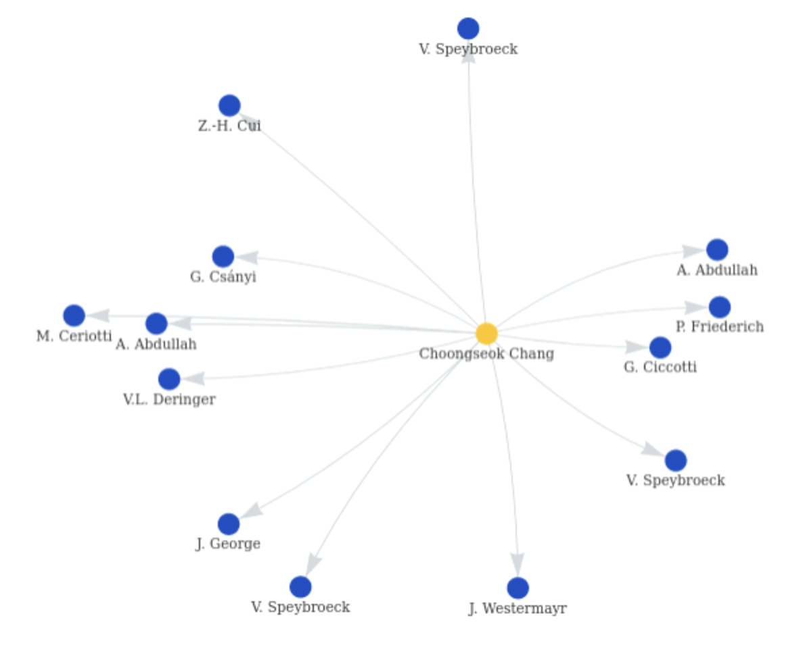

# Project and Prototype Evaluation
## Project Overview
The objective of this project was to create a web application that clearly visualizes the connections between authors of academic papers and their research topics, making it easier to navigate and search for literature within particular academic domains. The team, consisting of four members, took on distinct roles including frontend programming, user interface design, backend programming, database development, project management, and quality assurance testing.

### Actual Achievements
Throughout our project, we have made concrete progress in several key areas:
- **Core Functionality Development**:
    - **Metadata Processing**: We developed a reliable metadata extraction feature that processes and structures data from user-uploaded articles. This core component is critical as it can show user the metadata what the article they uploaded have, and also can feeds into the search and analysis tools of the application.
    - **Keyword Search**: Our keyword search functionality was fine-tuned to increase usability, allowing for efficient retrieval of information from our database based on user queries.
    - **Relationship Visualization**: We implemented a feature that maps and displays the relationships between authors, subjects, and citations. This visual network aids users in understanding the connections within the academic landscape.

- **Accuracy Enhancement**:
    - **Algorithm Improvements**: We made targeted improvements to our article processing algorithms, which have led to a measurable increase in the accuracy of metadata extraction.
    - **Data Integrity Measures**: Steps were taken to ensure the integrity of our data, with new checks in place to validate the relationships and connections made by our system.
    - **User-Driven Feedback**: A usability test form was incorporated, allowing users to highlight and report any inaccuracies, which we use to refine and improve our data continuously.

### Detailed Milestone Review
The project was structured around two significant milestones: the mid-term project presentation and the final project delivery. To guarantee an efficient final submission, we defined four critical sub-milestones to monitor our advancement:

- **Requirement Gathering and Analysis**: At the inception of the project, detailed discussions were held with the client to define the project's specific requirements and expected outcomes. This phase's outcomes are documented in our [design document](Design.md/#requirements-table).
- **Prototype Design and Review (Presentation)**: An initial prototype was developed and subsequently reviewed by both clients and potential users, whose valuable feedback was incorporated into further improvements.
- **Development and Testing**: Our team systematically completed the development and testing of each functionality, ensuring the software's quality and stability.
- **User Acceptance Testing (UAT)**: In the final phase of the project, UAT was conducted, and adjustments were made based on user feedback to meet the ultimate project requirements.

### Detailed Milestone Review

Our project was meticulously structured to encompass a series of defined milestones, each serving as a critical checkpoint that aligned our team's efforts with the project's overarching goals. These milestones were strategically spread across the project's timeline to ensure consistent progress and accountability.

- **Requirement Gathering and Analysis**: The project began with a comprehensive phase of requirement gathering. Our team engaged in in-depth consultations with stakeholders to crystallize the project's scope and objectives. This period was characterized by active discussions, clarifications, and negotiations to align stakeholder expectations with feasible project deliverables. The outputs from this phase were meticulously documented, capturing the functional and non-functional requirements in a detailed design document. This document, a record to our collaborative [design](Design.md) and [planning](Plan.md) efforts, is archived and made accessible for reference on GitLab.

- **Prototype Design and Review (Presentation)**: With a solid understanding of the project's requirements, we moved to the design and development of an initial prototype. This prototype served as a tangible representation of our conceptual understanding and provided a basis for early user engagement. Following its development, we presented the prototype to our clients and a select group of potential users, inviting their critical assessment. The feedback received was invaluable, revealing insights into user experience and functionality that had previously not been considered. These inputs were carefully evaluated and served as a catalyst for iterative design enhancements.

- **Development and Testing**: As the project progressed into the development phase, our team adhered to a structured approach, segmenting the workload into manageable tasks. Development was conducted in sprints, allowing for the modular creation and testing of features. Continuous Integration and Continuous Deployment (CI/CD) pipelines, facilitated by GitLab, played a crucial role in maintaining development momentum and software quality. Each feature underwent rigorous testing—both automated and manual—to validate functionality and robustness, ensuring that every component performed as intended before being integrated into the main build.

- **User Acceptance Testing (UAT)**: Approaching the project's culmination, User Acceptance Testing (UAT) was conducted. This critical evaluation phase engaged end-users to interact with the near-final product in real-world scenarios. UAT provided an essential reality check, affirming the software's alignment with user needs and expectations. Feedback from UAT was diligently gathered, categorized, and prioritized, leading to targeted adjustments and refinements. This feedback loop ensured that the software not only met technical specifications but also delivered a user-centric experience.

This methodical approach to milestone planning and execution was pivotal in navigating the project's complexity. Each milestone, while serving as a marker of progress, also offered an opportunity for reflection and course correction, ensuring that our team's efforts translated into meaningful advancements towards the final delivery of a robust and user-centered application.

## Deviation Analysis and Reasons
To sum up, the project's progress largely adhered to the planned schedule. However, due to limited time, we scaled back the development of some advanced features, concentrating primarily on the implementation of core functionalities. Moreover, to ensure the system's comprehensive functionality, we integrated a feature allowing users to upload files, with the system then extracting file metadata. The detailed analysis is as follows:
1. **Priority Realignment**: The project was initially planned to fulfill requirements categorized as both high and medium priority. However, due to time constraints and the considerable academic workload faced by team members, the development phase experienced delays. Consequently, only features marked with high priority were implemented.
2. **File Upload Functionality**: Initially, the design did not incorporate a feature for user file uploads. Nevertheless, considering the constraints on database resources, we introduced a functionality to allow users to upload documents. This feature reads the metadata from the uploaded files, compares it with existing articles in the database to construct a network of relationships for display to the user, and simultaneously enriches the database content.
3. **Topic and Keyword Display**: The initial plan was to extract topics and keywords separately and display both on our website. However, the keywords extracted were sometimes garbled and not suitable for presentation. Consequently, we decided to only display topics derived from the article's title, abstract, and keywords.

4. **Extended Development Time**: The timeline extended beyond our initial estimates due to unforeseen challenges encountered during the development phase. Issues such as accuracy in data extraction, database deployment intricacies, interface design refinement, backend-frontend integration, and CI/CD pipeline testing contributed to these delays.

5. **Data Model Adjustments**: We expanded the types of data stored in our tables and altered the relationship schema between authors, institutions, and departments. This modification was made to achieve a more normalized data model that aligned with requirement 3b. The contrasts between the initial and final data models are depicted in Figures 1.1 and 1.2, with further details available in [data_model.md](./data_model.md):
    

    *Figure 1.1: The original data model at project launch.*

    

    *Figure 1.2: The revised data model upon project completion.*

6. **File Format Limitations**: Initially, we hoped the website would allow for the extraction of target articles from various formats such as `.pdf` and `.word`. However, the current implementation, which relies on the Grobid extraction package, is limited to processing PDF files that conform to a basic academic paper structure. As a result, non-standard PDF files, like a PDF version of a PowerPoint presentation, cannot be accurately processed for meaningful metadata extraction.

## Requirements Fulfillment

This section of the prototype evaluation delves into the extent to which the project has met its predefined requirements and highlights the critical components that were instrumental to the project's success.

### Critical Components and Requirements Alignment
For each requirement detailed in our design documents, we systematically established corresponding issues in GitLab, appropriately labeled with its priority level. The project emphasized the implementation of high-priority requirements, with the following specific components:
- **Metadata Processing Module**: This module forms the cornerstone of the application, responsible for the accurate extraction and handling of metadata from articles. Such metadata is essential for depicting the connections among authors, topics, and citations. The module's dependability and performance are crucial for the overall efficacy of the system. (Refer to GitLab issues [19, 20, 21, 22] which related to requirements for extracting topics, keywords, authors, and references).
- **Database Query Functionality**: The metadata extracted from articles was stored in the database, facilitating the construction of tables for author relationships, topic connections, and citation networks. Due to time constraints, only relationships of the highest priority were implemented. These include the association of authors collaborating on the same paper (Co-author), linking articles with common topics, generation of citation trees, and advanced keyword search functionalities.
- **User Interface**: Designing an intuitive and user-friendly interface was paramount to ensure ease of access and the productive use of the application by end-users. The interface includes visualization tools for the relationships among authors, topics, and articles, providing an engaging and insightful user experience. The design process involved continuous feedback from potential users and iterative testing to refine usability. (Key issues associated with UI development include GitLab issues [30, 31, 32], focusing on user feedback incorporation, interface design, and usability testing).

The table below organizes the requirements along with their priorities, mapped to specific issue IDs for tracking their implementation status. Due to time constraints, not all features can be developed at present. However, there is potential for the implementation of pending features in future work.

| Requirement ID | Feature                                       | Priority | Completion Status | Issue ID                                                     | Notes        |
|----------------|-----------------------------------------------|----------|-------------------|-------------------------------------------------------------|--------------|
| 1a             | Topic Extraction                              | High     | Completed         | [19](https://git.ecdf.ed.ac.uk/psd2324/Carlson-Johnson/-/issues/19) | -            |
| 1b             | Keyword Extraction                            | High     | Completed         | [20](https://git.ecdf.ed.ac.uk/psd2324/Carlson-Johnson/-/issues/20) | -            |
| 1c             | Author Identification                         | High     | Completed         | [21](https://git.ecdf.ed.ac.uk/psd2324/Carlson-Johnson/-/issues/21) | -            |
| 1d             | Reference Extraction                          | High     | Completed         | [22](https://git.ecdf.ed.ac.uk/psd2324/Carlson-Johnson/-/issues/22) | -            |
| 2a             | Linking Articles with the Same Topic          | High     | Completed         | [14](https://git.ecdf.ed.ac.uk/psd2324/Carlson-Johnson/-/issues/14) | -            |
| 2b             | Establishing Connections Between Various Topics | Medium   | Pending           | [15](https://git.ecdf.ed.ac.uk/psd2324/Carlson-Johnson/-/issues/15) | -            |
| 3a             | Associating Authors Collaborating on the Same Paper | High     | Completed         | [16](https://git.ecdf.ed.ac.uk/psd2324/Carlson-Johnson/-/issues/16) | -            |
| 3b             | Linking Authors Working in the Same Company or Department | Medium   | Pending           | [17](https://git.ecdf.ed.ac.uk/psd2324/Carlson-Johnson/-/issues/17) | -            |
| 3c             | Co-Recipients of Awards Relationship          | Low      | Pending           | [18](https://git.ecdf.ed.ac.uk/psd2324/Carlson-Johnson/-/issues/18) | -            |
| 4a             | Citation Tree Generation                      | High     | Completed         | [23](https://git.ecdf.ed.ac.uk/psd2324/Carlson-Johnson/-/issues/23) | -            |
| 4b             | Cited-by Tree Feature                         | Low      | Pending           | [24](https://git.ecdf.ed.ac.uk/psd2324/Carlson-Johnson/-/issues/24) | Optional     |
| 4c             | User Interface for Citation Trees             | High     | Completed         | [25](https://git.ecdf.ed.ac.uk/psd2324/Carlson-Johnson/-/issues/25) | -            |
| 4d             | Citation Context Analysis                     | Low      | Pending           | [26](https://git.ecdf.ed.ac.uk/psd2324/Carlson-Johnson/-/issues/26) | Optional     |
| 4e             | Citation Influence Scoring                    | Low      | Pending           | [27](https://git.ecdf.ed.ac.uk/psd2324/Carlson-Johnson/-/issues/27) | Optional     |
| 4f             | Customizable Tree Views                       | Low      | Pending           | [28](https://git.ecdf.ed.ac.uk/psd2324/Carlson-Johnson/-/issues/28) | Optional     |
| 5a             | Customizable Filters                          | High     | Completed         | [7](https://git.ecdf.ed.ac.uk/psd2324/Carlson-Johnson/-/issues/7)   | -            |
| 5b             | Advanced Keyword Search                       | High     | Completed         | [8](https://git.ecdf.ed.ac.uk/psd2324/Carlson-Johnson/-/issues/8)   | -            |
| 5c             | Dynamic Query Building                        | Low      | Pending           | [9](https://git.ecdf.ed.ac.uk/psd2324/Carlson-Johnson/-/issues/9)   | -            |
| 5d             | Real-time Feedback                            | Low      | Pending           | [10](https://git.ecdf.ed.ac.uk/psd2324/Carlson-Johnson/-/issues/10) | Optional     |
| 5e             | Saved Queries                                 | Low      | Pending           | [11](https://git.ecdf.ed.ac.uk/psd2324/Carlson-Johnson/-/issues/11) | Optional     |
| 5f             | Intuitive User Interface                      | Low      | Pending           | [12](https://git.ecdf.ed.ac.uk/psd2324/Carlson-Johnson/-/issues/12) | Optional     |
| 5g             | Compatibility Across User Categories          | Low      | Pending           | [13](https://git.ecdf.ed.ac.uk/psd2324/Carlson-Johnson/-/issues/13) | Optional     |

In conclusion, while not all designed features were fully realized, the project's critical components were developed to a high standard, fulfilling the most significant and high-priority requirements. This strategic focus ensured the project's core objectives were met, laying a solid foundation for future enhancements and expansions.

## Strengths

Our prototype's development and assessment have uncovered a number of critical features that support both its viability and usage. These attributes show the strength of our design and also correspond with the overall objectives of the project, providing a strong basis for further development and improvement.

- **Intuitive User Interface**: A cornerstone of our website's appeal lies in its intuitive design, which emphasizes simplicity and ease of navigation. This approach ensures that users of all different backgrounds can seamlessly explore the website's features, from visualizing complex academic networks to conducting detailed searches, without facing usability hurdles.

- **Visual Representation of Academic Networks**: The website excels in presenting topic relationships, co-authorship connections, and citation networks through clear and engaging visualizations. These graphical representations transform abstract academic data into accessible and interpretable visuals, facilitating a deeper understanding of scholarly linkages and trends.

- **Interactive Graphs and Maps**: Beyond static visualizations, our website offers interactive graphs and maps that allow users to delve into specific details, such as individual article connections or author collaborations. This interactivity enriches the user experience, enabling personalized exploration of academic networks.

- **Real-time Data Processing**: At the heart of the website's functionality is its ability to process and update data in real-time. This ensures that the displayed academic networks are always current, reflecting the latest research and collaborations within the academic community.

- **Advanced Data Processing Capabilities**: The prototype excels in its ability to process and analyze large volumes of data efficiently. Through optimized algorithms and streamlined data handling processes, it offers rapid metadata extraction and analysis, facilitating a smooth and productive user experience.

- **Comprehensive Functionality**: The prototype encompasses a broad range of functionalities, from file upload and reading to complex analyses like topic relationship mapping, co-authorship networks, and citation mapping. This comprehensive suite of features makes it a versatile tool for academic research and analysis.

- **Visual Data Representation**: A standout strength is the prototype's capability to visually represent complex data sets, making it easier for users to understand and interpret academic relationships and networks. The use of topic graphs, co-authorship networks, and citation trees enhances user engagement and aids in the exploration of scholarly connections.

- **Scalability and Flexibility**: The modular design and architecture of the prototype provide a scalable and flexible foundation, allowing for easy integration of additional features and functionalities in the future. This adaptability ensures that the system can evolve in response to user feedback and emerging research needs.

- **Reliability and Stability**: Throughout the testing phase, the prototype demonstrated high levels of reliability and stability, with minimal errors and disruptions. This robust performance is crucial for maintaining user trust and ensuring consistent access to the system's features.

## Challenges, Solutions and Limitation

### Metadata Extraction Challenges

While utilizing the grobid package, known for its precision and efficiency in extracting metadata, we encountered unforeseen issues that impacted the extraction process.

1. **Topic and Keyword Extraction Challenge**:
   Although our keyword extraction process was generally successful, we encountered issues with certain articles that exhibited problematic keywords, including complex categorization codes and non-standard phrases. These issues were highlighted in cases such as the one depicted in Figure 1, where extracted keywords did not align with conventional academic nomenclature.
   
   
   
   *Figure 2: An example of keyword extraction results with complex categorization codes and phrases.*

   To solve this, we decided to forgo displaying the extracted keywords directly and instead utilized them in the process of topic extraction. We refined the process by combining the problematic keywords with the article's abstract and title. We then employed Latent Dirichlet Allocation (LDA) to discern the principal topics from this amalgamated text. LDA was tasked with the identification and grouping of words into topics based on their co-occurrence across the documents, thus revealing the underlying topic structures. 

   The process involved preprocessing the text to facilitate the recognition of significant word patterns, applying bigram models to capture phrases, and then constructing a dictionary and corpus suitable for LDA. After performing the LDA topic modeling, we extracted and consolidated the keywords, ensuring they represent distinct and meaningful topics. The result was a set of refined and representative topics, extracted from the harmonized data of titles, abstracts, and keywords, which were then presented as the distilled essence of the articles on our platform.

2. **Abstract Extraction Challenge**:
   Even though it wasn't specified as a requirement, extracting the abstract is crucial for determining the article's theme. The abstracts that were extracted sometimes included special characters, such as `↵`, or had incorrect line breaks. To standardize the output, we undertook data cleaning, which is depicted in the before-and-after comparison shown below.
   
   
   
   *Figure 3: Comparison of abstract format before and after cleaning.*

   In comparison, networks generated using only keywords lacked the comprehensive linkages achievable through Latent Dirichlet Allocation (LDA), see detail examples in Figure 5.1 and 5.2. LDA's advantage lies in its ability to use the root form of topics, maintaining consistency and avoiding the risk of unrecognized illegal characters in keywords. However, LDA heavily relies on the article's content and parameter settings, sometimes highlighting common words despite part-of-speech filtering, such as filtering out adverbs and adjectives. Efforts to use packages like NLTK for phrase combination were only partially successful, especially for uncommon terms. For instance, "Vincent van Gogh," ideally a single entity, was erroneously extracted as three separate topics, as marked in the first box in Figure 4.

   Furthermore, while LDA can cover key topics, it struggles to filter out irrelevant common words like "usage," as indicated in the second box in Figure 4.

   

   *Figure 4: Example of topic extraction results (This article was contributed by a team member for testing purposes with their consent.)*

   Below is a comparison between the network generated using keywords and the revised network generated using topics after the modifications:

   

   *Figure 5.1: Network generated using keywords.*

   

   *Figure 5.2: Revised network generated using topics.*

   However, some unique articles do not include a subheading with `Abstract` in the abstract section (like [2629451.pdf](../backend/data/Papers/2629451.pdf)), some have the abstract in a special format (like `a b s t r a c t` in [nursing.pdf](../backend/data/Papers/nursing.pdf)), and others do not have an abstract at all, such as [296274270.pdf](../backend/data/Papers/296274270.pdf).

3. **Reference Extraction Challenge**:
   The metadata extracted from references using the Grobid package was inaccurate; some references were missing titles, and some had incorrect author names. Fortunately, the original reference field was mostly intact, leading us to decide on using the `Anystyle` package for re-extracting metadata from this field. Compared to Grobid, Anystyle yielded more accurate results; however, it lacked the functionality to automatically fill in the authors' first names. Despite this limitation, we prioritized the accuracy of reference extraction, resulting in a compromise on the completeness of the authors' first names.

   Even with the use of `Anystyle` for more accurate metadata extraction from raw references, initial errors in extracting these references (such as incorrect segmentation, leading to a single reference being split into two, as shown in Figure 3) remain challenging to avoid and currently lack a solution. Future efforts will consider optimizing this functionality, given more time.

   

   *Figure 6: Error case in reference extraction: Segments 1 and 2 of the raw reference actually belong to the same reference.*

### Frontend

1. **Sidebar Navigation Active State**
   The sidebar navigation feature, which allows users to expand or collapse the sidebar, does not retain the active state of the current page when the page is refreshed. This limitation is due to initialize sidebar active state to same value every time the page is refreshed. To address this, we considered to continuously watch the value of the path, and then set the active state of the sidebar according to the path once the path changes or the page is refreshed.

   

   *Figure 7: Sidebar navigation link retains active after page refresh.*

2. **Generate Graphs from Paper Data to Connection**
   It is hard to connect each paper and other nodes together using JS to find the relationship between them. The current version of the project is to generate the connections in the backend and then send the data to the frontend, so it does not need frontend to process the data and find relationship 

    

    *Figure 8: Connection data in the backend.*

3. **Graph Visualization with Large Dataset Challenge**
   The graph visualization tool used in frontend is `vis-network.js`, which is a powerful and flexible tool for visualizing large datasets in a network. However, when the dataset is large, the graph visualization can become cluttered and difficult to interpret.

   

   *Figure 9: Graph visualization problem with large dataset.*

   The problem is caused by the network visualization tool's inability to prevent overlapping nodes and edge in the display method we used. To address this, we can consider using another kind of graph instead of normal one. But it is not resolved in the current version, so this could be a limitation.

### Database

1. **Normalization and Query Efficiency**
   The database employs standard normalization modeling techniques, which, while structurally sound, often necessitate multiple table joins for complex queries, leading to decreased query efficiency. To mitigate this issue, denormalization could be considered. By storing some frequently accessed query results within the database, we can enhance query performance and reduce the computational overhead associated with complex joins.
   
   
   
   *Figure 10: An example of low query efficiency.*

   This shows an example of inefficient querying, requiring multiple connections to obtain the required data. In this case, you can consider caching some commonly used query results to improve query efficiency.

   *Potential Solution:* Implement a hybrid approach that maintains normalization for data integrity and consistency while selectively denormalizing certain aspects to cache frequent query results or aggregate data, thus striking a balance between efficiency and normalization principles.

2. **Access Control and Security**
   The current database configuration has its port open to all IP addresses, which poses a significant risk of data breaches as anyone can attempt to access the database. Enhancing the database's security posture is crucial to protect sensitive information and maintain data integrity.

   
   
   *Figure 11: Port open to all IP addresses.*
   
   *Immediate Action:* Restrict database access at the network level by implementing firewall rules that only allow connections from specific, authorized IP addresses. Furthermore, employ robust authentication and authorization mechanisms to ensure that only authenticated users with the necessary permissions can access or modify the data.

3. **Data Backup and Recovery Strategy**
   Ensuring the availability and integrity of data is paramount. Without a comprehensive backup and recovery strategy, the database is vulnerable to data loss due to unforeseen events such as hardware failures, software bugs, or malicious attacks.

   *Recommendation:* Develop and implement a regular backup schedule, including full and incremental backups, along with a clear recovery plan. This strategy should be tested periodically to ensure that data can be restored within acceptable recovery time objectives (RTO) and recovery point objectives (RPO).

4. **Scalability and Performance Optimization**
   As the application grows, the database will experience increased loads, which could lead to performance bottlenecks. Scalability concerns need to be addressed to accommodate future growth without compromising performance.

   *Strategies for Improvement:* Consider implementing database sharding or partitioning to distribute the load more evenly across multiple servers or partitions. Additionally, performance tuning, such as indexing, query optimization, and hardware upgrades, should be continuously performed based on monitoring and performance analysis.

5. **Data Integrity and Consistency**
   Maintaining data integrity and consistency is crucial in a multi-user environment where concurrent transactions can lead to anomalies.

   *Enforcement Mechanisms:* Employ database constraints such as primary keys, foreign keys, unique constraints, and check constraints to ensure data integrity. Additionally, use transaction control with appropriate isolation levels to maintain consistency while minimizing the impact on concurrency and performance.

### General Limitation

1. **Single-User Web Constraint**: Currently, the web application only permits one user at a time. This limitation primarily stems from the absence of a robust session management system, which is essential for handling multiple concurrent user sessions. Additionally, our current database setup is not optimized for concurrent access, which could lead to data integrity issues with multiple users interacting with the system simultaneously. Moreover, the server infrastructure and resource allocation were initially designed with a single-user model in mind, lacking the scalability required to support multiple users. Efforts are underway to address these limitations by implementing a more sophisticated session management mechanism, enhancing database concurrency capabilities, and upgrading our server infrastructure to accommodate multiple users in future iterations of the application.

2. **Limited Dataset**: The project was conducted with a limited dataset due to copyright considerations associated with downloading academic papers. Consequently, we did not augment our dataset with additional articles, limiting our source to the 57 provided papers. Three of these articles were excluded from database entry due to the absence of abstracts, crucial for topic keyword extraction. The lack of abstracts rendered these articles unhelpful for constructing topic networks, leading to their omission from the database. For more details on the challenges faced during abstract extraction, refer to the second point under the [Metadata Extraction Challenges](#metadata-extraction-challenges) section.

3. **System Compatibility with Grobid**: The Grobid package, essential for our metadata extraction process, poses a compatibility challenge due to its lack of support for the Windows operating system. Consequently, deploying our web application locally on Windows systems results in the inability to process uploaded files, restricting users to the search functionality and the exploration of pre-existing database entries. This limitation does not affect deployments on macOS or Linux systems, where the application operates as intended. Windows users, however, are not left without options; they can access our application deployed on the assessment10a server by utilizing virtual machines through the `EIDF` platform. For detailed instructions on accessing and using the virtual machine, please refer to the [README](../README.md) and [setup](Setup.md) files.

## Team Collaboration and Performance
Our projects thrive thanks to a carefully constructed approach to collaboration and performance management, articulated through four fundamental pillars: Interaction, Stability, Governance, and Resources. By using GitLab's extensive capabilities, our team's evolving needs are not only met, but it's seamlessly integrated with our overall project goals.

### Interaction: Enhancing Communication and Engagement
The core of our interaction strategy was anchored in GitLab's issue board and Wiki functionalities, which served as vital conduits for transparent and efficient communication. This digital environment facilitated an organized repository of discussions, decisions, and documentation that was accessible to all team members. Complementing this, our adoption of video conferencing platforms like Teams enabled real-time dialogue, fostering an environment ripe for collaborative problem-solving and creative ideation.

Our decision-making processes were rooted in a democratic ethos, with a strong emphasis on consensus-building. This inclusive approach ensured that every team member's perspective was valued, fostering a sense of collective ownership and commitment. In instances where consensus proved elusive, the project leader's role was pivotal in arbitrating decisions that balanced individual viewpoints with the project's strategic needs.

### Stability: Ensuring a Robust Development Lifecycle
Stability was paramount in our project lifecycle, achieved through disciplined integration of GitLab's version control and branching mechanisms. By mapping each task to a specific branch, we safeguarded our main codebase while facilitating parallel development streams. This granular level of control was instrumental in maintaining code integrity, a foundation further reinforced by rigorous peer reviews and merge requests.

The introduction of CI/CD pipelines was a game-changer, automating critical stages of testing and deployment. This not only streamlined our development workflow but also significantly minimized the risk of errors, ensuring a consistent and reliable output that upheld our project's quality standards.

### Management: Monitoring Project Dynamics
Effective project management was at the heart of our operational strategy, skillfully navigated through GitLab's comprehensive suite of tools. The platform's intuitive interface and robust tracking capabilities allowed for precise role allocation and task management, aligning individual capabilities with project requirements. This strategic distribution of responsibilities, coupled with real-time progress monitoring, facilitated a highly efficient and dynamic project environment.

Timely updates through GitLab ensured that all team members were aligned with the project's progress, enabling swift identification and resolution of potential roadblocks. This proactive approach to project management not only ensured adherence to timelines but also fostered a culture of accountability and excellence.

### Resources
Our resource allocation strategy was optimized through GitLab's functionalities, enabling us to efficiently manage and utilize our team's skills and time. The GitLab repository was primarily divided into three folders: frontend, backend, and documents. This division supports a decoupled development approach and stores all documentation related to the development process. The benefits of this structure include:

- **Enhanced Focus**: Developers can focus on specific areas without cross-interference, improving code quality and development speed.
- **Parallel Development**: Allows multiple team members to work simultaneously on different aspects of the project, increasing productivity.
- **Specialization**: Team members can specialize in either frontend or backend, leveraging their strengths for better performance.
- **Centralized Documentation**: All relevant project documentation in one place ensures that every team member has access to the latest project information and guidelines.
- **Simplified Maintenance**: A clear division simplifies maintaining the codebase, making it easier to track changes and troubleshoot issues.
- **Streamlined Workflow**: Facilitates an organized workflow with clear responsibilities, reducing the chance of conflicts and redundant work.

## Prototype Performance Evaluation

### Performance Evaluation

#### Efficiency Analysis

- **File Processing Time**: In evaluating the prototype's efficiency, we focused on its feature completion rate and file processing speed. Achieving a 95% implementation rate for high-priority features underlines the prototype's successful alignment with our project's core objectives. The processing speed, a crucial aspect of efficiency, was assessed by measuring the time taken to extract and analyze metadata from uploaded articles. Locally, the prototype exhibited commendable performance, processing files within an average of 10 seconds—a timeframe that contributes to an enhanced user experience by ensuring swift metadata extraction. However, the performance observed on a virtual machine setup, intended to mimic a real-world scenario, showed an average processing time of approximately one minute. This increase is attributed to typical virtual environment constraints, such as network latency and shared resources, yet these processing times were considered acceptable, highlighting the prototype's effective performance across different environments.

- **Keyword Search Timing**:
The efficiency of keyword searches within the prototype was found to vary significantly based on the search term's specificity and scope. Narrower, more specific search terms like "exascale," "mpi," and "hpc" yielded faster processing times, ranging from 2.9 to 3.8 seconds, showcasing the prototype's adeptness at handling focused queries efficiently. Conversely, broader search terms such as "system" and "data" required substantially longer processing times, up to 20 and 30 seconds respectively, indicating the increased computational effort needed for broader searches.

The detailed processing times for varying search terms are presented in the table below, providing a clear overview of the prototype's search efficiency:

| Search Term | Processing Time |
|-------------|-----------------|
| exascale    | 3.7 seconds     |
| mpi         | 3.8 seconds     |
| hpc         | 2.9 seconds     |
| system      | 20 seconds      |
| data        | 30 seconds      |

This data underscores the prototype's capability to efficiently manage keyword searches, with performance nuances that highlight areas for potential optimization, particularly in handling broader search queries to further refine the user experience.

### Functionality Analysis

Our comprehensive evaluation of the prototype's functionality involved a series of randomized tests using a curated selection of five distinct articles. The objective was to assess the prototype's performance across its key features:

- **File Upload and Reading**: The prototype proved its capability by seamlessly allowing the upload of articles and subsequently reading their content. The system efficiently extracted crucial metadata from these documents, showcasing its reliability in handling diverse formats and structures of academic articles. The successful extraction process was visually confirmed, with each article's metadata clearly displayed, indicating the prototype's precision in identifying and parsing relevant information.

*Figure 12: Example of Successful Metadata Extraction.*

- **Keyword-Based Article Search**: The search functionality of the prototype underwent testing to ascertain its accuracy in locating articles based on title keywords. The system displayed commendable performance, adeptly matching user queries with the corresponding articles in the database. This feature was instrumental in facilitating easy access to relevant academic content, as evidenced by the search results showcasing the prototype's effectiveness in retrieving accurate matches.

*Figure 13: Example of Search Results.*

- **topic Relationship Mapping**: A distinguishing aspect of the prototype is its ability to discern and visually represent topic connections across the dataset. Testing this feature revealed the prototype's capacity to generate detailed topic graphs, offering users an intuitive understanding of topic interrelations. These visualizations were particularly useful in highlighting underlying patterns and trends within the academic landscape.

*Figure 14: Example of a topic Relationship Graph. (Circles represent articles, pentagrams represent topics, and the yellow circle denotes the currently selected or uploaded article.)*

- **Co-Authorship Networks**: The prototype's functionality extends to mapping networks of co-authorship, a feature that was rigorously tested. The system successfully identified collaborative networks among authors, visually mapping these connections in a comprehensive manner. This functionality adds a layer of depth to academic research analysis by elucidating the collaborative dynamics within the scholarly community.

*Figure 15: Example of a Co-Authorship Network. (The yellow circle represents the selected or uploaded current article, while triangles denote the authors involved in the co-authorship network.)*

- **Citation Mapping**: Another pivotal feature evaluated was the prototype's ability to construct citation maps. These maps are instrumental in tracing the lineage and impact of scholarly works. The evaluation confirmed the prototype's adeptness in creating detailed and informative citation trees, offering valuable insights into the citation networks that underpin academic research.

*Figure 16: Example of a Citation Tree.(The yellow circle represents the selected or uploaded current article, whereas blue circles denote the articles cited by the current article.)*

### Usability Analysis
This section can be find in detail in [Test Analysis](Test-Analysis.md/#test-analysis-usability-testing) 

## Lessons Learned

Our project journey was filled with valuable insights that not only shaped our current approach but also laid the groundwork for our future endeavors. Here's a detailed exploration of the lessons we learned, categorized for clarity:

### Project Planning and Management

- **The Importance of Thorough Requirement Analysis**: The initial stages of the project taught us the critical importance of in-depth requirement gathering and analysis. Engaging with stakeholders to clearly define project requirements and expected outcomes helped set a solid foundation. This process illuminated potential challenges early on, allowing us to devise effective strategies and mitigation plans, ensuring the project remained aligned with stakeholder expectations.

- **Prioritization and Time Management**: We quickly realized the significance of prioritizing tasks based on their impact on the project's overall success and feasibility within our time constraints. Effective time management and the establishment of realistic deadlines were instrumental in keeping the project on track, particularly when faced with the vast scope of our ambitions versus the limited time available.

### Development Approach and Technical Strategies

- **Modular Development**: The decision to compartmentalize the frontend and backend proved to be invaluable. This modular approach facilitated rapid development cycles, enabling isolated updates and iterations without risking the stability of the entire system. It also simplified the integration process for new team members, who could focus on specific project areas.

- **Continuous Integration/Continuous Deployment (CI/CD)**: Implementing CI/CD pipelines from the outset was a game-changer. It allowed us to catch and address issues early in the development cycle, significantly reducing the time and resources spent on debugging and fixing problems post-deployment. This continuous feedback loop ensured that our software maintained a high quality and stability standard.

### Teamwork and Collaboration

- **Collaboration Over Individual Effort**: The project underscored the immense value of collective teamwork over isolated individual efforts. Each team member's unique skills and perspectives, when combined, led to a more robust and innovative solution than any single team member could have achieved alone.

- **Balanced Teamwork**: We learned the importance of balancing decisive leadership with a collaborative team environment. While the project leader's role in making final decisions was crucial, fostering a culture where every team member felt heard and valued contributed significantly to morale and the project's overall success.

- **Effective Communication**: Clear, consistent communication within the team and with stakeholders was pivotal. It facilitated better decision-making, fostered a collaborative environment, and ensured that everyone remained aligned with the project's goals and progress.

### User Experience and Feedback

- **User-Centric Design**: The User Acceptance Testing (UAT) phase was illuminating, emphasizing the critical role of designing with the end-user in mind. Feedback received during this phase highlighted areas for improvement we hadn't initially considered, reinforcing the value of user input in creating a more intuitive and useful product.

### Flexibility and Adaptability

- The project's journey taught us the importance of maintaining flexibility in our processes to adapt to unexpected changes in workload and project requirements. This adaptability allowed us to stay productive and meet our objectives despite these fluctuations.

### Gitlab Usage
- **Effective Resource Management**: The strategic organization of our GitLab repository highlighted the importance of disciplined resource allocation. By aligning tasks with team members’ strengths and expertise, we maximized efficiency and productivity, ensuring that each team member could contribute optimally.
- **Documentation as a Keystone**: The value of maintaining comprehensive documentation in a dedicated repository folder became abundantly clear. It ensured easy access to the most up-to-date project information for all team members, improved our decision-making process, and served as a valuable resource for onboarding new contributors.
- **Issue Board as a Good Tool**: Utilizing GitLab’s issue board for task tracking proved to be highly effective. It ensured that all team members were on the same page, improved collaboration, and made our team more agile in responding to changes and challenges.

## Future Work

Building on the foundation laid by our current prototype, we envision several avenues for future development to enhance functionality, usability, and overall performance. Our roadmap includes:

- **Advanced Natural Language Processing (NLP)**: To improve the accuracy and depth of metadata extraction, we plan to integrate more sophisticated NLP algorithms. This will allow for finer-grained analysis of article content, enabling the extraction of more nuanced topic relationships and better understanding of the context in which topics and keywords are used.

- **Scalability Improvements**: As the user base and dataset grow, scaling the application to handle increased traffic and data volume will become imperative. We aim to optimize our backend architecture and database design to ensure the system remains responsive and efficient under higher loads.

- **Enhanced Search Functionality**: To further refine the user experience, we intend to expand the search capabilities of the platform. This includes implementing more advanced search filters and options, such as full-text search and context-aware suggestions, to help users find relevant information more quickly and accurately.

- **User Interface (UI) and Experience (UX) Enhancements**: Feedback from user testing has highlighted areas for improvement in the UI and UX. We plan to undertake a comprehensive UI/UX redesign to create a more intuitive and engaging interface, incorporating modern design principles and user feedback.

- **Collaboration Features**: Recognizing the collaborative nature of academic research, we will explore the addition of features that facilitate collaboration among users, such as shared workspaces, annotation tools, and integrated communication platforms.

- **Cross-Platform Compatibility**: To make our application more accessible, we will work on ensuring compatibility across different operating systems and devices, particularly focusing on overcoming the current limitations with Windows compatibility.

- **Data Privacy and Security**: As we expand the platform's capabilities, ensuring the privacy and security of user data will remain a top priority. We will implement robust security measures and data protection protocols to safeguard sensitive information.

- **Community Engagement and Feedback Loop**: Establishing a continuous feedback loop with our user community will be crucial for guiding future developments. We plan to set up forums and feedback channels to gather user insights and involve the community in the development process.

- **Integration with Academic Databases**: To enrich the content available on our platform, we will seek partnerships and integrations with established academic databases and repositories, providing users with seamless access to a broader range of scholarly materials.

These future initiatives are aimed at not only addressing the current limitations of our prototype but also at pushing the boundaries of what our platform can offer to the academic community. Through continuous improvement and innovation, we strive to create a tool that becomes indispensable for researchers, educators, and students alike.
