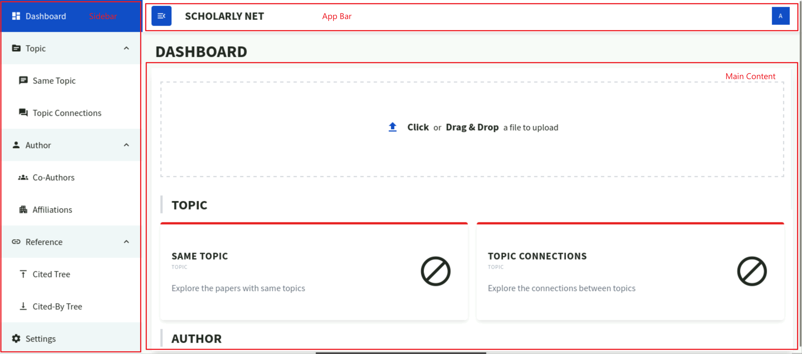
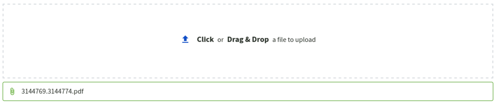
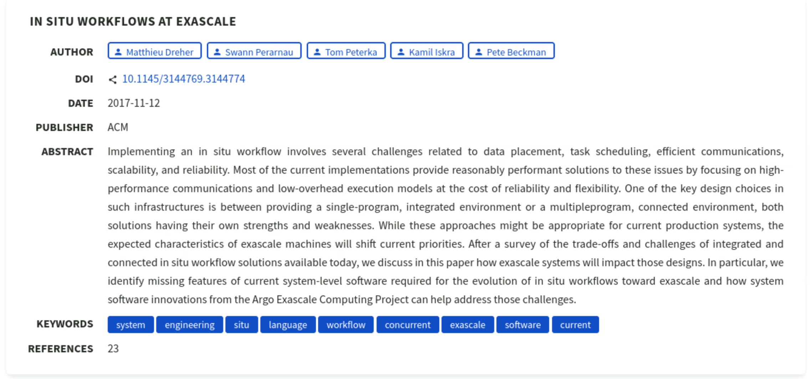
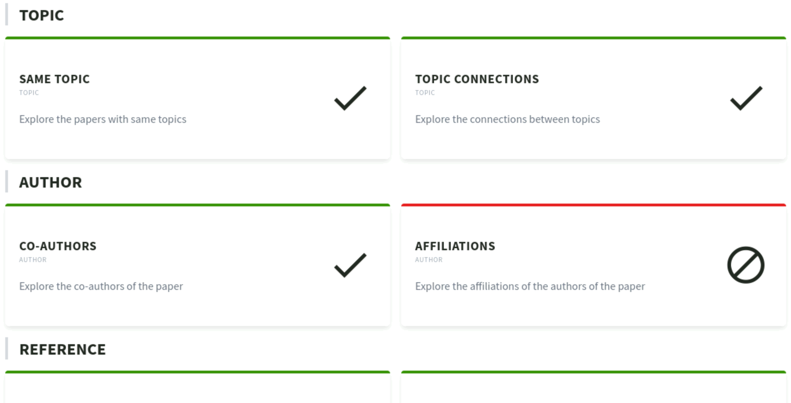
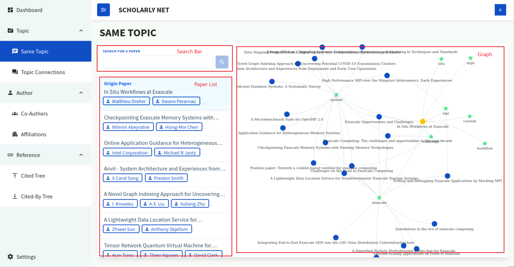
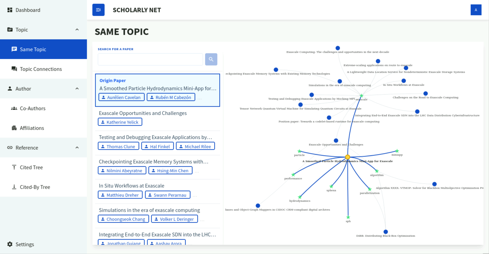
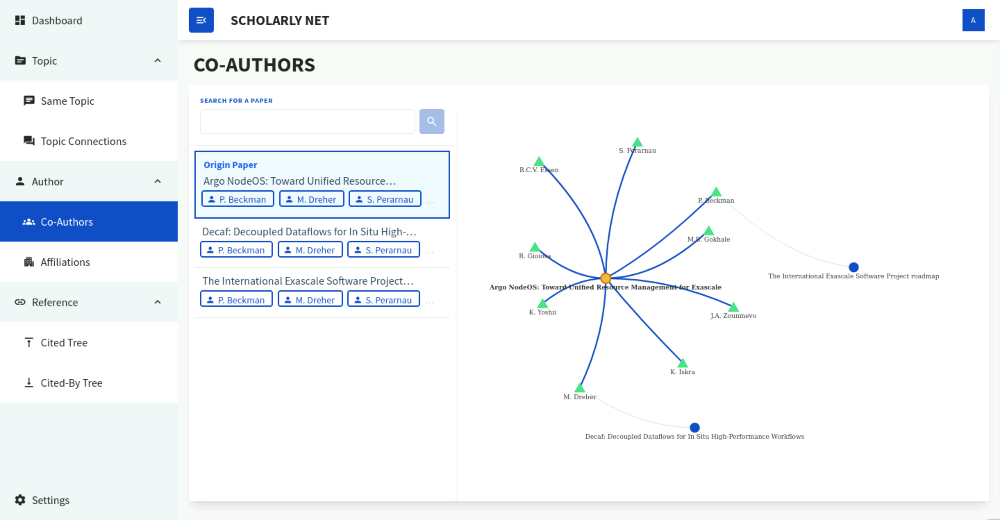
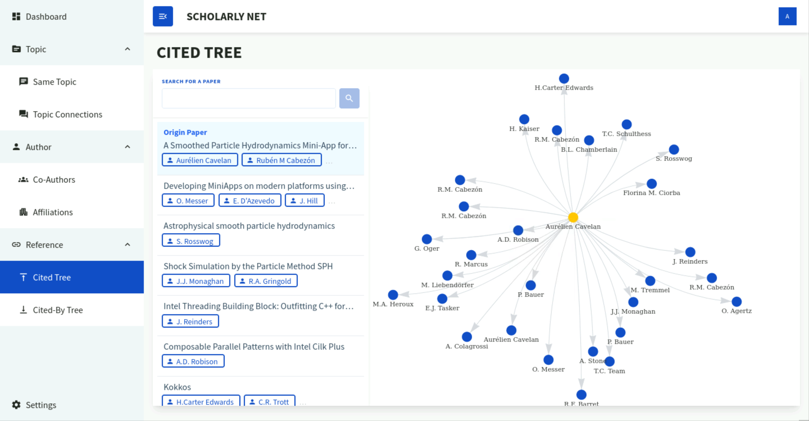

# Guide on how to use the application

*This guide will help you understand how to use the application.*

Our application is a tool that helps you find out the connections between different academic papers in three fields: 
Topic, Author, and Reference. The connections are visualized in a graph, where each node represents a paper and each
edge represents a connection between two papers.

## Getting Started
Our application is hosted on EIDF, so you can access it from the device that has access to it.

To get started, our application's layout is divided into three sections: the sidebar, the app bar, and the main content.

*Figure 1: Base Layout*

- **Sidebar**, located on the left side of the application, contains the clickable navigation links to different pages
of the application, and all these links are divided into four categories with each containing a few sub-links. You can 
expand or collapse each category by clicking on the category name, and the system will remember your choice.
- **App Bar**, located on the top of the application, contains the title of the application and the user's
profile(disabled). There is a button on the left side
of the app bar that can be used to expand or collapse the sidebar, and the system will remember your choice.
- **Main Content**, located on the bottom right of the application, is where the main content of the application is displayed. The content will change according to the navigation link you clicked on the sidebar.

## Dashboard
The Dashboard page is where you can upload your own papers for analysis.

The page is divided into three sections:
- **File Upload**: 
  - It is a gray dotted box on the top of the content section, with a text "Click or Drag & drop a file to upload".
  - This is where you can upload your papers by dragging and dropping them into the box, or by clicking the box to open
a file explorer.
  - The file should be in the format of a .pdf file or .docx file.
  - You can only upload one file at a time. New file will replace the old one.
    
    *Figure 2: File Upload Box*
- **Paper Information**: 
  - It is a card right below the file upload box.
  - This section only appears after you upload a file and system finishes processing the file.
  - This is where you can see the information extracted from the paper, such as the title, doi, and authors.
    
    *Figure 3: Paper Information Card*
- **Link Cards**: 
  - These are cards at the bottom of the content section, with initial stripes of red and 'blocked' icons.
  - These cards are the links that will navigate you to different analysis pages by clicking on them.
  - When no file is uploaded, the cards are marked in red. At this time, clicking on the cards will only navigate you
to relevant pages.
  - When a file is uploaded and analyzed, some of the cards will turn green, indicating that these parts of connections
visualization are available from the uploaded paper. Clicking on these green cards will navigate you to relevant
pages and generate the visualization directly from your paper, while clicking on the red cards acts the same as before.
    
    *Figure 4: Link Cards*

To use this page:
1. Click on the cards to navigate to different analysis pages.
2. Click on the box to open a file explorer and select a pdf or docx file, or drag and drop a file into the box.
3. Wait for the system to finish processing the file.
4. Check the paper information and click on the cards to navigate to different analysis pages.
5. Upload a new file to replace the old one if needed.

## Graph Pages
All other pages except the Dashboard page are graph pages. These pages are where you can see the connections between
different papers in a graph.

*Figure 5: Graph Page*

The page is divided into three sections:
- **Search Bar**: 
  - It is a search bar on the top left of the content section, with a blue search icon button on the right side.
  - This is where you can search for papers by their title.
  - By clicking on the search button or press 'ENTER' key, the system will search for papers that contain the keyword
in their title and display them in list in a pop-up window.
  - By clicking on the paper in the list, the pop-up window will close and the system will start to generate the graph.
- **Papers List**: 
  - It is a list on the left side of the content section, only shows up after the graph is generated. 
  - All the papers that are currently in the graph are displayed in this list after the graph is generated.
  - Clicking on one of the paper in the list will highlight that paper and its connections in the graph.
- **Graph**: 
  - It is a blank canvas on the right side of the content section, only shows up after the graph is generated.
  - This is where the graph is displayed.
  - You can drag the node or the graph to move it around, zoom in or out by scrolling the mouse wheel.
  - Hovering over a node will display the title and authors(if available) of that paper.
  - Clicking on a node will highlight its connections and that paper in the list.

To use these pages:
1. Type in title keyword in the search bar and press 'ENTER' key or click on the search button to search for papers.
2. Click on the paper in the list in the pop-up window to start generating the graph.
3. Click on the paper or the node to highlight it and its connections in the graph.
4. Search for another paper to generate another graph if needed.

### Same Topic Graph
It is a network graph. The yellow circle node is the original paper you searched for, the green star node is the topic
of the original paper, and the blue circle nodes are the papers that share the same topics with the original paper.

*Figure 6: Same Topic Graph*

### Topic Connection Graph
Still in development.

### Co-Author Graph
It is a network graph. The yellow circle node is the original paper you searched for, the green triangle nodes are the
authors of the original paper, and the blue circle nodes are the papers that some of these authors had also written
together.

*Figure 7: Co-Author Graph*

### Affiliation Graph
Still in development.

### Cited Tree Graph
It is a tree graph. The yellow circle node on the top is the original paper you searched for, and the blue circle nodes
are the papers that the original paper cited. The arrows indicate the direction of the citation.

*Figure 8: Cited Tree Graph*

### Cited-By Tree Graph
Still in development.

