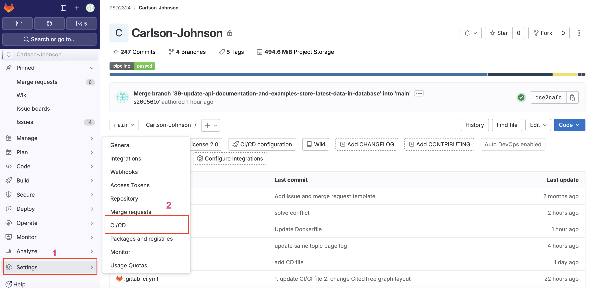
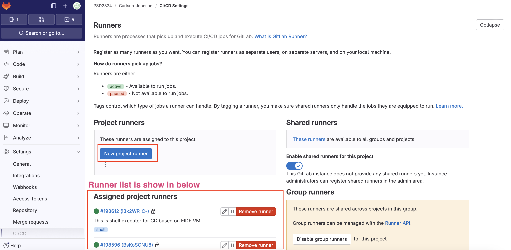
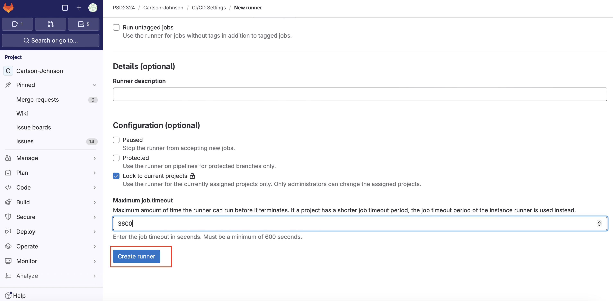
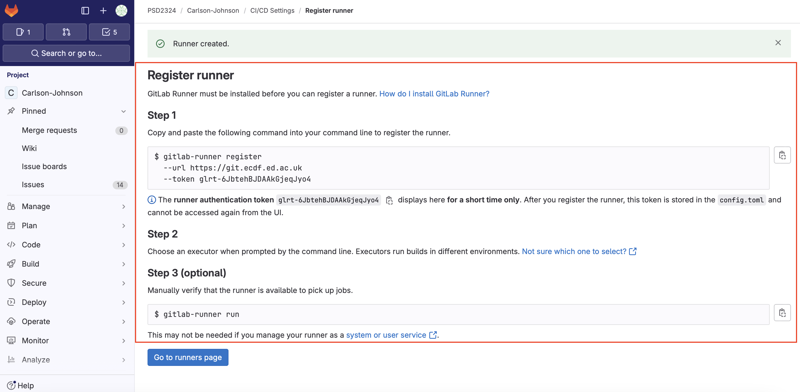
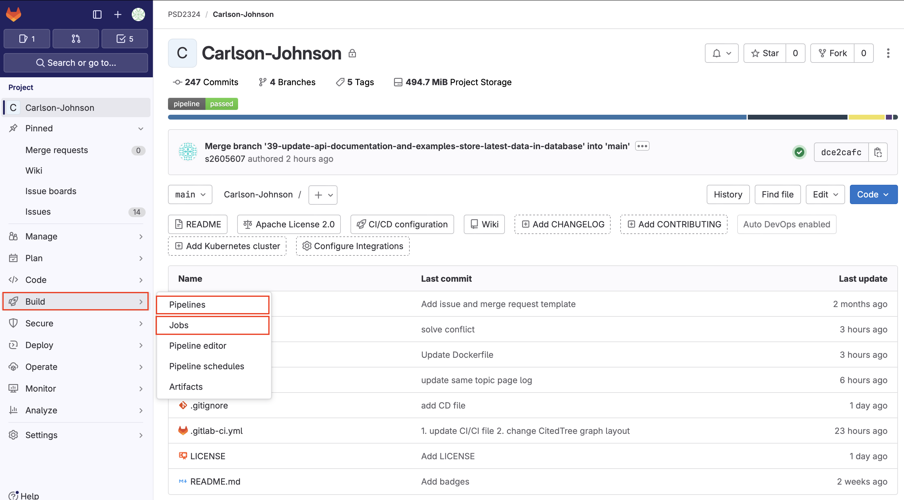

# CI/CD Pipeline Documentation

## Overview

This document describes the Continuous Integration and Continuous Deployment (CI/CD) pipeline implemented using GitLab for the PSD project with separate frontend and backend components. The pipeline automates the processes of installation, linting, testing, deployment, and cleanup for both components. The whole config of
 YAML`.gitlab-ci.yml` can be found in the [root directory of the project.](https://git.ecdf.ed.ac.uk/psd2324/Carlson-Johnson/-/tree/main?ref_type=heads)

## Code Management and Runtime Environment

### GitLab Code Repository

All the code and CI/CD configuration are stored in our GitLab repository, which is responsible for the:

- **Version Control**: GitLab provides version control functionality that allows team members to collaborate on development while tracking and managing code change history.  In addition, as code changes, the corresponding CI/CD process can be updated to ensure that the testing and deployment process remains consistent with the application.

- **CI/CD Configuration Management**: The GitLab CI/CD configuration file (`.gitlab-ci.yml`) is stored in the [code repository](https://git.ecdf.ed.ac.uk/psd2324/Carlson-Johnson/-/blob/main/.gitlab-ci.yml?ref_type=heads), which makes the definition of the CI/CD process and the development of code tightly integrated and easy to manage. In addition, storing the CI/CD configuration in the code repository increases the transparency of the process, and team members can easily access and review the CI/CD configuration.

- **Automated Triggers**: Every time code is pushed to the GitLab repository, the CI/CD process can be automatically triggered, enabling continuous integration and continuous deployment.

### EIDF Virtual Machine

In the CI/CD Implementation, we mainly use EIDF VM `eidf018-psd-assessment10a` as runtime environment, which is responsible for the:

- **Environmental Isolation**: The use of virtual machines creates isolated environments that provide a dedicated space for running and testing the various services in a project. With EIDF-provided virtual machines, authorised users are able to share the same hardware resources, allowing team members and customers to test and deliver projects in a unified environment independent of the developer's local setup.

- **Environment Consistency**: VMs can be configured to be the similar to the deployed environment, which can help to identify and resolve environment-related issues. In addition, a unified test environment is provided in team member collaboration, which prevents different test results caused by different environments.

### GitLab Runner

The GitLab Runner is responsible for executing CI/CD jobs defined by `.gitlab-ci.yml` and returning the results to GitLab UI. It is a standalone application that can run on a different machine than the GitLab server, e.g. this project uses a virtual machine from EIDF. The reason for use it are:

- **Multiple Execution Environments**: GitLab Runner supports a variety of executors, including Shell, Docker, Kubernetes, and more, allowing developers to choose the most appropriate runtime environment based on project needs. For example, using the gitlab runner with docker executor creates a clean, isolated environment for each CI job.

- **Fine-grained Access Control**: We can configure different  gitLab runners for different project components (e.g., front-end and back-end), or set specific gitlab runners to handle only specific branches of jobs (e.g., testing and deployment), which provides more granular access control and resource allocation. For example, we use a gitlab runner with a docker executor for testing and a gitlab runner with a shell executor for deployment.

### Docker
In the CI/CD pipeline, Docker provides a lightweight, portable way to package, distribute, and run applications. Using Docker, we can build, test, and deploy applications in a variety of environments and maintain environment consistency among development team members without worrying about "it works on my machine" issues caused by inconsistent environments. In our CICD pipeline, the main uses are as follows:

- **Environment consistency and isolation**: Docker containers provide an isolated environment for applications and their dependencies, ensuring consistency from development to production. This helps reduce problems caused by environment differences and makes it easier for us to deploy applications and run it in different environments.

- **Application isolation**: For our frontend and backend separation of the website project. In order to prevent a problem with one service leads to affect another service, we use docker to create multiple containers to deploy different services. In addition, different services may rely on different versions of third-party libraries, so running services in separate containers also avoids dependency conflicts and does not interfere with each other.

- **Official Image**: Docker provides many official images for different operating systems and environments that can be used directly. This provides a standardised and reliable base environment for CI and CD. It also avoids the complexity of manually configuring environments in CI and CD.

- **Docker Daemon**: Docker containers can run continuously on a virtual machine (VM) even if the VM's user is logged out.The running of Docker containers is managed by the Docker Daemon, which runs as a daemon service in the background on the EIDF's VMs. Whenever the Docker daemon is active, it maintains the running state of the container. This feature makes Docker ideal for use in our projects, as it can run backend services and applications, such as web backend services and automated tasks in CI/CD pipelines, ensuring continuity of these services even without manual intervention from developers.

## Setup Runtime Environment
This section shows how to configure the CI/CD runtime environment in EIDF (Ubuntu:22.04), as well as linking to GitLab's repository.

### Install Docker on EIDF VM
The process of installing docker was done based on the tutorials in the [docker official docs](https://docs.docker.com/engine/install/ubuntu/).

1. Log in VM rdp interface through VDI and open terminal to add Docker's official GPG key:
```bash
  sudo apt-get update
  sudo apt-get install ca-certificates curl
  sudo install -m 0755 -d /etc/apt/keyrings
  sudo curl -fsSL https://download.docker.com/linux/ubuntu/gpg -o /etc/apt/keyrings/docker.asc
  sudo chmod a+r /etc/apt/keyrings/docker.asc
```

2. Add the repository to Apt sources:
```bash
  echo \
    "deb [arch=$(dpkg --print-architecture) signed-by=/etc/apt/keyrings/docker.asc] https://download.docker.com/linux/ubuntu \
    $(. /etc/os-release && echo "$VERSION_CODENAME") stable" | \
    sudo tee /etc/apt/sources.list.d/docker.list > /dev/null

  sudo apt-get update
```

3. If the user is forced out of the rdp interface on VM, log into the ssh interface on VDI and enter:
```bash
sudo reboot
```
4. Log in VM again and check docker successfully installed:
```bash
sudo docker version
```

### Install GitLab Runner on EIDF VM (amd64)
1. Open terminal and download the binary for your system
```bash
sudo curl -L --output /usr/local/bin/gitlab-runner https://gitlab-runner-downloads.s3.amazonaws.com/latest/binaries/gitlab-runner-linux-amd64
```

2. Give it permission to execute
```bash
sudo chmod +x /usr/local/bin/gitlab-runner
```

3. Create a GitLab Runner user
```bash
sudo useradd --comment 'GitLab Runner' --create-home gitlab-runner --shell /bin/bash
```

4. Install and run as a service
```bash
sudo gitlab-runner install --user=gitlab-runner --working-directory=/home/gitlab-runner
```

5. Check GitLab Runner start successfully
```bash
sudo gitlab-runner start
```

6. Give `sudo` permission to GitLab runner to manage docker container automatically:
```bash
nano /etc/sudoers
```
Add below line in the file:
```
gitlab-runner ALL=(ALL) NOPASSWD: ALL
```

### Register GitLab runner
1. Open browser and GitLab repository page. Click `Setting` >> `CI/CD`

  
  *Figure 1: GitLab Repository Home Page.*

2. Go the `Runner` part and click `Expand` to `New project runner` or see the existing runner list.

  
  *Figure 2: GitLab Setting >> CI/CD >> Runner page.*

3. If want to add more runner, fill the form after click `New project runner` and press `Create runner`.

  
  *Figure 3: The form for create new GitLab runner.*

4. Follow the step in `Register runner` page and type the commands under `sudo` permission in the EIDF VM terminal.

  
  *Figure 4: The step to register runner on EIDF VM*

### Visualisation Pipeline
The GitLab UI interface provides visualisation of the CI/CD process. The results returned by the GitLab runner will be provide with graphical display of the run status and run results in it. [Pipeline](https://git.ecdf.ed.ac.uk/psd2324/Carlson-Johnson/-/pipelines) and [Job](https://git.ecdf.ed.ac.uk/psd2324/Carlson-Johnson/-/jobs) page can be found in side bar of GitLab repository page.


*Figure 5: The Job and Pipeline Page in GitLab UI.*


*Figure 6: The example of pipeline and jobs in GitLab UI.*

## Continuous Integration Design and Implementation (CI)

CI is mainly applied to the frequent integration of code into shared repositories during the development process. This pipeline includes automated tests (unit tests, integration tests, code quality checks, etc.) to verify that changes to the code do not break existing functionality.

The CI pipeline is divided into three main stages:

1. **Install**: At this stage, we are concerned with preparing the required environment for the code quality checks and automated tests that follow. his phase is only needed for the front-end because the environment for code quality checking and code automation testing is the same for the front-end. But for the backend, the code quality check does not need to install all the dependencies, so instead of setting up an additional installation phase, we will install the required dependencies in the automated tests phase.

2. **Lint**: The code quality checking phase improves the quality of code by running static code analyses on both front-end and back-end code. Code quality testing leads to tidier code and consistent specifications. In addition, it can detect potential errors and weaknesses in the code, such as syntax errors, type mismatches, unused variables, etc., before deployment. Also, by using a uniform coding standard, the consistency and readability of the code is improved. This ensures that developers in the team can easily read and understand other people's code, thus improving team efficiency.

3. **Test**: Automated testing ensures that newly committed code changes do not break existing functionality. This reduces the risk of breaking the original code when adding newly developed features. It runs the test commands in the CI configuration through an environment in a predefined docker container. This means it runs with the same conditions and steps every time. The benefit of this is that it eliminates human errors and omissions which improves the reliability and accuracy of the tests and code.

### Frontend Job

- **frontend_install**: Use the official `node:20` container image to ensure a consistent `Node.js` environment. Dependencies defined in the code in package.json can be installed by executing the `npm ci` command.

- **frontend_lint**: The front-end uses `npm run lint` to activate [ESLint](https://eslint.org) to inspect JavaScript code for potential errors and inconsistent coding style.

- **frontend_test**: The front-end executes unit tests via `npm test` with [Vitest](https://vitest.dev) library and these test cases are used to verify the rendering and behaviour of the UI components.

### Backend Job

- **backend_lint**: The backend does this by executing `flake8 .` to perform a static quality check of the Python code using the [flake8](https://flake8.pycqa.org/en/latest/) library. In addition, to avoid excessive line breaks caused by too short lengths of code which make the code less readable. We set the `--max-line-length=120` command to ensure that lines of code do not exceed 120 characters in length, instead of the original 79 characters.

- **backend_test**: The backend section configures the environment with `python:3.10` as the base docker image before executing the tests. The backend dependency installation is done by using [pip](https://pip.pypa.io/en/stable/cli/pip_install/) package management tool with the `pip install -r requirements.txt` command, which installs Python packages based on the names and versions of the dependent libraries listed in the pre-written `requirements.txt` file. The backend uses the [pytest](https://docs.pytest.org/en/8.0.x/) tool to run all unit and integration tests with `pytest` command.

### YAML Anchors for Script Reusability

YAML anchors are used to define common setup steps for frontend and backend directories to avoid the CI pipeline not switching into the correct path during execution (`.change_to_frontend_dir` and `.change_to_backend_dir`).
This design reduces repetitive continuous integration test configuration code for our project and improves flexibility and simplicity of configuration by automatically switching to the appropriate directories during the execution of frontend and backend jobs.

### Caching Strategy

Caching is used to speedup pipeline executing, which can reducing the time and number of times it takes to install dependencies. In the frontend install stage, we use `cache` keywords in `.gitlab-ci.yml` file with specific the `node_modules` directory path with `path` term to avoid having to re-download all the `npm` packages at each stage.


## Continuous Deployment Implementation (CD)

Continuous Deployment (CD) is the process of automating the deployment of code from a repository to a production environment during the software development process, for example from this project's GitLab repository to EIDF's VM. This pipeline follows continuous integration pipeline and ensures that new changes to the software are automatically and reliably released to the deployment environment for use by end-users, such as our client who has EIDF VM permissions in this project, after CI have passed the necessary testing and quality checks. By implementing a consistent CD pipeline process, the team was able to increase the speed and quality of software delivery while reducing errors in the manual deployment process.

The pipeline have additional two stages based on CI pipeline:

1. **Deploy**: In this phase, the frontend application and backend services are deployed to the target environment via Docker containers. In the configuration file, this stage uses the gitlab runner with shell executor. It will pull the latest code and build the Docker image based on the Dockerfile in the backend and frontend folders to deploy the image as a container, ensuring that the latest changes are available to the frontend application and the backend services in our group EIDF VM.

2. **Cleanup**: Once the deployment is complete, perform a cleanup operation, which may include cleaning up old Docker images, releasing resources, or emptying temporary files. This phase helps to keep the deployment environment tidy and ready for the next deployment.

### Frontend Job

- **frontend_deploy**: During the deployment phase of the CI/CD process, the `docker build` command is executed to build the Docker image of the frontend application. This step automatically installs dependencies, builds the application, and prepares the runtime environment according to the instructions in the Dockerfile. The built Docker image is then used to start a new container instance using the `docker run` command. The frontend can be accessed on the EIDF VM via a browser by specifying port 90 at http://localhost:90. At each deployment the previously running docker container is stopped and removed, and then the container is rebuilt

### Backend Job

- **backend_deploy**: By executing the `docker build` command to build an image based on the backend service's Dockerfile, which contains all the environment, dependencies, and application code needed to run the backend service. Starting the container of the backend service using the built image ensures that the service runs in an isolated environment and enables the service to accept external requests through port 8000 mapping.The backend API document can also be accessed in http://localhost:8000/docs. On each deployment the previously running docker container is stopped and removed, and then a rebuild of the container is performed.

### Grobid Job

- **grobid_deploy**: Grobid containers are run based on the officially provided Docker image `grobid/grobid:0.8.0`. The steps to deploy the Grobid service include stopping the currently running Grobid container (if it exists), removing the old container, building a new container by pulling the specified version of the official Docker image, and running the new Grobid container instance. Additionally, we verified that Grobid was successfully up and running by accessing the `/api/isalive` endpoint provided by Grobid to check the status of the service.

### Usage of Dockerfile

In the CI/CD pipeline, a image containing all the dependencies required by an application can be created through a Dockerfile, which defines all the instructions needed to build the final image through a series of steps and commands, starting with a base image. These include installing packages, copying project files to the image, setting environment variables, exposing ports, and specifying commands to be executed when the image starts. There are two dockerfiles in this project, the [frontend dockerfile](https://git.ecdf.ed.ac.uk/psd2324/Carlson-Johnson/-/blob/main/frontend/Dockerfile?ref_type=heads) and the [backend dockerfile](https://git.ecdf.ed.ac.uk/psd2324/Carlson-Johnson/-/blob/main/backend/Dockerfile?ref_type=heads).

## Job Trigger Condition Design in CI

In the CI/CD process, jobs are triggered based on two main conditions:

##### Trigger based on file changes

If a commit contains changes to a specific directory (`frontend/**/*` or `backend/**/*`), the associated lint, test, or deployment job is automatically triggered. Or if a commit contains changes to `.gitlab-ci.yml` file, all job will be triggered. This ensures that the corresponding process is executed only if the relevant part has changed.By executing testing or deployment processes only for the parts that have changed, unnecessary work such as retesting unchanged code or redeploying unmodified services can be reduced. This selective execution strategy directly reduces process execution time

##### Trigger based on commit branches

Deployment jobs are automatically triggered to deploy to the EIDF VM environment only on the `main` branch. This helps to ensure that only code changes that have been fully tested and deemed stable are deployed to the production environment.
