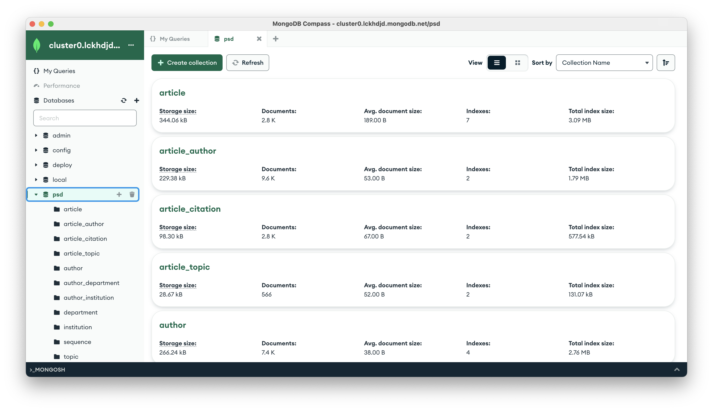

# Setup Environment in Local
This document provides a guide to setting up the development environment for this project on your local computer, including steps for installing and configuring the backend services and frontend services.

## Supported OS System

- macOS Sonoma (14.3.1) and above

- Ubuntu 20.04 LTS and above


This project does not support running on Windows because the Grobid service we use does not support running models on Windows for PDF parsing.

## Clone the GitLab Repo

``` bash
git clone https://git.ecdf.ed.ac.uk/psd2324/Carlson-Johnson
cd Carlson-Johnson
```


## Backend Service

### Setup Conda Environment

The instruction for installing conda from Anaconda:  

1. Open [Anaconda Download](https://www.anaconda.com/download) page and choose the package that suitable for your computer system. If you use the anaconda graphical installer, please fllow their installisation steps and ignore the steps below.

2. If you want to use the Commond line installer for Linux and Mac, download the Command Line installer in the bottom of [Anaconda Download](https://www.anaconda.com/download) page. For example, Mac OS M1 user should click `64-Bit (M1) Command Line Installer`

3. Run the following commond in your terminal:
```bash
cd the_path_your_download_sh
# This is an example for Mac OS, Ubuntu might have different filename
chmod +x Anaconda3-2024.02-1-MacOSX-arm64.sh
./Anaconda3-2024.02-1-MacOSX-arm64.sh
```

4. When you meet this please type Yes:
```text
Do you accept the license terms? [yes|no]
[no] >>>
```

5. When you meet this please Press Enter:
```text
[home/you/miniconda3] >>>
```

6. When you meet this please type Yes to setup conda in bash.
```text
installation finished.
Do you wish the installer to initialize Miniconda3 in your /home/you/.bashrc ? [yes|no]
[no] >>>
```

7. There are some useful conda commond:
```bash
# to create a conda environment
conda create -n env_name
# to activate a conda environment
conda activate env_name
# to quit a conda environment
conda deactivate
# to install a package in environment
conda install package_name
pip install package_name
```

### Setup Python Requirement
If using conda:
```bash
conda create -n PSD python==3.10.0
conda activate PSD
pip install -r backend/requirement.txt
```
If using python virtual environment:
```bash
# Make sure you are in the root directory in our project repo
mkdir PSD
python3 -m venv PSD
source PSD/bin/activate
pip install -r backend/requirement.txt
```

### Run the services
```bash
cd backend
export TEST_MODE=False
python -m app.main
```

### Run the Testing
```bash
# under backend folder
python -m pytest
# The API docs can be found in http://localhost:8000/docs
```
```bash
pip install flake8
# under backend folder
flake8 .
```

## Grobid Service

The instruction for installing and run Grobid from its [documentation](https://grobid.readthedocs.io/en/latest/Run-Grobid/).  

### Install Docker
The instruction for installing docker based on [docker docs](https://docs.docker.com/desktop/install/mac-install/).
```bash
sudo hdiutil attach Docker.dmg
sudo /Volumes/Docker/Docker.app/Contents/MacOS/install
sudo hdiutil detach /Volumes/Docker
```

### Using Grobid Official Image

```bash
docker run --rm --gpus all --init --ulimit core=0 -p 8070:8070 grobid/grobid:0.8.0
```

or using **lightweight** image

```bash
docker run --rm --init --ulimit core=0 -p 8070:8070 lfoppiano/grobid:0.8.0
```
The Grobid should be deployed on http://localhost:8070.

## Frontend Service

### Install Node.js
Install the Node.js from official [website](https://nodejs.org/en/download).

Or install from [brew](https://brew.sh) (Mac) or apt (Ubuntu)

By using brew in Mac:
```bash
# Install node.js
brew install node
# Check install successfully
node -v
npm -v
```

By using apt in Ubuntu:
```bash
# update apt package management index
sudo apt update
# Install install node.js and npm package management
sudo apt install nodejs
sudo apt install npm
# Check install successfully
node -v
npm -v
```

### Install dependency

```bash
cd frontend
npm install
```

### Run the Service
```bash
# Run as development mode
npm run dev
```

```bash
# Run as production preview mode
npm run build
npm run preview
```

### Run the Test
```bash
npm test
```

### Mongo DB Services
Since EIDF's VM is not publicly accessible, we deployed the database on a public Mongo DB server for ease of development and deployment. We monitor and manage the database status and links through the MongoDB compass visual interface.

*Figure 1: The screenshot for MongoDB Compass Application UI*
