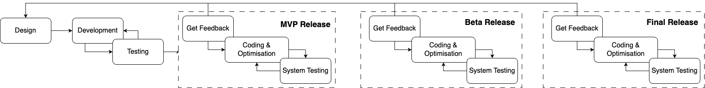
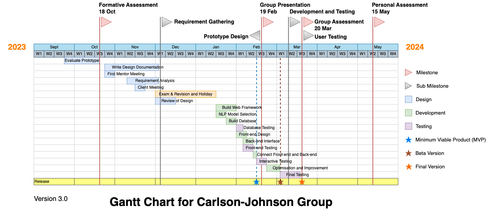
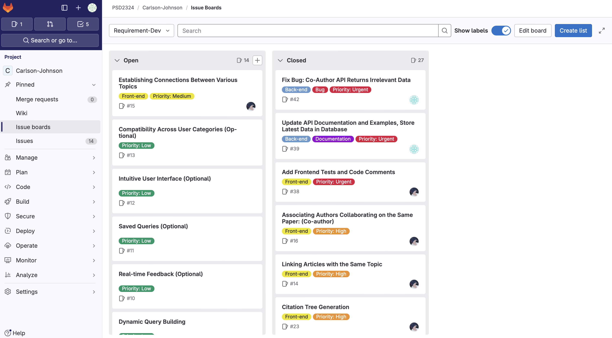
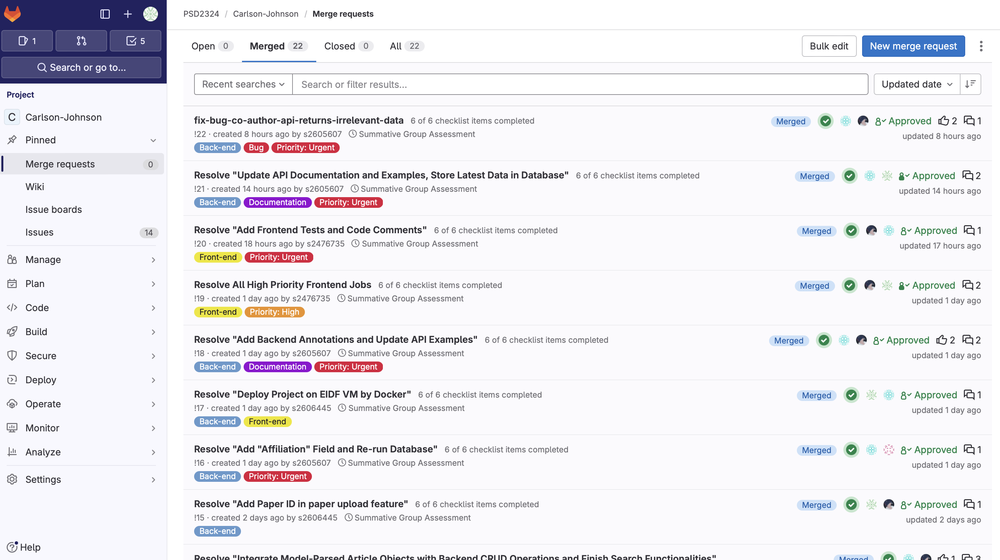

# PSD Project Planning
## Project Objective
The main objective of this project is to develop an integrated scholarly literature analysis system that is capable of processing scholarly articles to extract and analyse key elements of information, including authors, topics and citations. Researchers and analysts could use this tool to ingest and store a variety of articles into a centralised data base. Users can perform a variety of complex analytical queries from this database to discover patterns and gaps in scholarly research. These queries will help users to explore clusters of papers around specific topics, identify connections between article authors, thematic links, and map reference networks. By providing this depth and breadth of analysis, we expect to make it easier and more intuitive for researchers to analyse links and trends in existing research.

## Project Management
### Development Model

*Figure 1: The overlapping waterfall development model for this project.*

In order to effectively manage this project, we will be using the **Overlapping Waterfall** model as our software development methodology. This model is a variant of the traditional waterfall model that allows certain phases of a project to begin before the previous phase is fully completed. The main advantage of this approach is that it supports smooth transitions between phases, reduces wait times, and promotes more timely communication and collaboration among team members. In addition, we incorporate **Staged Delivery** strategy. The aim is to deliver some of the functionality as early as possible, which allows for faster user feedback and allows the project to be adjusted in subsequent phases based on that feedback. In this project, we have three delivery points: Minimum Viable Product (MVP), Beta, and Final release.

#### Advantage for us:

- **Accelerated delivery:** By allowing subsequent stages to start before the previous one is completely finished, the overall timeline of the project can be reduced and the delivery process accelerated.
- **Improved Resource Utilisation:** The Overlapping Waterfall model improves resource utilisation by better balancing the workloads of team members and ensuring that there is a continuous flow of work at any given time.
- **Early identification of issues:** Because the testing and development phases partially overlap, issues can be identified and resolved earlier in the development process, reducing the cost of fixing them later.
- **Continuous Feedback and Improvement:** Early and frequent deliveries in each phase allow for continuous collection of user and stakeholder feedback, enabling the product to adapt to changes in the market and user needs.
- **Reduced Waiting Time:** In the traditional waterfall model, a delay in one phase can lead to a postponement of the entire project. Whereas, in an overlapping waterfall model, certain work can be done in parallel, reducing delays caused by waiting for a particular phase to be completed.
- **Support for iterative elements:** While the overlapping waterfall model maintains the structured nature of the waterfall approach, it also supports elements of iterative development, allowing the product to be refined over time as it is developed.
- **More effective risk management:** Early iterative delivery and testing helps to identify risks and address them in advance, rather than facing potentially big problems later in the project.

#### Why suitable for us:
For the particular scenario of this project being our postgraduate coursework, our considerations as follows:

- **Flexibility in balancing multiple course loads**: The overlapping waterfall model provides a higher degree of flexibility than the traditional waterfall model by allowing different phases of a project to partially overlap. This approach allows for better time management between multiple course assignments for us. By starting the next phase before the previous phase has been fully completed, it is possible to make better use of the time window to work on multiple courseworks at the same time, rather than being stuck in one phase of a single project. Additionally, tasks are better distributed among the team, and there is no need to wait for the previous person's work to be fully completed before starting subsequent work.

- **Promoting timely feedback and continuous improvement**: For coursework, we want to get timely feedback from course organisers and client. The overlapping waterfall model, combined with a phase delivery strategy that provides usable functionality earlier, means that feedback can be gathered more quickly and the project can be adjusted based on that feedback, which ensures that the outcome of the project is more closely aligned with the course requirements and the expectations of the client.

### Timeline

*Figure 2: The Gantt chart for planning timeline.*

This Gantt chart is a project management tool to show a project timeline for the Carlson-Johnson Group. This timeline covers the period from September 2023 to May 2024. The entire development model uses an overlapping waterfall model. It divides the main project activities into key class: design, development, and testing. In addition, it marks three main assessment points as main milestones, which are group presentation, group assessment and individual assessment.
- **Design** phase includes prototype evaluation, design documentation, requirements analysis, and design review.
- **Development** phase includes building web framework, selecting NLP model, building database, frontend design, backend interface development, frontend and backend connection.
- **Testing** phase including database testing, frontend testing, interaction testing, optimisation, final testing, etc.

Project release points include Minimum Viable Product (MVP), Beta, and Final release.
- **MVP Release**
  - Aim:
    1. Started writing the core functionality of the MVP, focusing on implementing the ability to ingest and store articles and perform basic analytical queries.
    2. Implement a basic user interface that allows the user to interact with the system.
  - Expect result: Implement a stable, usable prototype of the system that enables users to do basic operations with it, such as uploading files to get article metadata. Also, we expect have a complete UI design based on the [Mockplus](https://www.mockplus.com) tool.

- **Beta Release**
  - Aim:
    1. Started writing the core functionality of the MVP, focusing on implementing the ability to ingest and store articles and perform basic analytical queries.
    2. Improve the features implemented in the product based on the feedback collected during the MVP phase. We hope that the Beta version will allow us to test the product more extensively, fix issues not found during the MVP phase, and continue to collect user feedback to further improve the product.
  - Expect result: A more fully-featured, better user experience version of the product, suitable for wider user testing and feedback collection.

- **Final release**
  - Aim:
    1. Based on the feedback collected in the Beta release, complete the final product adjustment and optimisation, and release a stable version on EIDF VM.
  - Expect result: A stable website that meets the client's functional needs and can be accessed directly in the VM of the EIDF.

#### Why suitable for us:
- **Progressive delivery ensures continued progress**: Because each person in our group had a different educational background, by dividing the projects into three main types: design, development, and testing; and clearly assigning specific tasks (e.g., prototype evaluation, framework building, database testing, etc.) within each type, we were able to make sure that each person could perform the tasks in which he or she specialised. In addition, we set clear assessment points (e.g. group presentations, group evaluations, and individual evaluations), which helped us to be able to regularly review and assess the status of the project matched the timeline requirements of the course.

## Task management and Team Collaboration
Task Management enables us to organise, prioritise and track work progress effectively, ensuring that every task is completed on time. In this project, we plan to primarily use GitLab and MS Teams as a platform for task management and team communication.

### Use of Issue Board
In this project, we chose to use the [Issue Board](https://git.ecdf.ed.ac.uk/psd2324/Carlson-Johnson/-/boards) provided by GitLab as the core task management tool to track tasks and monitor the progress of the project by adopting "open" and "closed" statuses, which allows us to clearly visualise the status of each task and the corresponding participants. In addition, the use of an issue board ensured that everyone in our team was in synchronisation with the current status and next steps of the project.

*Figure 3: The screenshot for our issue board, which can be found [here](https://git.ecdf.ed.ac.uk/psd2324/Carlson-Johnson/-/boards).*

### Use of Issue
In our project, for better task management, we have broken down the functionality to be implemented based on the client's requirements into small manageable tasks, each of which creates an Issue in the [Issue Board](https://git.ecdf.ed.ac.uk/psd2324/Carlson-Johnson/-/boards).This approach helps to clearly track the progress of each task. In addition, by updating the content and details in the Issue, each member of the project can easily access the latest status and history of the task. Additionally, when creating the Issue, the entire team used a uniform [Issue template](https://git.ecdf.ed.ac.uk/psd2324/Carlson-Johnson/-/blob/main/.gitlab/issue_templates/issue_template.md?ref_type=heads) to set the Issue submission information with uniform standards. This helped the team not miss information and reduce repetitive steps when creating the Issue.

In addition, the support for tags based on issues allows us to categorise and filter tasks in more detail, for example we organise tasks by priority and task type. This classification capability increases the flexibility of task management, allowing us to quickly locate specific tasks or groups of tasks, so that we can efficiently allocate tasks and resources. In addition, Issue has the ability to tightly integrate with other GitLab features such as milestones and merge requests. By associating tasks with specific milestones, we can better track project progress and critical delivery times.

### Merge Request Workflows
In our project management, [Merge Request](https://git.ecdf.ed.ac.uk/psd2324/Carlson-Johnson/-/merge_requests?scope=all&state=merged) is a key feature in GitLab that promotes improved code quality and team collaboration. Our team has a strict policy against pushing code directly to the `main` branch, and all code changes must be implemented through Merge Requests with separate branch. This ensures that each merge is thoroughly reviewed and that the code in the `main` branch is always stable. In the merge request process, we require that each merge request be peer-reviewed by another member of the team as a reviewer. This process not only improves the quality of the code, but also ensures that the code can be further examined.

For further efficiency and quality in submitting requests and reviews, we also used [Merge Request template](https://git.ecdf.ed.ac.uk/psd2324/Carlson-Johnson/-/blob/main/.gitlab/merge_request_templates/merge_request_template.md?ref_type=heads), which ensured that submitters had to provide sufficient contextual information, including the purpose of the code change, the scope of the impact, and any relevant Issue numbers, so that reviewers could understand each change more quickly and comprehensively. In addition, the tight linkage between Merge Requests and Issues makes it easy to track the progress of each feature or fixed, from requirements to deployment, in GitLab, and the corresponding Issue is automatically closed when the merge request is approved, keeping the Issue board logical and simple. In addition, the linkage between Merge Requests and Issues makes it easy to track the progress of each feature or fixed, from requirements to deployment, in GitLab, and the corresponding Issue is automatically closed when the merge request is approved, keeping the Issue board logical and simple.

*Figure 4: The screen shot for our history of Merge Request, which can be found [here](https://git.ecdf.ed.ac.uk/psd2324/Carlson-Johnson/-/merge_requests?scope=all&state=merged).*

### Use of MS Teams
In our projects, our team consistently holds weekly meetings aimed at reviewing the past week's progress, setting upcoming tasks and goals, code synchronisation, resolving code conflicts, and discussing possible challenges and solutions. These meetings sometimes take place online and sometimes we choose to meet in person to suit different situations and needs. Online meetings are primarily conducted through the MS Teams platform.

## Usability Testing

The usability testing was conducted using a combination of direct observation, user feedback, and task success rates. Participants were asked to perform specific tasks within the application, with the guideline provided in the [Guide on how to use the application](Guide.md) and feedback form followed after. Their interactions and feedback were recorded and analyzed to identify usability issues and areas for improvement.

### Usability Cohort

The participants for the usability testing were selected based on the target user demographic for the web application. The initial candidate pool was introduced in the [Design Document](Design.md), which includes students, academics, government officials, developers, and companies. But due to the limited time and resources, the participants were selected from the students and academics.

### Testing Objective
The usability testing was conducted to evaluate the system's ease of use, efficiency, and user satisfaction. The testing objectives were to gather feedback and insights from the participants to identify usability issues and areas for improvement, and to evaluate the overall user satisfaction with the system.

### Participants Selection

The participants for the usability testing were selected based on the target user demographic for the web application. The initial candidate pool was introduced in the [Design Document](Design.md), which includes students, academics, government officials, developers, and companies. But due to the limited time and resources, the participants were selected from the students and academics.

### Testing Environment

The usability testing was conducted in a controlled environment, with two ways provided, which are in-person and remote testing. The participants were given a way to access the application via EIDF VM, or the permission to control one of our group members' computer to interact with the system. The testing was conducted using user feedback forms, task-based testing scenarios, and user interviews to gather feedback and insights from the participants.

### Testing Procedure

1. The participants were provided with a brief introduction to the application and its core functionalities.
2. The participants were given a [Guide](Guide.md) on how to use the application, which included the layout of the application, the core functionalities, and the steps to perform specific tasks.
3. The participants were given a way to access the application via EIDF VM, or the permission to control one of our group members' computer to interact with the system.
4. The participants were asked to perform specific tasks written in the [Usability Test Form](Usability-Form.md) .
5. The participants were asked to finish the Usability Form after each task and give a general feedback at the end of the test.
6. The interactions and feedback were recorded and analyzed to identify usability issues and areas for improvement.

### Evaluation Methods

The usability testing was conducted using a combination of direct observation, user feedback, and task success rates. After the forms were collected, the feedback was analyzed to identify common praise and issues, showing the strengths and weaknesses of the system. Based on these issues and feedback, useful insights were gathered to guide the future development and improvement of the system. After the issues and improvements were identified, the overall application rate was taken into account to evaluate the issues priority level and the overall user satisfaction.

## Risk Management
### Risk Assessment
By ensuring that our risk management process was both accurate and had broad coverage, we took an approach that ranged from generic risk categories to detailed risk analyses specific to the circumstances of this project. At the start, we identified a series of common risk categories based on our general experience in software development and project management, such as technology risks, budget and time management risks, teamwork and communication risks, and so on.

Further, specific risk factors such as third-party dependencies and data volume were given special attention for the unique needs and conditions of this project. For example, the project's dependency on external data sources or libraries may pose risks such as compatibility issues, update delays, and even service interruptions. The risk list is also reviewed and updated to ensure that emerging risks are identified and the likelihood and impact assessments of existing risks are kept up to date. This continuous risk management strategy ensures that we are able to adjust our responses in a timely manner to meet new challenges as the project progresses, and ultimately to ensure the successful implementation of the project.

Our prioritisation of risks is based on two key dimensions: the probability of the risk occurring and the level of impact on the project should it occur. Through this approach, we are able to determine which risks require immediate attention and which can be dealt with as resources allow. The risk level (low, medium, high) serves as a visual indicator to help us quickly identify and focus on the most important risk points.

### Risk Categorization Table for the Academic Analysis Project
The table below provides a structured overview of potential risks by category, assessing the probability of each risk occurring, the impact if it occurs, and the level of risk to the project.

| Risk Category | Risk Factor | Probability | Impact | Risk Level |
|----------|-------------|-------------|--------|------------|
| Scheduling | Inaccurate time estimations for development milestones | Possible | Severe | Medium |
| Scheduling | Unexpected occurrences delaying project timelines | Possible | Moderate | Medium |
| Scheduling | Insufficient resource allocation affecting project pace | Possible | Severe | Medium |
| Operational | Challenges in process implementation | Probable | Moderate | Medium |
| Operational | Integration with external systems causing delays | Possible | Moderate | Medium |
| Technical | System performance issues under heavy load | Probable | Severe | High |
| Technical | Functional issues in data analysis features | Probable | Severe | High |
| Programmatic | Legal issues related to data use and copyright | Probable | Catastrophic | Critical |
| Programmatic | Changing customer requirements impacting scope | Possible | Moderate | Medium |
| User | User conflict leading to project delays | Unlikely | Moderate | Low |
| User | Resistance to new system adoption | Possible | Moderate | Medium |
| User | Negativity impacting team morale and productivity | Unlikely | Moderate | Low |
| User | Lack of commitment from end-users | Unlikely | Moderate | Low |
| Requirements | Lack of clarity in project requirements | Possible | Severe | High |
| Requirements | Requirement conflicts not resolved | Possible | Moderate | Medium |
| Requirements | Incorrectly identified requirements leading to rework | Possible | Severe | High |
| Project Complexity | New technology leading to learning curve | Probable | Moderate | Medium |
| Project Complexity | Immature processes leading to inefficiencies | Possible | Moderate | Medium |
| Project Complexity | Aging technology causing integration issues | Unlikely | Moderate | Low |
| Planning and Control | Ineffective project planning and control | Possible | Severe | High |
| Planning and Control | Inaccurate estimation of project scale | Possible | Severe | Medium |
| Planning and Control | Inexperience in project management | Possible | Moderate | Medium |
| Planning and Control | Communication breakdowns within the team | Possible | Moderate | Medium |
| Team | Lack of training for new technologies | Possible | Moderate | Medium |
| Team | Inexperience with specialized analytical tools | Possible | Moderate | Medium |
| Team | Skills mismatch and resource inadequacy | Possible | Moderate | Medium |
| Organisational Environment | Organisational changes impacting project continuity | Unlikely | Severe | Low |
| Organisational Environment | Political issues within the organization affecting decisions | Unlikely | Moderate | Low |
| Specific to Project | Browser compatibility | Possible | Severe | High |
| Specific to Project | Mobile compatibility | Probable | Moderate | High |
| Specific to Project | Limitations of the accuracy of Grobid | Certain | Severe | High |
| Specific to Project | Memory Limits for virtual machines | Possible | Catastrophic | High |

*Table 1: List of risk considerations.*

- **Browser compatibility**:
There may be differences in the interpretation and rendering of JavaScript and CSS in different browsers, which may lead to compatibility issues with the application on some browsers. (may not be compatible with IE, recommended not to use)

- **Mobile compatibility**:
If the Vue.js application needs to run on mobile devices, special attention needs to be paid to mobile browser compatibility (whether it can be displayed properly) and performance issues to ensure that the application runs properly on different mobile devices.

- **Limitations of the accuracy of Grobid**: Grobid is an open source tool for extracting, parsing and reconstructing documents from academic literature. This risk refers to the possibility that Grobid may not be able to achieve the desired accuracy when processing a given document, which may be due to the complexity of the document's format or to the fact that Grobid's model is not sufficiently sophisticated for certain document types.

- **Memory Limits for Virtual Machines**: This risk relates to the possibility that the virtual machine (VM) used by the project may not be able to meet the operational or scaling requirements of the project due to memory resource limitations. Insufficient memory resources may lead to performance bottlenecks, affecting application response time and stability. Currently we are using a VM with 49 gigabytes (Gigabytes) of memory, and we are already using about 75% of it.

### Risk Control
#### Risk Management Planning
1. **Scheduling**:
   - Develop a comprehensive project timeline with buffer periods for unexpected delays.
   - Regularly review and adjust resource allocations to ensure project milestones are met.
2. **Operational**:
   - Define clear process workflows and ensure all team members are trained on them.
   - Establish protocols for integrating external systems to minimize disruptions.
3. **Technical**:
   - Ensure system design includes scalability and high-load performance considerations.
   - Conduct thorough testing to verify functional requirements are met.
4. **Programmatic**:
   - Consult legal experts to navigate data use and copyright issues.
   - Maintain open communication with the client to manage scope and requirements effectively.
5. **User**:
   - Engage with end-users early and frequently to build buy-in and commitment.
   - Organize training sessions and demos to reduce resistance to the new system.
6. **Requirements**:
   - Facilitate regular meetings with stakeholders to clarify requirements.
   - Use conflict resolution techniques to manage and align differing requirements.
7. **Project Complexity**:
   - Offer training to upskill team members on new technologies.
   - Regularly review and optimize processes to reduce inefficiencies.
8. **Planning and Control**:
   - Utilize experienced project managers and proven project management methodologies.
   - Ensure clear and continuous communication channels within the project team.
9. **Team**:
    - Provide ongoing training and professional development opportunities.
    - Assess and realign team skills with project needs periodically.
10. **Organisational Environment**:
    - Develop strategies to manage change and maintain project stability.
    - Monitor organizational politics and plan for potential impacts on the project.
11. **Specific to Project**:
    - Implement cross-browser testing and mobile compatibility testing to ensure the website performs well across different environments.
    - Optimize application performance, including code refactoring and memory management, to enhance the efficiency of virtual machines.

#### Risk Resolution
- **Technical and Operational Risks**: Implement a staged rollout of the system to manage the complexity and integration points, allowing for iterative improvements.
- **Budget and Scheduling Risks**: Establish a change control board to handle scope changes and ensure any adjustments are made with full awareness of their implications on budget and schedule.
- **User and Requirements Risks**: Use a user-centric design approach to ensure the system meets the actual needs and expectations of the users, minimizing resistance and maximizing satisfaction.
- **Programmatic Risks**: Stay updated with legal and customer changes that could affect the project; have a legal team on standby to advise on emerging issues.

- **Browser compatibility**: In the future plan, we can use automated testing using cross-browser testing tools to ensure application compatibility on major browsers. In addition, we also can regularly update the development guide with the latest compatibility to guide user to use the suitable browser.

- **Mobile compatibility**: Incorporate responsive design principles into existing designs to ensure that the app provides a great user experience on different sized mobile devices. For future development, we can try testing on real devices and simulators, covering the major mobile operating systems and screen sizes.

- **Limitations of the accuracy of Grobid**: Because of the dataset and computational resources limitations, we can not to retrain the model. In the future development, we can use more types of articles to fine-tune the model and make the model more robust.

- **Memory Limits for Virtual Machines**: Clean-up phases are performed after the deployment of containers to avoid unused images and resources that are not deleted or released. If the application is to be extended in future development, other deployment options may need to be considered, such as cloud servers.

#### Risk Monitoring
- **Continuous Monitoring**: Implement a risk management dashboard that allows for real-time monitoring of key risk indicators.
- **Regular Reviews**: Conduct frequent risk assessment reviews to identify new risks and reassess the status of existing ones.
- **Stakeholder Feedback**: Use stakeholder feedback as a tool to monitor user satisfaction and detect early signs of resistance or conflict.
- **Performance Metrics**: Establish performance metrics to evaluate the effectiveness of risk management strategies, making adjustments as necessary
