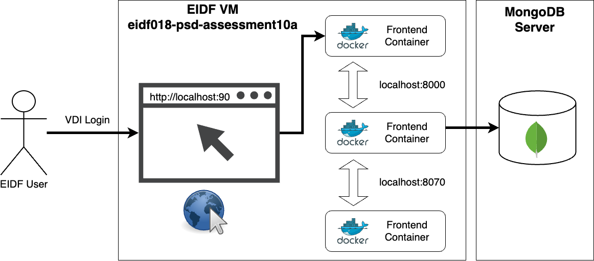
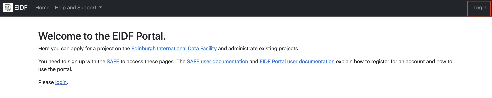
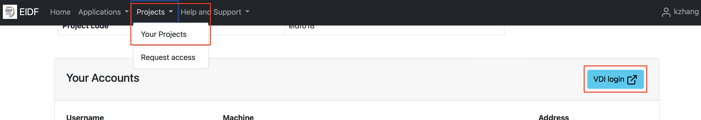
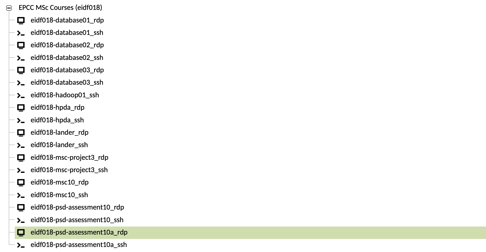
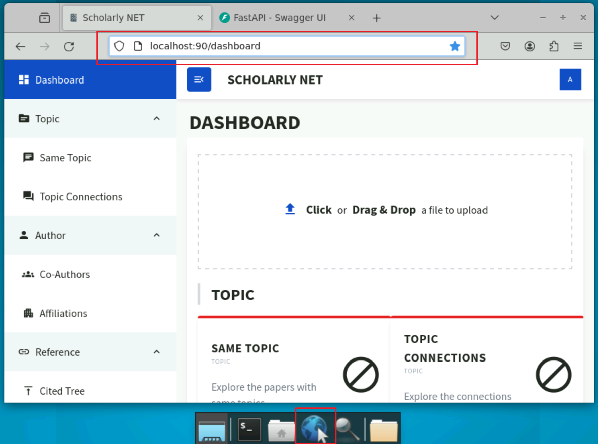

# Group Carlson-Johnson

## Table of Content

- [Project Description](#project-description)
- [Quick Start](#quick-start)
- [Project Documents List](#project-documents-list)
  - [Formative Assessment](#formative-assessment)
  - [Group Assessment](#summative-group-assessment)
  - [Project Meeting](#project-meeting)
- [Contributors](#contributers)

## Project Description

The aim of this project is to develop a system for analysing academic papers. The system will support analyses of authorship, sentiment, subject and topic. Users will be able to import articles into the data store in order to perform a variety of analytical queries including paper topic clustering, inter-author linking, inter-topic linking, relationships between authors and topics, sentiment analysis, paper outcomes, citation networks and timelines.

### Client
The client for this project is the course organisation team for practical software development in the EPCC MSc programme.

## Quick Start
Our project has been deployed in the EIDF VM and the implementation can be found in the CICD implementation documentation. Users who have access to the EIDF `eidf018-psd-assessment10a` VM can directly use the browser in the VM to access http://localhost:90. If you want to run this application on your local computer, you can refer the [setup](/Documents/Implementation/Setup.md) document.

*Figure 1: The flow chart of the deployment in EIDF VM.*

### Instruction
1. Login to [EIDF portal](https://portal.eidf.ac.uk) by using your SAFE account.

*Figure 2: Screenshot for EIDF protal.*

2. Choose `VDI Login` under Projects >> Your Projects

*Figure 3: Screenshot for find VDI login.*

3. Select the `eidf018-psd-assessment10a_rdp` connection.

*Figure 4: Screenshot for find VM connection.*

4. When login to the VM connection, click web browser and type http://localhost:90 to access our application. The full detail how to interact with our website can refer to [guide](Documents/Implementation/Guide.md) documents.

*Figure 5: Screenshot for how to access our web application in web browser.*

## Project Documents List

### Formative Assessment

The given prototype of the project is located in branch '[proto](https://git.ecdf.ed.ac.uk/psd2324/Carlson-Johnson/-/tree/proto)'.

- [Formative Assessment](https://git.ecdf.ed.ac.uk/psd2324/Carlson-Johnson/-/blob/proto/README.md)

### Summative Group Assessment

All project documents are located in [Documents](./Documents) folder.

The table below outlines the specific contents of each folder and document within, highlighting the criteria they satisfy and the unique role they play in supporting the project's goals.

| Folder              | Document                                                                                                | Criteria Satisfied             |
|---------------------|---------------------------------------------------------------------------------------------------------|--------------------------------|
| Design              | [Architecture-And-Components-Design.md](./Documents/Design/Architecture-And-Components-Design.md)       |Technology Stack (Language and Technology Choices) and Software Architecture with detailed components design|
| Design              | [Data-Model.md](./Documents/Design/Data-Model.md)                                                       | A more detailed version of data modelling. |
| Design              | [Design.md](./Documents/Design/Design.md)                                                               | Including Requirements Engineering, Design, and Data Modelling and Test Plans |
| Implementation/API  | [API-Doc.md](./Documents/Implementation/API/API-Doc.md)                                                 | Documentation of the API endpoints |
| Implementation/API  | [openapi.json](./Documents/Implementation/API/openapi.json)                                             |  JSON representation of API, adhering to the OpenAPI Specification |
| Implementation      | [CICD.md](./Documents/Implementation/CICD.md)                                                           | CI/CD Pipeline Design and Deployment |
| Implementation      | [Evaluation.md](./Documents/Implementation/Evaluation.md)                                               | Project and Prototype Evaluation |
| Implementation      | [Guide.md](./Documents/Implementation/Guide.md)                                                         | Instructions for end-users on how to use the application |
| Implementation      | [Setup.md](./Documents/Implementation/Setup.md)                                                         | Instructions on setting up the development/testing environment |
| Implementation      | [Test-Analysis.md](./Documents/Implementation/Test-Analysis.md)                                         | Testing Analysis and Usability Analysis |
| Implementation      | [Usability-Form.md](./Documents/Implementation/Usability-Form.md)                                       | Form used for usability testing purposes |
| Planning            | [Plan.md](./Documents/Planning/Plan.md)                                                                 | Project plan including Project Management, Task Management and Timeline, Usability Cohort and Test Plan, Risk Review |
| Presentation        | [Carlson-Johnson-PSD-Presentation.pptx](./Documents/Presentation/Carlson-Johnson-PSD-Presentation.pptx) | Presentation for clients |
|Image| [Collection of all figures used in documents.](./Documents/Image)                                       |-|

### Project Meeting

- [Project Meeting Minutes](https://git.ecdf.ed.ac.uk/psd2324/Carlson-Johnson/-/wikis/Meeting-Minutes)

## Contributers

- Kejia Zhang
- Xinyi Ding
- Yongkang Qiu
- Yucheng Liang

Supported by Daniyal Arshad

## Acknowledgement
We would like to extend our heartfelt appreciation to the EPCC PSD Course Supervisor Team and Daniyal Arshad for their invaluable support and guidance throughout this project. Their expertise and encouragement have been essential to our success.
