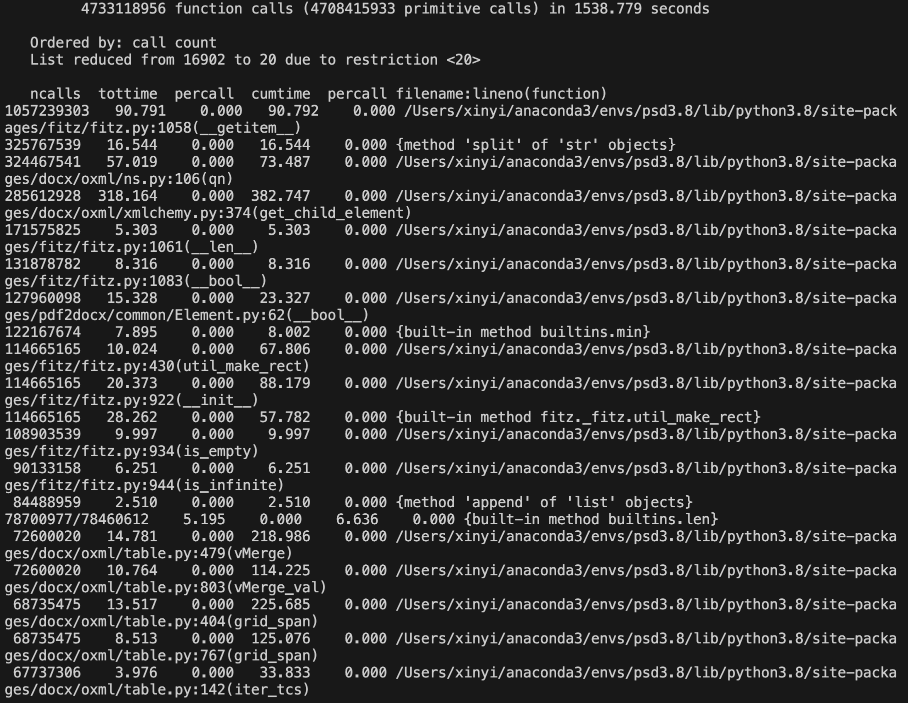

# Prototype Analysis for Formative Assessment

*Table of Content*
- [Dependencies](#dependencies)
  * [Python](#python)
  * [Used Library](#used-library)
- [Instruction](#instruction)
  * [Running Instruction](#running-instruction)
  * [Setup Python Environment](#setup-python-environment)
- [Summary of functionality](#summary-of-functionality)
  * [Main functionality:](#main-functionality-)
  * [User Diagram](#user-diagram)
- [Code Performance Analysis](#code-performance-analysis)
  * [Profiling](#profiling)
  * [Memory Usage Analysis](#memory-usage-analysis)
- [Correctness Analysis](#correctness-analysis)
  * [PDF to DOCX to JSON](#pdf-to-docx-to-json)
  * [Entities Recognition](#entities-recognition)
  * [Program Testing](#program-testing)
- [Code Defect Analysis](#code-defect-analysis)
  

## Dependencies
### Python
This code was made by Python, and need using Python3 to run. The later [Section](#setup-conda) supply the instruction about installing conda to work with Python.

### Used Library
#### Built-In Library
1. json: this is a built-in library for Python to process data in JSON format. In this prototype code, It is used to store information about text and entities in JSON format in a file. 
2. os: this is a built-in library for Python that provides features to interact with the operating system, such as file and directory management.
3. sqlite3: this is a built-in library for Python to interact with SQLite databases. In this code, it is used to connect to SQLite databases, execute SQL queries, and manage database tables.

#### Third-party Library
1. pdf3docx: this is python library for converting PDF files to DOCX format. It allows to extract the contents of a PDF document into a DOCX file in Microsoft Word. In this code it is used to convert research paper in PDF format to DOCX format for subsequent processing of text and entities.
2. docx: this is part of the Python-docx library, which is used to create and manipulate Microsoft Word DOCX files. It is used to read and process converted DOCX format research paper files.
3. simplify_docx: this is a Python library for simplifying and extracting text content from DOCX files, removing special characters, etc. it used to extract the text in DOCX files and convert it to JSON format for further processing and storage.
4. spacy: this is a natural language processing library that provides a rich set of NLP features, including text processing, entity recognition, text classification, and more. Its website is https://spacy.io/. it is used to load English NLP models for entity recognition of text in DOCX files.
5. openpyxl: this is a Python library for reading and writing Excel files (.xlsx format). For this code, it is used to load the meta data for the research paper from Excel file.
6. prompt_toolkit: this is a Python library for building interactive command line interfaces, providing features such as auto-completion and history. Using this in this code can allow user to enter query commands without directly write SQL query commands.

## Instruction
### Running Instruction
``` bash
git clone https://git.ecdf.ed.ac.uk/psd2324/Carlson-Johnson
cd Carlson-Johnson
tar -xf papers.tar.gz
python prototype.py
```

### Setup Python Environment
#### Setup Conda
The instruction for installing conda from Anaconda:\
1. Open [Anaconda Download](https://www.anaconda.com/download) page and choose the package that suitable for your computer system. If you use the anaconda graphical installer, please fllow their installisation steps and ignore the steps below.
2. If you want to use the Commond line installer for Linux and Mac, download the *****.sh installer.
3. Run the following commond in your terminal:
```bash
cd the_path_your_download_sh
chmod +x *****.sh
./*****.sh
```
4. When you meet this please Enter Yes:
```text
Do you accept the license terms? [yes|no]
[no] >>>
```
5. When you meet this please Press Enter:
```text
[home/you/miniconda3] >>>
```
6. When you meet this please Enter Yes to setup conda in bash.
```text
installation finished.
Do you wish the installer to initialize Miniconda3 in your /home/you/.bashrc ? [yes|no]
[no] >>>
```
7. There are some useful conda commond:
```bash
# to create a conda environment
conda create -n env_name
# to activate a conda environment
conda activate env_name
# to quit a conda environment
conda deactivate
# to install a package in environment
conda install package_name
pip install package_name
```
#### Setup Requirement
If using conda:
```bash
conda create -n PSD python==3.9.0
conda activate PSD
pip install -r requirement.txt
```
If using python virtual environment:
```bash
mkdir my_project_venv
python3 -m venv my_project_venv
source my_project_venv/bin/activate
pip install -r requirement.txt
```
#### Common Setup Environment Error
When run the prototype.py, it might show:
```text
RuntimeError: cannot find builtin font with name 'Arial'
```
Solution: Go to your anaconda3’s installed package folder, find the path Anaconda3/envs/pdf2docx/Lib/site-packages/pdf2docx/common/constrants.py. Change 
DEFAULT_FONT_NAME = ‘Arial’ to ‘helv’. This is link to the official [#issue](https://github.com/dothinking/pdf2docx/issues/216) from pdf2docx in GitHub.

```text
ERROR: Could not build wheels for tokenizers, which is required to install pyproject.toml-based projects
```
Solution: Please use M1-requirement.txt to reinstall those packages.

## Summary of functionality
### Main functionality:
1. This code can read the metadata of the paper from an Excel file (index.xlsx), such as the name of the paper, the path to the PDF file, and so on.
2. This code can connect to a SQLite database (test_db.sqlite) and define three tables: papers (information about papers), entities (information about entities), and papers_have_entities (information about the association of papers with entities).
3. This code can convert PDF files to DOCX files.
4. This code can analysis the text of the paper into entities and the entity information was stored as a JSON file and save the entities in the SQLite.
5. This code provide a command line interface that allows the user to enter queries to retrieve entity-related papers from SQLite database.

### User Diagram

 
<p style="text-align:center">Figure.1 User Diagram</p>

As shown in Figure.1, the user starts the code in a command line terminal. The code starts execution, loading the configuration and database connection. If it is the first run or if there are new articles in the papers folder, the code will use pdf2docx, spaCy library to analyse the articles and the analysed article entities information will be saved in the SQLite database. After that the code will wait for the user to enter the query command in the command line. When the code receives the user's input, it parses the query command and generates a SQL command to retrieve the relevant information from the SQLite database, The code displays the results of the query in a readable form on the command line terminal, showing the papers that match the query condition. The user can continue to enter new query commands, or enter "q" to exit the code. If the user chooses to exit, the code ends execution.
## Code Performance Analysis
### Profiling
#### Profiling Methodology
The performance analysis was conducted using the cProfile module in Python. cProfile is a built-in profiler that records the execution time of functions and provides valuable data for identifying areas of code that may benefit from optimization. cProfile is a convenient and reasonably low-overhead C extension library in Python used for profiling long-running programs. It helps us understand where a program spends its time and which functions consume the most resources.
#### Profiling the Program
To profile a Python program without modifying the source code, we can execute the following command in the terminal:

`python -m cProfile -o analysisResult.stats prototype.py`

This command profiles the "prototype.py" program and stores the performance data in a file called "analysisResult.stats." This approach allows us to perform performance analysis without making any changes to the source code, while also generating performance data files for subsequent analysis and evaluation.

#### Performance Data Overview
The performance data generated provides insights into the total function calls and execution times for various functions and modules used in the prototype. Given the extensive statistics available, we here focus on the top twenty data points, which encompass both the most time-consuming functions and the functions with the highest call counts.

#### Top 20 Time-Consuming Functions

By using the following code to obtain top 20 time-consuming function in the statistic file.
```
import pstats
from pstats import SortKey
p = pstats.Stats('analysisResult.stats') 
p.sort_stats(SortKey.TIME).print_stats(20)
```

Among the top twenty time-consuming functions/modules, as shown in Figure.2, we observe that operations related to XML parsing, machine learning (employed for entity recognition), and PDF conversion exhibit the highest time consumption.

Examining the code in conjunction with the performance data reveals that operations involving the reading of PDFs and the subsequent writing of DOCX and JSON files account for a substantial portion of the total runtime. These operations are characterized by significant input and output (I/O) activities, contributing to the overall execution time.

Considering these observations, one potential avenue for optimizing performance involves the exploration of parallelization techniques tailored to CPU-intensive tasks. By parallelizing these resource-intensive operations, we can potentially enhance the efficiency and overall runtime of the program.

 
<p style="text-align:center">Figure.2: Top 20 most time-consuming functions</p>

#### Top 20 Call Count Functions
With a quick overview of the top twenty most-called functions, as shown in Figure.3, we have found that there is no significant difference from the top 20 most time-consuming functions. These functions cover a range of operations, including string manipulation, list operations, and functions related to PDF and DOCX document processing. This aligns with our earlier observation that the code involves substantial I/O operations and emphasizes the importance of efficient handling of data and documents.

 
<p style="text-align:center">Figure.3: Top twenty most-called functions</p>

### Memory Usage Analysis

In addition to profiling the program's execution time, it's crucial to monitor its memory usage. Memory usage analysis provides insights into how the program manages memory resources, helping to identify potential memory leaks or areas for optimization.

To analyze memory usage, we employed the "memory_profile" tool during program execution. This tool allows us to track memory consumption over time and identify specific functions or operations that may cause excessive memory usage. It can also visualize the results of the tracking, providing a comprehensive view of memory utilization. The memory usage obtained during this evaluation increases with the run, as illustrated in Figure.4.

 
<p style="text-align:center">Figure.4: Memory Usage Illustration</p>

#### Key Findings
1.	**Steady Memory Consumption**: Throughout the execution of the program, we observed relatively stable memory consumption. This suggests that the code effectively manages memory resources during most of its runtime.
2.	**Memory Spikes**: There are noticeable memory spikes at certain points during the program's execution. These spikes are likely caused by the processing of large PDF files, which temporarily require more memory for data storage and manipulation.
3.	**End-of-Run Fluctuations**: Towards the end of the program's execution, there is a wider range of memory usage fluctuations. This behavior warrants further investigation to determine the root causes and potential areas for optimization.

## Correctness Analysis

### PDF to DOCX to JSON

**Brief Steps:**
Processed papers involves converting PDF files into DOCX format, extracting textual content, simplifying the text, extracting entities information, and saving the results as JSON files.

**Correctness:**
- For plain text, the extraction performs well.
- But errors could occur when transforming formulars, such as:
	- `{"TYPE": "text", "VALUE": "n \u00d7 c \u00d7 d2\u00d7 d2 x, "}`
	- `{"TYPE": "text", "VALUE": "\ufffd(X\u22a4iB)Mj i."}`

### Entities Recognition

Some of the unclear entities are shown in the chart below:

| entity_id | entity_name           | entity_type |
| --------- | --------------------- | ----------- |
| 1474      | 11 (64.7%             | PERCENT            |
| 14025     | the period 2017-2021, | DATE        |
| 14034     | 20, 21].2.3           | CARDINAL    |
| 14037     | the period,           | DATE        |
| 14439     | 2017.G.               | DATE        |
| ...       |                       |             |

### Program Testing
#### Test Environment

- Operating System: Windows 11 Ver 22H2
- Python Version: 3.9.18
- Dependency Library Versions: \*See details in requirements.txt\*

#### Test Cases

| ID  | Test Case                                                     | Input Data                                                          | Steps                                                                                                                                    | Expected Output                                                                          |
| --- | ------------------------------------------------------------- | ------------------------------------------------------------------- | ---------------------------------------------------------------------------------------------------------------------------------------- | ---------------------------------------------------------------------------------------- |
| 1   | Convert PDF to Docx                                           | PDF file path: "Papers/yang19c.pdf"                                 | 1. Run the code to convert all the PDFs to DOCXs<br> 2. Check if the specified DOCX file exists at the expected path                     | A DOCX file is created at "Docs/yang19c.pdf.docx"                                        |
| 2   | Extracting Text from DOCX and entity recognition              | DOCX file path: "Docs/yang19c.pdf.docx"                             | 1. Run the code to extract text from the specified DOCX file.<br> 2. Compare the entities from extracted text with the expected entities | Text extracted from the DOCX file and entities are stored in database                    |
| 3   | SQL Query for papers                                          | SQL query: `get all papers`                                         | 1. Execute the query in program terminal<br>2. Check the printed results                                                                 | Print the query and details of all papers                                                |
| 4   | SQL Query for papers that mention an entity                   | SQL query: `get all papers that mention person Mage`                | 1. Execute the query in program terminal<br>2. Check the printed results                                                                 | Print the query and details of all papers that mention the person named "Mage"           |
| 5   | SQL Query for papers that mention multiple entities           | SQL query: `get all papers that mention person Mage or work Parcheesi` | 1. Execute the query in program terminal<br>2. Check the printed results                                                                 | Print the query and details of all papers that mention the person named "Mage" or "John" |
| 6   | SQL Query for papers that mention an entity with limit of one | SQL query: `get one papers that mention organisation DEC`                | 1. Execute the query in program terminal<br>2. Check the printed results                                                                 | Print the query and details of a paper that mention the organisation named "DEC"              |
| 7   | SQL Query for papers with mention of a none-exist person      | SQL query: `get all papers that mention work abc`                 | 1. Execute the query in program terminal<br>2. Check the printed results                                                                 | Print the query                                                                          |
| 8   | Invalid SQL Query                                             | SQL query: `get paper`                                              | 1. Execute the query in program terminal<br>2. Check the printed results                                                                 | Print the query and prompting the user to re-enter                                       |
| 9   | Exit the program                                              | Query `q`                                                           | Execute the query in program terminal                                                                                                    | Print the query and exit program                                                         |

#### Test Results

Case 1:
A DOCX file is created at "Docs/yang19c.pdf.docx"

Case 2:
Text extracted from the DOCX file and entities are stored in database

Case 3:
```
get all papers
(1, 'Fostering early numerical competencies by playing conventional board games', 'Papers/1-s2.0-S0022096520305142-main.pdf', 'Docs/1-s2.0-S0022096520305142-main.pdf.docx', 'JSON/1-s2.0-S0022096520305142-main.pdf.json', 'Ents/1-s2.0-S0022096520305142-main.pdf.json')
(2, 'Development of child’s home environment indexes based on consistent families of aggregation operators with prioritized hierarchical information', 'Papers/1-s2.0-S0165011413002583-main.pdf', 'Docs/1-s2.0-S0165011413002583-main.pdf.docx', 'JSON/1-s2.0-S0165011413002583-main.pdf.json', 'Ents/1-s2.0-S0165011413002583-main.pdf.json')
...
(56, 'LegoNet: Efficient Convolutional Neural Networks with Lego Filters ', 'Papers/yang19c.pdf', 'Docs/yang19c.pdf.docx', 'JSON/yang19c.pdf.json', 'Ents/yang19c.pdf.json')
```

Case 4:
```
get all papers that mention person Mage
(1, 'Fostering early numerical competencies by playing conventional board games', 'Papers/1-s2.0-S0022096520305142-main.pdf', 'Docs/1-s2.0-S0022096520305142-main.pdf.docx', 'JSON/1-s2.0-S0022096520305142-main.pdf.json', 'Ents/1-s2.0-S0022096520305142-main.pdf.json', 22, 1, 21, 22, 'Mage', 'PERSON')
(6, 'Enhancing arithmetic in pre-schoolers with comparison or number line estimation training: Does it matter? ', 'Papers/1-s2.0-S0959475216300718-main.pdf', 'Docs/1-s2.0-S0959475216300718-main.pdf.docx', 'JSON/1-s2.0-S0959475216300718-main.pdf.json', 'Ents/1-s2.0-S0959475216300718-main.pdf.json', 22, 6, 7, 22, 'Mage', 'PERSON')
```

Case 5:
```
get all papers that mention person Mage or person John
(1, 'Fostering early numerical competencies by playing conventional board games', 'Papers/1-s2.0-S0022096520305142-main.pdf', 'Docs/1-s2.0-S0022096520305142-main.pdf.docx', 'JSON/1-s2.0-S0022096520305142-main.pdf.json', 'Ents/1-s2.0-S0022096520305142-main.pdf.json', 22, 1, 27, 22, 'Mage', 'PERSON')
(6, 'Enhancing arithmetic in pre-schoolers with comparison or number line estimation training: Does it matter? ', 'Papers/1-s2.0-S0959475216300718-main.pdf', 'Docs/1-s2.0-S0959475216300718-main.pdf.docx', 'JSON/1-s2.0-S0959475216300718-main.pdf.json', 'Ents/1-s2.0-S0959475216300718-main.pdf.json', 22, 6, 9, 22, 'Mage', 'PERSON')
(1, 'Fostering early numerical competencies by playing conventional board games', 'Papers/1-s2.0-S0022096520305142-main.pdf', 'Docs/1-s2.0-S0022096520305142-main.pdf.docx', 'JSON/1-s2.0-S0022096520305142-main.pdf.json', 'Ents/1-s2.0-S0022096520305142-main.pdf.json', 125, 1, 9, 125, 'Parcheesi', 'WORK_OF_ART')
```

Case 6:
```
get one papers that mention person Mage
(13, 'The Impact of Degraded Speech and Stimulus Familiarity in a Dichotic Listening Task ', 'Papers/236297027.pdf', 'Docs/236297027.pdf.docx', 'JSON/236297027.pdf.json', 'Ents/236297027.pdf.json', 2338, 13, 9, 2338, 'DEC', 'ORG')
```

Case 7:
```
get all papers that mention person abc
```

Case 8:
```
get paper
Traceback (most recent call last):
  File "xxx\prototype.py", line 221, in <module>
    cur.execute(build_query(user_input))
sqlite3.OperationalError: near "FROM": syntax error
```

Case 9:
```
q
Process finished with exit code 0
```

#### Test Summary

1. Test Case 1: Convert PDF to DOCX
	- **Status:** Passed
	- **Description:** The code successfully converted a PDF file to a DOCX file, and the DOCX file was created at the expected path
2. Test Case 2: Extracting Text from DOCX and entity recognition
	- **Status:** Passed
	- **Description:** The code successfully extracted text from the DOCX file and stored entities in database
3. Test Case 3: SQL Query for papers
	- **Status:** Passed
	- **Description:** The code successfully printed the query and details of all papers
4. Test Case 4: SQL Query for papers that mention an entity
	- **Status:** Passed
	- **Description:** The code successfully printed the query and details of all papers that mention the person named "Mage"
5. Test Case 5: SQL Query for papers that mention multiple entities
	- **Status:** Passed
	- **Description:** The code successfully print the query and details of all papers that mention the person named "Mage" or "John"
6. Test Case 6: SQL Query for papers that mention an entity with limit of one
	- **Status:** Passed
	- **Description:** The code successfully printed the query and details of a paper that mention the organisation named "DEC"
7. Test Case 7: SQL Query for papers with mention of a none-exist person
	- **Status:** Passed
	- **Description:** The code successfully printed the query
8. Test Case 8: Invalid SQL Query
	- **Status:** Failed
	- **Description:** The code printed the query and exited with a traceback log of syntax error.
9. Test Case 9: Exit the program
	- **Status:** Passed
	- **Description:** The code successfully printed the query and exited the program.

#### Overall Test Results

The majority of test cases have passed, demonstrating the correctness of the code's functionality. However, there is one failed test case related to handling invalid SQL queries, indicating that the prototype still needs to be improved.


## Code Defect Analysis

### Lack of Comments

The code lacks comments, making it less understandable. Adding comments would enhance code readability.

```
# Original Code - Lack of Comments
files_to_process = []
for row in index.iter_rows(min_row=2):
```

```
# Improved Code - Adding Comments
files_to_process = []  # List to store processed files
# Iterate through data rows (skipping the header row)
for row in index.iter_rows(min_row=2):
```

### Lack of Modularity

The code is monolithic and lacks modularity. Breaking it into smaller functions would improve organization and reusability.

```
# Original Code - Lack of Modularity
def build_and_cases(query_string_array, query_parts, entry_index):
    # Function with a long and complex logic
    # ...
    return current_index
```

```
# Improved Code - Modularizing the Function
def build_and_cases(query_string_array, query_parts, entry_index):
    # Function with specific logic for building query conditions
    # ...
    return current_index
```

### Lack of Packaging
The code lacks organization through packages or modules. Using packages and modules would improve structure and maintainability.

```
# Original Code - Lack of Packaging
from pdf2docx import parse
import docx
from simplify_docx import simplify
```

```
# Improved Code - Organizing Related Functionality into a Package
from document_processing import parse_pdf_to_docx, simplify_docx
```

### Potential for Asynchronous Processing

The code performs operations sequentially, potentially causing performance issues with large datasets. Consider using asyncio for concurrent operations to optimize execution.

```
# Original Code - Sequential Operations
for path in os.listdir(source_path):
    # ...
```

```
# Improved Code - Using asyncio for Concurrent Operations
import asyncio
async def process_files(paths):
    for path in paths:
        # ...
```

### Error Handling

The code lacks comprehensive error handling. Adding proper error and exception handling would enhance code robustness.

```
# Original Code - Lack of Error Handling
if not exists(docx_file):
    # convert pdf to docx
    parse(pdf_file, docx_file)
```

```
# Improved Code - Adding Error Handling
if not exists(docx_file):
    try:
        # Attempt to convert pdf to docx
        parse(pdf_file, docx_file)
    except Exception as e:
        print(f"Error converting {pdf_file} to docx: {str(e)}")
```

### Code Duplication

There's duplication in the code, specifically in file path concatenations and database operations. Refactoring to eliminate duplication would improve code maintainability.

```
# Original Code - Code Duplication
row_dictionary['paper_docx'] = os.path.join(docs_path, row_dictionary['paper_pdf'] + '.docx')
row_dictionary['paper_json'] = os.path.join(json_path, row_dictionary['paper_pdf'] + '.json')
row_dictionary['paper_entities'] = os.path.join(ents_path, row_dictionary['paper_pdf'] + '.json')
row_dictionary['paper_pdf'] = os.path.join(source_path, row_dictionary['paper_pdf'])
```

```
# Improved Code - Removing Code Duplication
pdf_filename = row_dictionary['paper_pdf']
row_dictionary['paper_docx'] = os.path.join(docs_path, pdf_filename + '.docx')
row_dictionary['paper_json'] = os.path.join(json_path, pdf_filename + '.json')
row_dictionary['paper_entities'] = os.path.join(ents_path, pdf_filename + '.json')
row_dictionary['paper_pdf'] = os.path.join(source_path, pdf_filename)
```

### Hardcoded Values

There are hardcoded values like database file paths and sheet names. It's recommended to use configuration files or environment variables to manage such values more flexibly.

```
# Original Code - Hardcoded Values
xlsx_file = Path(".", "index.xlsx")
```

```
# Improved Code - Using Configurable Values
config_file_path = Path(".", "config.json")  # Load configuration from a separate file
xlsx_file = config_file.get("xlsx_file_path", "index.xlsx")  # Read xlsx file path from configuration
```

### Lack of Documentation

Add higher-level documentation to explain the code's purpose, dependencies, and usage.

```
# Original Code - Lack of Higher-level Documentation
# ...
```

```
"""
This script processes documents and populates a database.
It converts PDFs to DOCX, extracts entities, and stores data in SQLite.

Usage:
- Ensure proper configuration in 'config.json'.
- Run the script to process documents and update the database.
"""
# ...
```

### SQL Injection Risk

Use parameterized queries to prevent SQL injection vulnerabilities.


```
# Original Code - SQL Injection Risk
query_string = "SELECT " + ' '.join(query_parts['select']) + " FROM " + ' '.join(query_parts['from']) + ' '.join(query_parts['limit'])
```

```
# Improved Code - Using Parameterized Queries to Mitigate SQL Injection Risk
query_string = "SELECT {} FROM {} {}".format(', '.join(query_parts['select']), ' '.join(query_parts['from']), ' '.join(query_parts['limit']))
```

### External Dependencies

Ensure that all external dependencies (e.g., libraries like pdf2docx, spacy) are well-documented, up to date, and compatible with the Python version being used.

```
# Original Code - Importing External Libraries

from pdf2docx import parse
import docx
from simplify_docx import simplify
import spacy
```

```
# Improved Code - Ensuring Dependencies and Version Management
# It's important to include version information for dependencies in a requirements.txt file or similar.
# Additionally, regularly update and review dependencies for security and compatibility.

import pdf2docx
import docx
import simplify_docx
import spacy
```

### Code Formatting

Consistently formatting the code using a style guide such as PEP 8 would improve its readability.

```
# Original Code - Inconsistent Code Formatting
def build_query(input_values):
query_string_array = input_values.split(' ')
```

```
# Improved Code - Consistent Code Formatting (PEP 8)
def build_query(input_values):
    query_string_array = input_values.split(' ')
```

### OOP

OOP offers a powerful and flexible approach to software development, emphasizing concepts like modularity, reusability, encapsulation, abstraction, polymorphism, and more. These advantages contribute to improved code quality, maintainability, and scalability, making OOP a preferred choice for building complex and robust software systems.

```
class Database:
    """
    A class for managing database operations using SQLite.
    Attributes:
        db_file (str): The path to the SQLite database file.
        conn (sqlite3.Connection): The database connection.
    Methods:
        __init__(self, db_file): Initialize a Database instance.
        create_tables(self): Create tables if they don't exist in the database.
        execute_query(self, query, params=None): Execute an SQL query and return a cursor.
        commit(self): Commit changes to the database.
        close(self): Close the database connection.
    """

    def __init__(self, db_file):
        pass
    def create_tables(self):
        pass
    def execute_query(self, query, params=None):
        pass
    def commit(self):
        pass
    def close(self):
        pass

class DocumentProcessor:
    """
    A class for processing documents, including PDF to DOCX conversion, text extraction,
    entity recognition, and database storage.
    Attributes:
        source_path (str): Path to the source PDF files.
        docs_path (str): Path to store DOCX files.
        json_path (str): Path to store JSON files.
        ents_path (str): Path to store entity JSON files.
        database (Database): An instance of the Database class.
        nlp (spacy.Language): A spaCy language model for entity recognition.
    Methods:
        __init__(self, source_path, docs_path, json_path, ents_path, database):
            Initialize a DocumentProcessor instance.
        process_document(self, row_dict): Process a single document.
        process_documents(self, files_to_process): Process multiple documents concurrently.
    """

    def __init__(self, source_path, docs_path, json_path, ents_path, database):
        pass
    async def process_document(self, row_dict):
        pass
    async def process_documents(self, files_to_process):
        pass
```

### Potential optimization

Batch-Executing (with Database) offers significant performance and maintainability benefits when dealing with repetitive SQL operations, such as inserting, updating, or deleting multiple rows.

```
# Use executemany to insert multiple rows at once
cursor.executemany(sql, batch_data)
# Commit the changes to the database
conn.commit()
# Close the database connection
conn.close()
```